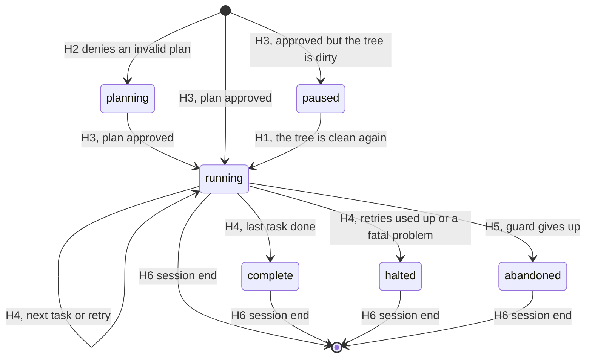

# planandtier reference

A complete description of what the `planandtier` plugin does and how each part works. The user-facing
quick start is the plugin's own [README](../../plugins/planandtier/README.md). The design history is in
[`planandtier-spike-spec.md`](planandtier-spike-spec.md), and the measurements behind the design are in
the findings docs listed under [Evidence](#evidence).

Tested on Claude Code 2.1.283 (Windows).

## Contents

- [What it is](#what-it-is)
- [Requirements and installation](#requirements-and-installation)
- [The lifecycle of a plan](#the-lifecycle-of-a-plan)
- [The task block](#the-task-block)
- [Model and effort tiers](#model-and-effort-tiers)
- [Opting out of tiering](#opting-out-of-tiering)
- [The hooks](#the-hooks)
- [The run](#the-run)
- [Session state](#session-state)
- [The tier agents](#the-tier-agents)
- [Permission modes](#permission-modes)
- [Failure handling and safety rules](#failure-handling-and-safety-rules)
- [Configuration and environment](#configuration-and-environment)
- [Plugin layout](#plugin-layout)
- [Testing](#testing)
- [Limitations and non-goals](#limitations-and-non-goals)
- [Troubleshooting](#troubleshooting)
- [Evidence](#evidence)
- [Planned changes](#planned-changes)

## What it is

planandtier turns an approved plan-mode plan into serial subagent execution. Each task in the plan runs
as its own subagent, one at a time, on the model and effort chosen for it while planning, and commits its
own work.

The user's experience is plain plan mode: plan, approve, watch. The plugin adds four things:

1. **Tiering rules while planning.** In plan mode, Claude is told to end the plan with a machine-readable
   task list, with a model, an effort and a self-contained prompt for each task.
2. **A gate on approval.** A plan whose task list is missing or invalid, or that is planned in a dirty
   Git working tree, cannot be approved. Claude sees the problems and fixes them (or tells the user), so
   the user never sees a plan that cannot run.
3. **Automatic hand-off.** After approval, Claude is given the exact Agent call for each task in turn and
   dispatches it. Hooks refuse any other dispatch. Nothing is typed after approval.
4. **Commits and retries.** Each task is one commit. A failed attempt is reset to the commit before it and
   retried one tier up, twice at most, and then the run stops.

### Design goals

| Goal | How it is met |
|---|---|
| **Seamless** | Built-in plan mode is unchanged; hooks do the hand-off. No command to type after approval. |
| **Cheap** | Each task runs on the cheapest tier expected to succeed first time. Orchestration costs one short Agent call and one short report per task attempt in the main session. |
| **Deterministic** | Task order, tier and prompt come from the tasks file named in the approved plan, checked against its hash. Workers read their prompt from that file; no model recalls or retypes a task. Hooks check every dispatch and every result. |
| **Recoverable** | Every finished task is a commit with a `Planandtier-Task:` trailer, and a failed attempt is reset to the commit before it. |
| **Built-in first** | Plan mode, `ExitPlanMode` approval, the Agent tool and plugin agents are all Claude Code's own. |

### Why not a workflow

Earlier versions ran the tasks in a dynamic workflow. Claude Code shows every workflow agent the user's
latest typed prompt as a request that overrides its task, and plan-dialog feedback is never relayed, so a
task changed through that feedback was refused. Subagents started with the Agent tool get no such
frame, and hooks can check each dispatch and read each report
([`planandtier-agent-dispatch-findings.md`](planandtier-agent-dispatch-findings.md)). So the tasks now
run through plugin agents, one per tier, the way
[Orchestratinator](../../plugins/orchestratinator/README.md) runs its workers.

## Requirements and installation

- **Node 20 or later** on the `PATH`. Every hook is a Node script.
- **Git.** A tiered plan must be planned and run in a Git repository that has at least one commit and a
  clean working tree. An opted-out plan has no such requirement.
- For the tested behavior, `CLAUDE_CODE_EFFORT_LEVEL` and `CLAUDE_CODE_SUBAGENT_MODEL_FORCE` should be
  unset. Either would override the agents' effort or model.

Install from the marketplace:

```bash
claude plugin marketplace add timschreiber/claude-plugins
claude plugin install planandtier@timschreiber
```

Or load it from a checkout of this repo, without installing:

```powershell
claude --plugin-dir ./plugins/planandtier
# after editing plugin files:
/reload-plugins
```

The plugin's state is one JSON file per session under the plugin's data directory (see
[Session state](#session-state)). It also writes a tasks file next to each approved plan's file, and
shortens that plan file (see [The tasks file](#the-tasks-file)). The only changes to the project are the
tasks' own commits.

## The lifecycle of a plan

```mermaid
sequenceDiagram
    actor U as User
    participant M as Main session
    participant H as Plugin hooks
    participant A as Tier agent
    U->>M: Prompt in plan mode
    H-->>M: H1 adds the tiering rules
    M->>M: Explores, writes the plan and its tiered-tasks block
    M->>H: ExitPlanMode
    H-->>M: H2 checks the block and the Git tree (deny with reasons)
    H-->>H: H2 moves the block to the tasks file, leaves a table
    U->>M: Approves the plan (with the table)
    H-->>M: H3 starts the run and gives the first dispatch
    loop Each task, in order
        M->>H: Agent(planandtier:<tier>, pointer prompt)
        H-->>H: H4 pre checks the dispatch, records HEAD
        H-->>M: H4 post: the task runs in the background; end the turn
        H->>A: The worker reads its task, does it, runs Verify, commits
        A-->>H: SubagentStop: H4 checks the commit and moves the run on (notice saved)
        A-->>M: The report arrives as a prompt
        H-->>M: H1 gives the notice: next task, retry after a reset, or stop
    end
    H-->>M: All tasks done (or the run stopped)
```

1. **Planning.** In plan mode, H1 adds the rules in [`rules/tiering.md`](../../plugins/planandtier/rules/tiering.md)
   to the conversation. Claude plans as usual, including any Explore or Plan research, and ends the plan
   with a `## Tasks` section holding one `json tiered-tasks` block.
2. **Gate.** When Claude calls `ExitPlanMode`, H2 reads the plan file and validates the block. If it is
   invalid, the call is denied with every problem listed, and Claude fixes the plan file and calls
   `ExitPlanMode` again. If the directory is not a Git repository or has uncommitted changes, the call is
   denied and Claude tells the user. Once both are fine, H2 moves the block to the tasks file and puts a
   table of the tasks in its place, because the approval dialog cannot show a plan with very long lines.
3. **Approval.** The user reads the plan, with the table, and approves it. The prompts are in the tasks
   file the table names. A rejected plan triggers nothing: Claude revises it and offers it again.
4. **Hand-off.** H3 loads the tasks from the tasks file, saves a `running` state, and gives Claude the
   exact Agent call for T01.
5. **The run.** Claude makes that call. H4 checks it. In an interactive session the worker runs in the
   background, so Claude ends its turn. The worker does its task and commits. When it stops, H4 checks the
   result and moves the run on, and when the worker's report arrives, H1 gives Claude the next call: the
   next task, a retry one tier up after a reset, or the end of the run. See [The run](#the-run).
6. **Session end.** H6 deletes the session's state file.

## The task block

The plan must end with a `## Tasks` section holding **exactly one** fenced block whose info string is
`json tiered-tasks`:

````markdown
## Tasks

```json tiered-tasks
{
  "tasks": [
    {
      "id": "T01",
      "title": "Add the IClock abstraction",
      "model": "sonnet",
      "effort": "medium",
      "prompt": "Read docs/spec.md section 3. Create src/IClock.cs with ... Verify: dotnet build succeeds and dotnet test --filter ClockTests passes."
    }
  ]
}
```
````

The block is what gets executed. The prose above it is for the user to read and judge, so the two must
agree.

### Fields

Every task has exactly these five keys, all strings. Any other key is an error.

| Field | Rule |
|---|---|
| `id` | `T01`, `T02`, ... matching the task's position: the first task must be `T01`, the second `T02`, with no gaps. |
| `title` | One non-empty line, at most 100 characters. Used as the task's commit message and in its dispatch description. |
| `model` | `sonnet` or `opus`. |
| `effort` | `low`, `medium` or `high` for `sonnet`; `low`, `medium`, `high` or `xhigh` for `opus`. `sonnet` / `xhigh` is accepted as an alias for `opus` / `low`. |
| `prompt` | Non-empty and contains the text `Verify:`. |

### Whole-block rules

- The block must be a JSON object of the form `{"tasks": [...]}` with a non-empty `tasks` array.
- At most 99 tasks.
- Exactly one `json tiered-tasks` block in the plan. Two or more is an error.
- The block and the opt-out line (below) cannot both appear.
- Invalid JSON is an error that includes the parser's message.

### How the block is found

[`lib/tasks.js`](../../plugins/planandtier/scripts/lib/tasks.js) is the only code that reads or rewrites
plan text. H2 and H3 reach its `parsePlan()` through `resolvePlan()` in
[`lib/sidecar.js`](../../plugins/planandtier/scripts/lib/sidecar.js), which also loads the tasks file. It
scans the plan line by line and tracks fenced code blocks, so:

- Backtick and tilde fences both work, with up to three spaces of indentation, and a fence closes only on
  a matching character with at least the opening length.
- A `json tiered-tasks` fence quoted inside another fence (as an example, like the one in this document)
  is content, not a block.
- A fence with any other info string (for example plain `json`) is not a task block.
- CRLF and LF line endings are both handled.
- The tasks it returns carry only the five known keys.

Validation collects **every** problem before returning, so Claude can fix them all in one pass. Error
messages name the task and field and list the allowed values, for example
`T03.effort: "max" is not allowed for opus; use low, medium, high or xhigh`.

### The tasks file

The approval dialog withholds a plan that has one very long line: a line of 4,500 characters was
withheld, while a 21 KB plan with short lines was shown (see
[`planandtier-dialog-findings.md`](planandtier-dialog-findings.md)). Each task's prompt is a single JSON
line, so a long prompt would make the plan impossible to approve. The dialog reads the plan file after
H2 runs, so H2 shortens the file first.

When the block is valid and H2 read it from the plan file, H2:

1. Writes the block's body, exactly as Claude wrote it, to `<plan>.tasks.json` next to the plan file
   (`brave-fox.md` gives `brave-fox.tasks.json`).
2. Replaces the block, fence lines included, with a generated section, and removes any earlier one. The
   plan keeps its line endings.

```text
<!-- planandtier:tasks -->
Tasks file: `C:\Users\me\.claude\plans\brave-fox.tasks.json` (sha256 `0123456789abcdef`)

| ID | Title | Model | Effort | Prompt |
|---|---|---|---|---|
| T01 | Add the IClock abstraction | sonnet | medium | 412 chars |

Open the tasks file to read each prompt before approving.
<!-- /planandtier:tasks -->
```

The hash is the first 16 hex characters of the tasks file's sha256. A plan with this section and no block
is loaded from the tasks file. That works only if the file still matches the hash, and the section is
exactly the one H2 would write for those tasks (trailing spaces and line endings aside). The hash proves
the file is unchanged, and the second check proves the table does: without it, a table edited by hand (a
new title, another model) would be approved while the old tasks ran.

| Situation | Result |
|---|---|
| The tasks file matches its hash, validates, and matches the table | The plan is valid, with the tasks from the file. A resubmitted plan passes H2 unchanged. |
| The tasks file is missing, changed, or invalid, or the table was edited | H2 denies and tells Claude to write the complete block again in place of the table. H3 runs nothing. |
| Two sections, a section with no `Tasks file:` line, or a section with the opt-out line | An error, handled the same way. |
| A new block and an old section | The block wins. H2 moves it and removes the old section. |

To change the tasks after the user rejects the plan, Claude writes a complete new block under `## Tasks`.
Neither Claude nor the user should edit the table or the tasks file by hand. The tasks files are not
deleted, so each one remains a record of what ran. The workers read their prompts from this file during
the run.

### Writing task prompts

A worker sees only its own prompt and the repository. It never sees the plan or the conversation, though
it does get the project's `CLAUDE.md` automatically. The rules therefore tell Claude to make each prompt:

- Name the files and spec sections to read first, including `AGENTS.md` or a spec if the project has one.
- State exact names, signatures, behavior and error handling, and name the tests with their cases, so no
  design decision is left to the worker.
- For a find-and-replace task, make the prompt a list of `(file, old_str, new_str)` triples, not prose
  describing the changes, followed by the `Verify:` step.
- Cover one coherent piece of work, roughly one commit, touching a few files.
- End with a `Verify:` step: a command or check that fails if the task is incomplete, such as a build, a
  named test run or a grep for the expected change. The task is committed only when it passes.
- Leave out commit steps: the worker commits the task itself.

A task can depend only on earlier tasks, so tasks are ordered accordingly.

## Model and effort tiers

Seven tiers are allowed. Each is also the name of the agent that runs it, `planandtier:<model>-<effort>`.
The rules tell Claude to favor the smallest model and effort that will get the job done:

1. Pick the model by the kind of work: `sonnet` for fully specified work, `opus` for work that needs
   judgment or is too intricate and wide for `sonnet`.
2. Start at `medium` effort, the baseline. Lower it for a task that is easier or simpler than the baseline
   for its model, and raise it for one that is harder or more complex.
3. Past `sonnet` / `high`, go to `opus` / `low`: `sonnet` stops at `high`.

A failed task is reset and retried one tier up, so a tier that is slightly too small usually costs less
than one that is too big.

| Tier | Use for |
|---|---|
| `sonnet` / `low` | Easier than the baseline: fully given work, such as literal find-and-replace pairs, a new file whose exact content is in the prompt, or a rename whose complete set of references the planner has checked. Full rules below. |
| `sonnet` / `medium` | **The baseline.** Fully specified work: names, signatures, behavior and test cases are all in the prompt. |
| `sonnet` / `high` | Harder than the baseline: fully specified but intricate work, such as parsers, state machines, numeric code, many edge cases. |
| `opus` / `low` | Fully specified, intricate and wide (interacting edge cases across several files, where `sonnet` / `high` is likely to miss one), or small bounded judgment: a well-defined change in unfamiliar code that the prompt cannot fully describe. |
| `opus` / `medium` | **The baseline for judgment work.** Judgment the plan cannot pin down: unfamiliar library internals, poorly documented APIs, debugging a known failure. |
| `opus` / `high` | The hardest bounded implementation: a failure of unknown cause across components, or subtle cross-cutting changes. |
| `opus` / `xhigh` | Very rare, for extreme reasoning only: concurrency correctness, algorithmic subtleties, security-critical logic. The plan's prose must say why. |

If more than about one task in ten is `opus` / `high` or above, the rules treat the plan as
under-specified: the design decisions belong in planning, with the answers written into the prompts.

**Why Sonnet stops at `high`.** On every published comparison found, Opus 5.5 at `low` scored above
Sonnet 5 at `xhigh`, at a lower cost per task. The closest result was on reasoning-heavy scientific coding
(SciCode, 59% against 54%); the widest was on Terminal-Bench 4.0 (31% against 7%). So `sonnet-xhigh` was
dropped and its work given to `opus-low`. The data comes almost entirely from Anthropic and Artificial
Analysis, and this choice is expected to be revisited when a newer Sonnet ships. See
[`planandtier-tier-findings.md`](planandtier-tier-findings.md).

**`sonnet` / `xhigh` is an alias.** The rules never offer it, but a plan that asks for it is not denied: the
parser replaces it with `opus` / `low`, so the table in the approval dialog, the dispatch and the retries
all use `opus-low`. The aliases are in `ALIASES` in `lib/tasks.js`.

**Not allowed:** Haiku, the `max` effort, and Fable. Haiku was removed because, in the user's experience,
it does not follow instructions reliably and too often does its own thing on coding work. The published
coding results agree: 25.5 against Sonnet 5's 88.2 on Scale's SWE-Bench Pro V2, and 17 against Sonnet 5
at `low`'s 24 on the Artificial Analysis index (`planandtier-tier-research.json`).

**The retry ladder** is the table's order: `sonnet` from `low` to `high`, then `opus` from `low` to
`xhigh`.

The allowed tiers are defined in three places that must be kept in step: `ALLOWED` in `lib/tasks.js`,
which enforces them and derives `TIERS`, the agents in `agents/`, and `rules/tiering.md`, which tells
Claude about them. `agents.test.js` checks the first two against each other.

### `sonnet` / `low`: fully given work

Work whose result is fully written out in the prompt. There are three kinds.

**Find-and-replace.** Extremely mechanical work, expressed as one or more literal find-and-replace pairs.
For each edit, the task's prompt states the exact file, the exact existing text to match (`old_str`), and
the exact text to replace it with (`new_str`). A single task may contain multiple such pairs across one or
a few files — do not fragment mechanical work into one task per pair. Each `old_str` must include enough
surrounding context to match exactly one location in its file; the planner must verify this (e.g. by
grep) before finalizing the plan, not leave it for the worker to discover.

**A new file**, with its complete, exact content in the prompt.

**A rename.** A rename qualifies for this tier only when the planner has enumerated the complete, closed
set of reference sites — the file's own path plus every import, config entry, build script line, test
fixture, etc. that names it — and has confirmed (e.g. via a verified grep) that the set is exhaustive. The
edits may be given as replacement pairs or described. If the planner cannot be confident the set of
references is closed — dynamically constructed paths, reflection, generated code, string
interpolation, or a codebase where a plain search might miss variants — the rename is not mechanical:
it moves to `sonnet` / `medium` or higher. Either way, its `Verify:` step must do more than confirm a
build passes — it needs a check that would catch a missed reference (e.g. a repo-wide search for the old
name returning nothing outside comments/history).

Anything that needs the worker to work out code or content belongs to `sonnet` / `medium` or above.

## Opting out of tiering

For an ordinary plan, the user asks for one. Claude then puts this exact line in the plan, on its own
line and outside any code fence, with no task block:

```
Tiered execution: off
```

With that line, H2 lets the plan through without any Git check, H3 deletes any earlier run state for the
session, and the plan is approved and carried out the ordinary way. The rules tell Claude to use the line
only when the user asks for it or the task is trivial.

A plan with neither a task block nor the opt-out line cannot be approved (until the denial cap below is
reached). The opt-out line inside a code fence does not count.

## The hooks

Six scripts under [`scripts/`](../../plugins/planandtier/scripts/), registered in
[`hooks/hooks.json`](../../plugins/planandtier/hooks/hooks.json). Each runs as
`node "${CLAUDE_PLUGIN_ROOT}/scripts/<script>.js" [mode]`.

| Hook | Event | Matcher | Script and mode | Timeout |
|---|---|---|---|---|
| H1 Rules | `UserPromptSubmit` | none | `h1-plan-rules.js` | 15 s |
| H1 Rules | `PostToolUse` | `EnterPlanMode` | `h1-plan-rules.js enter` | 15 s |
| H2 Gate | `PreToolUse` | `ExitPlanMode` | `h2-gate-exit-plan.js` | 30 s |
| H3 Hand-off | `PostToolUse` | `ExitPlanMode` | `h3-post-approval.js` | 30 s |
| H4 Dispatch | `PreToolUse` | `Agent` | `h4-dispatch.js pre` | 30 s |
| H4 Dispatch | `SubagentStop` | none | `h4-dispatch.js stop` | 15 s |
| H4 Dispatch | `PostToolUse` | `Agent` | `h4-dispatch.js post` | 60 s |
| H4 Dispatch | `PostToolUseFailure` | `Agent` | `h4-dispatch.js failure` | 60 s |
| H5 Guard | `PreToolUse` | `Edit\|Write\|NotebookEdit` | `h5-guard.js pre` | 15 s |
| H5 Guard | `Stop` | none | `h5-guard.js stop` | 15 s |
| H6 Cleanup | `SessionEnd` | none | `h6-cleanup.js end` | 15 s |

Every hook ignores calls made by subagents (any input with an `agent_id`), so workers and other agents are
never gated, guarded or given the rules. H4's `stop` mode is the exception: `SubagentStop` comes from the
subagent itself.

### H1: rules

- On `UserPromptSubmit` in plan mode, it prints the text of `rules/tiering.md`, which Claude Code adds as
  context. It fires on every prompt submitted in plan mode.
- On `PostToolUse` for `EnterPlanMode`, it returns the rules as `additionalContext`. This covers Claude
  entering plan mode itself.
- On `UserPromptSubmit` outside plan mode, if H4 left a **notice** (a worker finished and its attempt was
  judged), it prints the notice and clears it. The worker's report arrives as an `<agent-message>` or
  task-notification prompt, so this is how a background run moves on to its next step with nothing typed.
- Otherwise, for a prompt the user typed, with a run `running` and no task in flight, it prints where the
  run stands and the next exact dispatch, so the user can say "continue" after an interruption. Worker
  reports and task notifications get no such note.
- For a `paused` run (the tree was dirty at approval), it checks the tree again. If it is clean now, the
  run becomes `running` and the note gives the first dispatch; otherwise the note says why it still waits.

### H2: gate

Runs before every main-thread `ExitPlanMode` call.

1. Reads the plan from the file at `tool_input.planFilePath`. If the file is missing or empty, it falls
   back to `tool_input.plan`. The file comes first because `tool_input.plan` is whatever Claude sent and
   was measured to be stale after a retry.
2. Parses it with `resolvePlan()`. The opt-out line passes silently.
3. For a valid tiered plan, checks the Git working directory (`cwd`): it must be inside a repository that
   has a commit, with no uncommitted changes (`git status --porcelain` empty; ignored files do not count).
   Otherwise it denies, names the problem, and tells Claude not to call `ExitPlanMode` again until the user
   has fixed it. These denials are never passed through and do not count toward the cap.
4. A valid plan read from the plan file then has its block moved to the tasks file (see
   [The tasks file](#the-tasks-file)). A plan that already has its table passes unchanged. It never rewrites
   text that came from `tool_input.plan`, so a missing plan file is never created.
5. Otherwise it denies the call with `permissionDecision: "deny"` and a reason that lists every problem,
   names the plan file to fix, and mentions the opt-out line. When the problem is the table or its tasks
   file, the reason tells Claude to write the complete block again in place of the table. If the plan has
   no block, no table and no opt-out line at all, the full rules are appended to the reason.

**Denial cap.** H2 counts its denials of invalid plans in the session state. After three, it lets the next
call through rather than spend more turns; H3 then runs the plan untiered and says so. The count is reset
when a tiered plan is approved. A denial keeps any existing state intact apart from the count.

Claude sees a denial as `PreToolUse:ExitPlanMode hook error: <reason>`. The user sees no dialog.

### H3: hand-off

Runs after a successful `ExitPlanMode`, which means the user approved the plan. A rejected plan does not
fire it. Calls from agents (`tool_response.isAgent`) are ignored.

It reads the approved text from the file at `tool_response.filePath`, then `tool_input.planFilePath`, then
`tool_response.plan`, then `tool_input.plan`, taking the first that is non-empty. The file comes first
because the dialog shows the file as H2 left it, and the user can edit it there. `tool_response.plan` was
measured to hold the same shortened text. It parses the text with `resolvePlan()`. Then:

| Parse result | What H3 does |
|---|---|
| Opt-out line | Deletes the session state (an untiered plan replaces any earlier run) and says nothing. |
| A table that was edited, or whose tasks file is missing, changed or invalid | Deletes the state and tells Claude that nothing will run: tell the user and suggest planning again, and do not implement the plan, since its prompts are not in it. |
| Invalid (only possible after H2's cap) | Deletes the state and tells Claude the plan will not run as tiered tasks: tell the user, then implement the plan normally. |
| Valid, tree clean | Saves a `running` state (tasks, tasks file and hash, branch, working directory), prunes session files older than 7 days, and gives Claude the exact Agent call for T01. |
| Valid, tree no longer clean | Saves the run as `paused` with the reason, and tells Claude to ask the user to commit or stash: the run starts on their next message once the tree is clean (H1). |
| Valid, state not saved | Tells Claude the tasks could not be saved: tell the user, then implement the plan normally. |

If H2 could not write a tasks file, H3 writes the tasks to `<session_id>.tasks.json` beside the state file,
so the workers always have one to read.

### H4: dispatch

Drives [the run](#the-run). It acts only on Agent calls whose `subagent_type` starts with `planandtier:`;
other agent types are left alone.

- **`pre`** refuses, with the reason and the exact expected call, any dispatch that is not the one the run
  expects: the current task's tier agent, the expected prompt (line endings and trailing spaces aside), and
  no task already in flight. With no run in progress it refuses every planandtier dispatch. It then checks
  the tree: uncommitted changes that no task made, or a different branch from the one the run started on,
  **halt** the run at once. On a pass it records HEAD, marks the task in flight, and drops any notice not
  yet shown (it is stale once Claude has made the next dispatch).
- **`stop`** (`SubagentStop`) fires when the dispatched worker finishes, in the foreground or the
  background. It reads the report from `last_assistant_message`, or from the last assistant text in
  `agent_transcript_path` if that is missing, judges the attempt (see
  [Judging an attempt](#judging-an-attempt)), moves the run on, and saves what Claude must be told next as
  the state's `notice`.
- **`post`** (`PostToolUse`) fires when Claude's Agent call returns. If a notice is waiting, the worker
  already finished (a foreground run, as in a headless session): it gives Claude the notice as
  `additionalContext` and clears it. Otherwise the task is running in the background, and it tells Claude
  to end its turn: the next step comes when the report arrives (H1).
- **`failure`** (`PostToolUseFailure`) treats a failed Agent call as a failed attempt, with the error's
  first line as the reason, and gives Claude the result directly.

Whether a dispatch runs in the foreground is not checked. In an interactive session the Agent tool has no
`run_in_background` setting and always runs subagents in the background; in a headless session Claude can
choose (see [`planandtier-agent-dispatch-findings.md`](planandtier-agent-dispatch-findings.md)).

It never sets `permissionDecision: "allow"`; its only decisions are denials.

### H5: guard

Keeps the main thread dispatching while a task is due. Active only while the run is `running` and no task
is in flight.

- **`pre`:** denies main-thread `Edit`, `Write` and `NotebookEdit` calls, with a reason that repeats the
  next dispatch. After three denials it steps aside and marks the run `abandoned`. Shell commands are not
  guarded, so Claude can inspect the repository; if one changes files, H4 halts the run at the next
  dispatch.
- **`stop`:** blocks the turn from ending, with the same reason, or with H4's notice if one is waiting
  (which it then clears). If Claude Code reports the stop hook is already active (a second consecutive
  stop), it allows the stop and marks the run `abandoned`. While a task is in flight it is silent, so
  Claude can end its turn while a background worker runs.

### H6: cleanup

On `SessionEnd` it deletes the session's state file. A run does not outlive its session; the tasks that
finished are already committed.

## The run

### The dispatch

For each attempt, Claude calls the Agent tool with:

- `subagent_type`: `planandtier:<tier>`, for example `planandtier:sonnet-medium`;
- `description`: `<id>: <title>`;
- `prompt`: a pointer to the task, never the task itself:

```
Tasks file: C:\Users\me\.claude\plans\brave-fox.tasks.json
Task: T02
```

A retry adds two lines:

```
Retry: attempt 2 of 3; the attempt at sonnet-medium failed and was rolled back.
Reason: Verify failed: 2 tests fail in ClockTests
```

H3, H4 and H1 always give Claude this call spelled out, and H4 refuses any other.

In an interactive session the worker runs in the background: Claude's Agent call returns at once, H4 tells
Claude to end its turn, and the run continues when the worker's report arrives as a prompt. So Claude's
turn ends between tasks, and each report starts the next with nothing typed. In a headless session the
call can run in the foreground, and the run continues within the turn.

### The worker

The worker reads the tasks file, finds its task by id, and does only what that task's prompt says. It runs
the `Verify:` step, and only if it passed commits everything as one commit:

```
git add -A
git commit -m "<title>" -m "Planandtier-Task: T02"
```

It never pushes, amends, resets, stashes, rebases or switches branches. It ends with a report block:

```
STATUS: DONE | FAILED
COMMIT: <sha> | NONE
VERIFY: PASS | FAIL | NOT RUN
NOTE: <one line>
```

### Judging an attempt

H4's `stop` mode does not take `DONE` on trust. An attempt succeeds only if all of these hold:

- the report says `DONE`;
- exactly one new commit exists since the recorded HEAD, and its message has the task's
  `Planandtier-Task:` trailer;
- the working tree is clean;
- the branch is the one the run started on.

A different branch is fatal. Anything else that fails is a failed attempt, with the worker's NOTE or the
failed check as the reason.

### After an attempt

| Outcome | What happens |
|---|---|
| Success, more tasks left | The next task starts at its own tier. Claude gets its dispatch. |
| Success, last task | The run is `complete`. Claude lists each task's commit and tier and tells the user. |
| Failure, fewer than 2 retries used, a higher tier exists | H4 checks that no commit made by the attempt is on a remote branch, runs `git reset --hard <recorded HEAD>` and `git clean -fd`, and asks for the same task one tier up, with the reason. |
| Failure after 2 retries, or at `opus-xhigh` | The run is `halted`. Nothing is reset: the last attempt's changes and any commit it made stay for the user to inspect. Claude reports the task, each tier tried and the reason, and must not fix it itself. |
| A failed attempt's commit is on a remote branch, the reset fails, or the branch changed | The run is `halted` at once, without a reset. |

The reset removes the failed attempt's commits, changes and untracked files. Ignored files are left alone.
Earlier tasks' commits are kept, because the recorded HEAD is after them.

### Continuing and stopping

If the user interrupts the run, the state stays `running`. On the user's next message, H1 tells Claude
where the run stands and gives the next dispatch, so "continue" resumes it at the task that was due. If the
user wants to stop, Claude does not dispatch, and H5 steps aside after a few blocks.

## Session state

One JSON file per session: `${CLAUDE_PLUGIN_DATA}/sessions/<session_id>.json`, outside the project.
If `CLAUDE_PLUGIN_DATA` is unset, `<temp dir>/planandtier/sessions/` is used. With `--plugin-dir`, Claude
Code sets `CLAUDE_PLUGIN_DATA` itself, to `~/.claude/plugins/data/planandtier-inline`.

During a run the file looks like this:

```json
{
  "phase": "running",
  "tasks": [ { "id": "T01", "title": "...", "model": "sonnet", "effort": "low", "prompt": "..." } ],
  "tasksFile": "<path to the tasks file>",
  "tasksHash": "<the 16-character hash from the plan's table, or null>",
  "planFile": "<path to the approved plan file>",
  "branch": "main",
  "cwd": "<the repository's working directory>",
  "current": {
    "index": 1, "attempt": 2, "tier": "sonnet-high", "tried": ["sonnet-medium"],
    "head": "<sha recorded at dispatch>", "inFlight": false, "report": null,
    "lastFailure": { "tier": "sonnet-medium", "reason": "..." }
  },
  "done": [ { "id": "T01", "tier": "sonnet-low", "commit": "<sha>", "attempts": 1 } ],
  "notice": "<what Claude must be told next, or null>",
  "approvedAt": "2026-09-28T14:03:00.000Z",
  "denials": 0,
  "guardDenials": 0
}
```

`notice` is written by H4 when it judges an attempt, and cleared by whichever hook shows it first: H4's
`post` for a foreground run, H1 when the worker's report arrives, or H5 if Claude stops first. A halted run
also has `halt: {task, tried, reason}`; a paused run has `pausedBecause`. Before approval the file, if any,
holds only H2's denial count. Timestamps are written by hooks.

### Phases



| Phase | Set by | Meaning | Guards | Dispatches accepted |
|---|---|---|---|---|
| (no file) | H3 opt-out or invalid, H6 end | Idle. | Off | No |
| `planning` | H2, on a denial with no earlier state | Holds only the denial count. | Off | No |
| `paused` | H3 | Approved, waiting for a clean tree. | Off | No |
| `running` | H3; H1 for a paused run | Tasks in progress. | **On** while no task is in flight | Only the expected one |
| `complete` | H4 | Every task committed. | Off | No |
| `halted` | H4 | Stopped at a task; see `halt`. | Off | No |
| `abandoned` | H5, after giving up | Claude stopped dispatching. | Off | No |

Approving a new plan replaces the state. State writes are atomic (a temp file, then a rename). Session ids
are reduced to letters, digits, `_` and `-` before being used as file names. A corrupt or unreadable file
reads as no state. Each approval prunes session and temp files not modified in 7 days.

## The tier agents

[`agents/`](../../plugins/planandtier/agents/) holds seven plugin agents, one per tier, named
`<model>-<effort>` and run as `planandtier:<model>-<effort>`. They share one body (the worker's rules and
report block above) and differ only in frontmatter:

| Frontmatter | Value |
|---|---|
| `model` | `sonnet` or `opus` |
| `effort` | The tier's effort |
| `maxTurns` | 30, 40, 60 or 80 for `low`, `medium`, `high`, `xhigh` |
| `disallowedTools` | `Agent, Workflow`, so a worker cannot start subagents or workflows |

Workers inherit the session's permission mode and get the project's `CLAUDE.md` automatically. The
worker's rules replace any git instructions in the project's instruction files for the length of the task.

## Permission modes

The plugin does not depend on auto mode.

| | Auto mode | Manual permissions |
|---|---|---|
| Dispatch after approval | Claude dispatches with nothing typed. | The same. The Agent tool needs no permission. |
| Worker actions | Proceed under auto mode. | Workers can ask for permission as they edit files, run commands or commit. Allow rules for the tools your tasks use reduce this. |

The plugin never sets `permissionDecision: "allow"` anywhere, so it never bypasses a permission prompt.
The only decisions it makes are denials, from H2, H4 and H5. The agent-dispatch design has not yet been
run end to end in either mode; see [Evidence](#evidence).

## Failure handling and safety rules

Rules every hook follows, enforced by [`lib/hook.js`](../../plugins/planandtier/scripts/lib/hook.js) and
[`lib/git.js`](../../plugins/planandtier/scripts/lib/git.js), and checked by the tests:

- **Never fail loudly.** Every error, including an uncaught exception or unhandled rejection, is swallowed
  and the exit code stays 0. Empty, malformed or non-object stdin produces no output.
- **Degrade to ordinary Claude Code.** If the state cannot be read, a hook does nothing. If it cannot be
  written at approval, H3 tells Claude to implement the plan normally.
- **Never grant permission.** No hook sets `permissionDecision: "allow"`.
- **Never block forever.** H2 gives up after three denials of an invalid plan, H5's `pre` after three, and
  H5's `stop` on the second consecutive stop. H2's Git denials are the user's to fix and are not capped,
  but each one tells Claude to stop and tell the user.
- **Never lose work silently.** A reset happens only before a retry, only to the HEAD recorded when that
  task was dispatched from a clean tree, and never over a commit that a remote branch contains. The last
  failed attempt is never reset.
- **Debug output goes to a file, never to stdout,** and only when `PLANANDTIER_DEBUG` is set.
- **Output is flushed, not cut off.** Hooks set the exit code instead of calling `process.exit`, so large
  outputs such as the rules text are written in full.

How the plugin behaves when something goes wrong:

| Situation | Outcome |
|---|---|
| Claude cannot produce a valid block in three tries | The fourth `ExitPlanMode` passes; H3 tells Claude to implement the plan normally and tell the user. |
| The working tree is dirty or not a Git repository when the plan is submitted | H2 denies, and Claude tells the user to commit or stash. |
| The tree becomes dirty between submission and approval | The run is saved as `paused` and starts on the user's next message once the tree is clean. |
| The tree is dirty, or the branch changed, at a dispatch | The run halts before the task starts. |
| A task fails | It is reset and retried one tier up, twice at most, then the run halts with the last attempt left in place. |
| A worker reports `DONE` without exactly one trailer commit, or leaves changes uncommitted | Treated as a failed attempt. |
| A worker returns no report | Treated as a failed attempt. |
| The Agent call itself fails | Treated as a failed attempt. |
| A failed attempt's commit is on a remote branch | The run halts without a reset. |
| Claude dispatches the wrong tier or prompt, or a second task while one is running | H4 refuses and repeats the right call. |
| The worker's report never arrives as a prompt | The notice waits in the state; the user's next message gets it from H1, or H5 gives it if Claude stops. |
| Claude edits files or stops instead of dispatching | H5 blocks a few times, then steps aside and marks the run `abandoned`. |
| The tasks file or the table changes after the table is written | H2 denies a resubmission and asks for the full block again. After approval, H3 runs nothing and tells Claude to say so. |
| H2 cannot write the tasks file or the plan | The plan reaches the dialog with its block, and H3 writes a tasks file beside the state. A plan with a very long line is then withheld by the dialog. |

## Configuration and environment

| Setting | Effect |
|---|---|
| `PLANANDTIER_DEBUG` | When set, hook errors, unparseable input, a block H2 could not move, and every state write and removal are appended, with timestamps, to `planandtier-debug.log` in the system temp directory. |
| `CLAUDE_PLUGIN_DATA` | Set by Claude Code. Parent of the `sessions/` state directory. A value set in the shell is ignored under `--plugin-dir`. |
| `CLAUDE_PLUGIN_ROOT` | Set by Claude Code. Used to locate the hook scripts and the rules file. |
| `CLAUDE_CODE_EFFORT_LEVEL` | If set, overrides the agents' effort. Leave unset. |
| `CLAUDE_CODE_SUBAGENT_MODEL_FORCE` | If set, overrides the agents' models. Leave unset. |

There is no plugin-specific settings file. The tiers, limits and wording are constants in the scripts:

| Constant | Value | Where |
|---|---|---|
| Allowed models and efforts | `sonnet` × `low`, `medium`, `high`; `opus` × `low`, `medium`, `high`, `xhigh` | `lib/tasks.js` `ALLOWED` |
| Aliases | `sonnet` / `xhigh` runs as `opus` / `low` | `lib/tasks.js` `ALIASES` |
| Tier ladder | `ALLOWED` in order | `lib/tasks.js` `TIERS` |
| Retries per task | 2 | `lib/run.js` `MAX_RETRIES` |
| Commit trailer | `Planandtier-Task: <id>` | the agents; checked in `lib/run.js` |
| Maximum tasks | 99 | `lib/tasks.js` |
| Maximum title length | 100 characters | `lib/tasks.js` |
| Block info string | `json tiered-tasks` | `lib/tasks.js` |
| Opt-out line | `Tiered execution: off` | `lib/tasks.js` |
| Table markers | `<!-- planandtier:tasks -->`, `<!-- /planandtier:tasks -->` | `lib/tasks.js` |
| Tasks file name | `<plan name>.tasks.json`, next to the plan | `lib/sidecar.js` |
| Tasks file hash | First 16 hex characters of sha256 | `lib/sidecar.js` |
| H2 denial cap | 3 | `h2-gate-exit-plan.js` |
| H5 tool-denial cap | 3 | `h5-guard.js` |
| State pruning age | 7 days | `h3-post-approval.js` |

## Plugin layout

```
plugins/planandtier/
  .claude-plugin/plugin.json     # name, displayName, description; no version field
  README.md                      # user-facing quick start
  agents/<model>-<effort>.md     # the seven tier agents, one shared body
  hooks/hooks.json               # H1-H6 registrations
  rules/tiering.md               # text H1 adds, and H2 appends when the block is missing
  scripts/
    h1-plan-rules.js
    h2-gate-exit-plan.js
    h3-post-approval.js
    h4-dispatch.js
    h5-guard.js
    h6-cleanup.js
    lib/git.js                   # the Git commands a run needs; never throws
    lib/hook.js                  # stdin, output, debug logging, never-throw wrapper
    lib/run.js                   # the run as pure functions: dispatch, report, judging, retries
    lib/sidecar.js               # the tasks file: move the block, load and check it
    lib/state.js                 # per-session state file: read, atomic write, remove, prune
    lib/tasks.js                 # the only parser, validator and rewriter of plan text; the tiers
```

The plugin is pure Node and Markdown, with no dependencies and nothing vendored from `shared/`. It is
cataloged in [`.claude-plugin/marketplace.json`](../../.claude-plugin/marketplace.json) as
`planandtier` (display name "Plan and Tier").

## Testing

Unit and integration tests use Node's built-in test runner, with no dependencies. They need `git` on the
`PATH`: the run's tests commit, reset and push in temporary repositories.

```powershell
node --test tests/planandtier/*.test.js
```

On Node 24, pass the files as above; `node --test tests/planandtier/` treats the directory as a single
file and fails.

| File | Covers |
|---|---|
| `tests/planandtier/tasks.test.js` | Every validation rule, the allowed and rejected tiers, the tier ladder, fence handling (nested, tilde, CRLF, other info strings), the opt-out line, multiple blocks, invalid JSON, collecting all errors, key stripping; the generated table, finding and rejecting sections, and replacing a block while keeping CRLF or LF. |
| `tests/planandtier/sidecar.test.js` | The tasks file's name and hash, moving a block, and loading a tasks file that is intact, missing, changed or invalid, or whose table was edited. |
| `tests/planandtier/git.test.js` | The repository and clean-tree check, HEAD and branch, commits since a base, pushed commits (with a bare remote), and the reset. |
| `tests/planandtier/run.test.js` | The expected dispatch and prompt, checking a dispatch, parsing reports, judging an attempt, and moving on: next, complete, retry up the ladder, halt. |
| `tests/planandtier/agents.test.js` | One agent per tier with the right frontmatter, and one shared body. |
| `tests/planandtier/state.test.js` | Round-trips, missing and corrupt files, id sanitizing, atomic writes, pruning, an unwritable data directory, the temp-directory fallback. |
| `tests/planandtier/hooks.test.js` | Each hook run as a child process against real stdin: the gate and its Git checks, the tasks file, starting and pausing a run, the dispatch check, whole runs through real commits, retries with a real reset, halts, the guard, the resume note, silent exit on bad input and an unwritable data directory, debug logging, `hooks.json`, and that no script ever grants permission. |

The agents' behavior cannot be unit tested; it is checked by the end-to-end run under [Evidence](#evidence).
To try the plugin by hand, load it with `claude --plugin-dir ./plugins/planandtier`, enter plan mode in a
clean repository, and ask for a small multi-step change.

## Limitations and non-goals

- **Serial only.** Tasks run one at a time. Parallel execution is a non-goal.
- **No pauses between tasks.** There are no per-task approval gates.
- **No pushing.** Each task is a local commit on the current branch.
- **Git required.** A tiered plan needs a Git repository with a clean working tree.
- **Only what `Verify:` checks is checked.** A worker commits when its verify step passes; work the step does
  not cover is not caught.
- **Workers see only their prompt**, not the plan or the conversation. A vague prompt gives a vague result.
- **Orchestration uses model turns.** One Agent call and one short report per attempt reach the main
  session.
- **The model dispatches.** The plugin gives the exact call and refuses any other, but cannot make the call
  itself. If Claude never dispatches, the guard steps aside after a few blocks.
- **A run ends with its session.** A resumed session cannot continue a run from an earlier one; the tasks
  that finished are committed, and their trailers show which.
- **The user approves a table, not the prompts.** The dialog cannot show very long lines, so the prompts
  are in the tasks file, which the user has to open to read.
- **Tasks files are kept.** One is written next to each plan file that passes H2, and none is deleted.
- **Always on.** In every session with the plugin enabled, plan mode gets the tiering rules and
  `ExitPlanMode` is gated. Use the opt-out line for an ordinary plan.
- **Rules on every plan-mode prompt.** H1 adds the rules text each time a prompt is submitted in plan mode,
  which costs context in a long planning conversation.

## Troubleshooting

| Symptom | Likely cause and fix |
|---|---|
| Plan mode behaves as if the plugin were absent | Node is not on the `PATH`, or the plugin is not enabled. Check `node --version` and `/plugin`. Set `PLANANDTIER_DEBUG=1` and look at `planandtier-debug.log` in the temp directory. |
| `ExitPlanMode` keeps being denied for the task block | The block is invalid; the denial lists each problem. After three denials the plan goes through untiered. |
| `ExitPlanMode` is denied because of the working tree | Commit or stash your changes, or make sure you are in a Git repository with at least one commit. |
| The dialog says the plan is too large to be shown in full | A line in the plan is too long for the dialog. If the plan still has its task block, H2 could not rewrite the plan file; `PLANANDTIER_DEBUG=1` logs that. If the long line is in the prose, ask Claude to wrap it. |
| After approval Claude says the tasks could not be loaded | The tasks file or the table was changed after the table was written. Plan again. |
| After approval Claude says the run cannot start | The tree became dirty after the plan was submitted. Commit or stash, then send any message. |
| A dispatch is refused | Claude's call did not match the expected one. The refusal repeats the right call; Claude should make it. |
| The run stopped at a task | Read Claude's report: the task, the tiers tried and the reason. The last attempt's changes are in the working tree. Fix or discard them, then plan the rest again. |
| The run stopped because of uncommitted changes or a branch change | Something other than a task changed the tree or the branch during the run. Nothing was reset. |
| Tasks run at the wrong effort or model | Check that `CLAUDE_CODE_EFFORT_LEVEL` and `CLAUDE_CODE_SUBAGENT_MODEL_FORCE` are unset. |
| Workers stop at permission prompts | Expected under manual permissions. Add allow rules for the tools your tasks use, or use auto mode. |

## Evidence

Every measured claim above traces to one of these. Evidence files are under `probes/evidence/`. The rows
marked *workflow era* were measured with the earlier design, which ran the tasks in a dynamic workflow;
their findings about plan mode, hooks and the dialog still apply.

| Claim | Document | Evidence |
|---|---|---|
| Opus 5.5 at `low` scored above Sonnet 5 at `xhigh` at a lower cost per task on every published comparison found; the Opus effort steps above `high` add little | [`planandtier-tier-findings.md`](planandtier-tier-findings.md) | `planandtier-tier-research.json` (published sources, fetched 2026-09-28) |
| Agent-tool subagents get no user-request frame; `PreToolUse` on Agent sees `subagent_type` and `prompt`, and a corrective denial is followed; the report is in `SubagentStop`'s `last_assistant_message`; in an interactive session the Agent call has no `run_in_background` field and the subagent runs in the background | [`planandtier-agent-dispatch-findings.md`](planandtier-agent-dispatch-findings.md) | `planandtier-agent-probe.log`, `planandtier-agent-probe-results.json`, `planandtier-reject-worker-frames.json`, `planandtier-agents-interactive-attempt1-probe.log` |
| The dialog withholds a plan with one line of about 4,500 characters but shows a 21 KB plan with short lines, and it reads the plan file after `PreToolUse` hooks run | [`planandtier-dialog-findings.md`](planandtier-dialog-findings.md), steps in [`dialog-shapes-run.md`](../../probes/planandtier/dialog-shapes-run.md) | `planandtier-dialog-shapes-observations.json`, `planandtier-dialog-shapes-probe.log` |
| The tasks file end to end: a plan with a 5,781-character line shown as a table and loaded from its tasks file; `tool_response.plan` holds the shortened text (*workflow era*) | [`planandtier-dialog-findings.md`](planandtier-dialog-findings.md), steps in [`planandtier-sidecar-run.md`](planandtier-sidecar-run.md) | `planandtier-sidecar-observations.json`, `planandtier-sidecar-probe.log`, `planandtier-sidecar-debug.log`, `planandtier-sidecar-plan.md`, `planandtier-sidecar-plan.tasks.json` |
| Rejecting a plan after the move: Claude writes a new block and H2 replaces the table; workflow agents are shown the latest typed prompt as overriding their task, and dialog feedback is never relayed (*workflow era*) | [`planandtier-dialog-findings.md`](planandtier-dialog-findings.md), steps in [`planandtier-reject-run.md`](planandtier-reject-run.md) | `planandtier-reject-observations.json`, `planandtier-reject-probe.log`, `planandtier-reject-debug.log`, `planandtier-reject-plan.md`, `planandtier-reject-plan.tasks.json`, `planandtier-reject-worker-frames.json` |
| `permission_mode` on `UserPromptSubmit`; `ExitPlanMode` hooks fire; deny makes Claude revise; `tool_input.plan` can be stale; `additionalContext` reaches the model; Haiku ignores effort (*workflow era*) | [`planandtier-spike-findings.md`](planandtier-spike-findings.md) | `planandtier-spike-headless-results.json`, `planandtier-spike-interactive-results.json` |
| All eight Sonnet and Opus pairs run at exactly the requested effort (*workflow era*, per-call effort) | [`planandtier-spike-findings.md`](planandtier-spike-findings.md) | `planandtier-effort-pairs-results.json` |
| A CRLF workflow script fails the launch (*workflow era*; no longer applies) | [`planandtier-dialog-findings.md`](planandtier-dialog-findings.md) | `planandtier-launch-shapes-results.json` |
| End to end in auto mode and with manual permissions (*workflow era*) | [`planandtier-e2e-findings.md`](planandtier-e2e-findings.md), [`planandtier-manual-mode-findings.md`](planandtier-manual-mode-findings.md) | `planandtier-e2e-results.json`, `planandtier-default-mode-headless-results.json`, `planandtier-manual-mode-results.json` |

The agent-dispatch design has not yet been run end to end. A first interactive attempt showed that
background runs must be followed (the fix described above); the steps for the run are in
[`planandtier-agents-run.md`](planandtier-agents-run.md). The probe plugins and their scripts are in
`probes/planandtier/`.

## Planned changes

[`planandtier-opt-in-draft-plan.md`](planandtier-opt-in-draft-plan.md) is a draft, not implemented, for
making the plugin opt-in per session (`/planandtier` to arm, `/planandtier:stop` to disarm) and for
running a saved plan named in a prompt. It was written for the workflow design and needs revising. Nothing
in it is decided until its evidence phase has run. This document describes the plugin as it is now.
