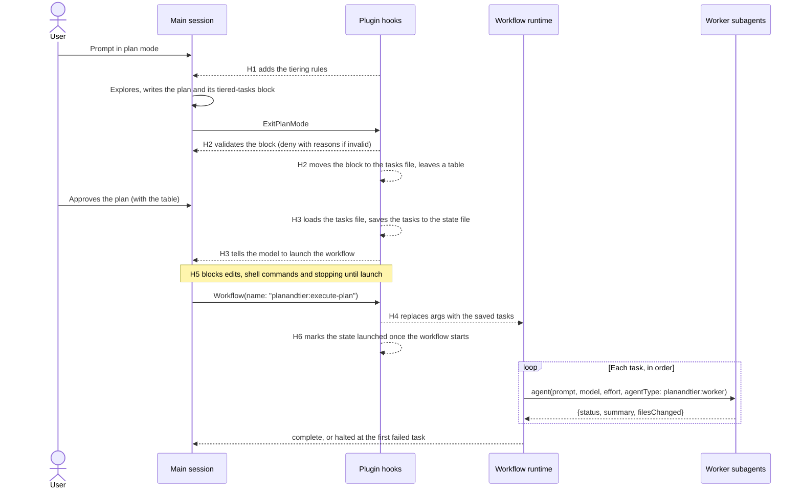
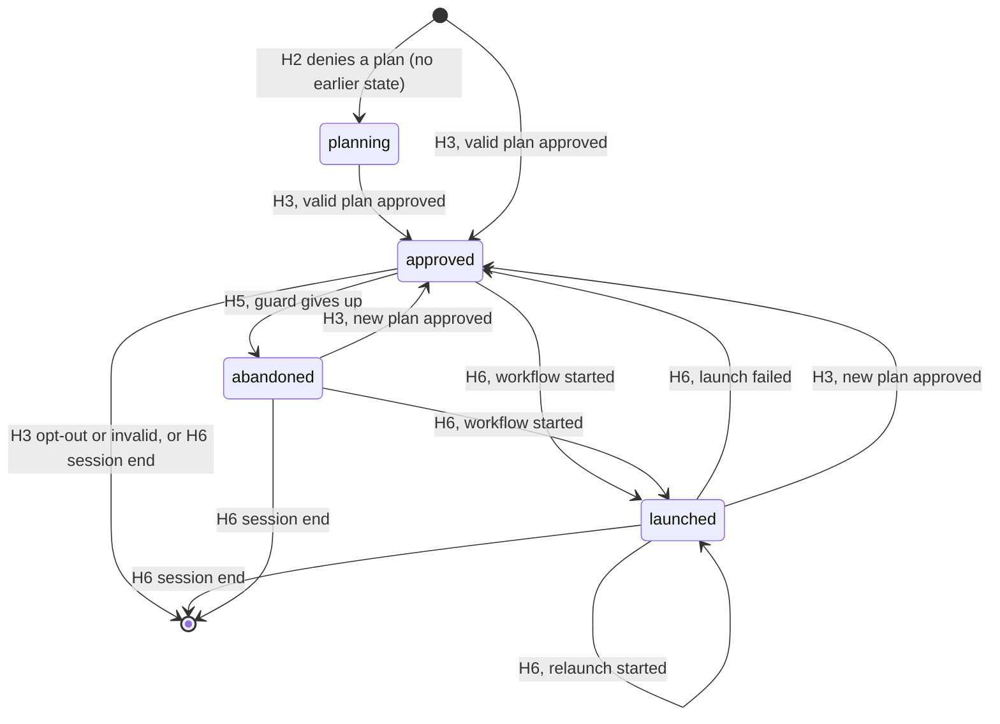

# planandtier reference

A complete description of what the `planandtier` plugin does and how each part works. The user-facing
quick start is the plugin's own [README](../../plugins/planandtier/README.md). The design history is in
[`planandtier-spike-spec.md`](planandtier-spike-spec.md), and the measurements behind the design are in
the findings docs listed under [Evidence](#evidence).

Tested on Claude Code 2.1.283 (Windows). Workflows are a research preview, so behavior described here
can change between Claude Code versions.

## Contents

- [What it is](#what-it-is)
- [Requirements and installation](#requirements-and-installation)
- [The lifecycle of a plan](#the-lifecycle-of-a-plan)
- [The task block](#the-task-block)
- [Model and effort tiers](#model-and-effort-tiers)
- [Opting out of tiering](#opting-out-of-tiering)
- [The hooks](#the-hooks)
- [Session state](#session-state)
- [The execute-plan workflow](#the-execute-plan-workflow)
- [The worker agent](#the-worker-agent)
- [Relaunching a plan](#relaunching-a-plan)
- [Permission modes](#permission-modes)
- [Failure handling and safety rules](#failure-handling-and-safety-rules)
- [Configuration and environment](#configuration-and-environment)
- [Plugin layout](#plugin-layout)
- [Testing](#testing)
- [Limitations and non-goals](#limitations-and-non-goals)
- [Troubleshooting](#troubleshooting)
- [Evidence](#evidence)
- [Planned changes](#planned-changes)

## What it is

planandtier turns an approved plan-mode plan into serial subagent execution. Each task in the plan runs
as its own subagent, one at a time, on the model and effort chosen for it while planning.

The user's experience is plain plan mode: plan, approve, watch. The plugin adds three things:

1. **Tiering rules while planning.** In plan mode, Claude is told to end the plan with a machine-readable
   task list, with a model, an effort and a self-contained prompt for each task.
2. **A gate on approval.** A plan whose task list is missing or invalid cannot be approved. Claude sees
   the problems, fixes the plan file and tries again, so the user never sees an invalid plan.
3. **Automatic hand-off.** After approval, the tasks are saved and Claude is told to launch a saved
   workflow. The workflow runs the tasks in order and stops at the first failure. Nothing is typed after
   approval.

### Design goals

| Goal | How it is met |
|---|---|
| **Seamless** | Built-in plan mode is unchanged; hooks do the hand-off. No command to type after approval. |
| **Cheap** | Orchestration runs as JavaScript in a saved workflow, not as model turns, and each task runs on the cheapest model and effort expected to succeed first time. |
| **Deterministic** | Task order, model, effort and prompt come from the tasks file named in the approved plan, checked against its hash and parsed by one library. No model recalls or retypes the tasks. |
| **Built-in first** | Plan mode, its Explore and Plan subagents, `ExitPlanMode` approval and the workflow runtime are all Claude Code's own. |

## Requirements and installation

- **Node 20 or later** on the `PATH`. Every hook is a Node script.
- **Dynamic workflows enabled** in `/config`.
- For the tested behavior, `CLAUDE_CODE_EFFORT_LEVEL` and `CLAUDE_CODE_SUBAGENT_MODEL_FORCE` should be
  unset. Either would override the per-task effort or model.

Install from the marketplace:

```bash
claude plugin marketplace add timschreiber/claude-plugins
claude plugin install planandtier@timschreiber
```

Or load it from a checkout of this repo, without installing:

```powershell
claude --plugin-dir ./plugins/planandtier
# after editing plugin files:
/reload-plugins
```

The plugin writes nothing into the project. Its state is one JSON file per session under the plugin's
data directory (see [Session state](#session-state)). It also writes a tasks file next to each approved
plan's file, and shortens that plan file (see [The tasks file](#the-tasks-file)).

## The lifecycle of a plan



1. **Planning.** In plan mode, H1 adds the rules in [`rules/tiering.md`](../../plugins/planandtier/rules/tiering.md)
   to the conversation. Claude plans as usual, including any Explore or Plan research, and ends the plan
   with a `## Tasks` section holding one `json tiered-tasks` block.
2. **Gate.** When Claude calls `ExitPlanMode`, H2 reads the plan file and validates the block. If it is
   invalid, the call is denied with every problem listed. Claude edits the plan file and calls
   `ExitPlanMode` again. The user sees one plan and one approval. Once the block is valid, H2 moves it to
   the tasks file and puts a table of the tasks in its place, because the approval dialog cannot show a
   plan with very long lines.
3. **Approval.** The user reads the plan, with the table, and approves it. The prompts are in the tasks
   file the table names. A rejected plan triggers nothing: Claude revises it and offers it again.
4. **Hand-off.** H3 reads the approved plan, loads its tasks from the tasks file, saves them, and tells
   Claude that its next action is to call the `Workflow` tool for `planandtier:execute-plan`, with no
   arguments. Until the workflow starts, H5 denies main-thread edits and shell commands and blocks the turn
   from ending.
5. **Launch.** Claude calls `Workflow`. H4 replaces the call's `args` with the saved tasks. When Claude Code
   confirms that the workflow started, H6 marks the state `launched`, which stands the guards down.
6. **Execution.** The workflow runs each task through the `planandtier:worker` agent at the task's model
   and effort, one at a time. It halts at the first task that does not report `done`. Watch it with
   `/workflows`.
7. **Session end.** H6 deletes the session's state file.

## The task block

The plan must end with a `## Tasks` section holding **exactly one** fenced block whose info string is
`json tiered-tasks`:

````markdown
## Tasks

```json tiered-tasks
{
  "tasks": [
    {
      "id": "T01",
      "title": "Add the IClock abstraction",
      "model": "sonnet",
      "effort": "medium",
      "prompt": "Read docs/spec.md section 3. Create src/IClock.cs with ... Verify: dotnet build succeeds and dotnet test --filter ClockTests passes."
    }
  ]
}
```
````

The block is what gets executed. The prose above it is for the user to read and judge, so the two must
agree.

### Fields

Every task has exactly these five keys, all strings. Any other key is an error.

| Field | Rule |
|---|---|
| `id` | `T01`, `T02`, ... matching the task's position: the first task must be `T01`, the second `T02`, with no gaps. |
| `title` | One non-empty line, at most 100 characters. Shown as the workflow phase name while the task runs. |
| `model` | `sonnet` or `opus`. |
| `effort` | `low`, `medium`, `high` or `xhigh`. Both models take all four. |
| `prompt` | Non-empty and contains the text `Verify:`. |

### Whole-block rules

- The block must be a JSON object of the form `{"tasks": [...]}` with a non-empty `tasks` array.
- At most 99 tasks.
- Exactly one `json tiered-tasks` block in the plan. Two or more is an error.
- The block and the opt-out line (below) cannot both appear.
- Invalid JSON is an error that includes the parser's message.

### How the block is found

[`lib/tasks.js`](../../plugins/planandtier/scripts/lib/tasks.js) is the only code that reads or rewrites
plan text. H2 and H3 reach its `parsePlan()` through `resolvePlan()` in
[`lib/sidecar.js`](../../plugins/planandtier/scripts/lib/sidecar.js), which also loads the tasks file. It
scans the plan line by line and tracks fenced code blocks, so:

- Backtick and tilde fences both work, with up to three spaces of indentation, and a fence closes only on
  a matching character with at least the opening length.
- A `json tiered-tasks` fence quoted inside another fence (as an example, like the one in this document)
  is content, not a block.
- A fence with any other info string (for example plain `json`) is not a task block.
- CRLF and LF line endings are both handled.
- The tasks it returns carry only the five known keys.

Validation collects **every** problem before returning, so Claude can fix them all in one pass. Error
messages name the task and field and list the allowed values, for example
`T03.effort: "max" is not allowed for opus; use low, medium, high or xhigh`.

### The tasks file

The approval dialog withholds a plan that has one very long line: a line of 4,500 characters was
withheld, while a 21 KB plan with short lines was shown (see
[`planandtier-dialog-findings.md`](planandtier-dialog-findings.md)). Each task's prompt is a single JSON
line, so a long prompt would make the plan impossible to approve. The dialog reads the plan file after
H2 runs, so H2 shortens the file first.

When the block is valid and H2 read it from the plan file, H2:

1. Writes the block's body, exactly as Claude wrote it, to `<plan>.tasks.json` next to the plan file
   (`brave-fox.md` gives `brave-fox.tasks.json`).
2. Replaces the block, fence lines included, with a generated section, and removes any earlier one. The
   plan keeps its line endings.

```text
<!-- planandtier:tasks -->
Tasks file: `C:\Users\me\.claude\plans\brave-fox.tasks.json` (sha256 `0123456789abcdef`)

| ID | Title | Model | Effort | Prompt |
|---|---|---|---|---|
| T01 | Add the IClock abstraction | sonnet | medium | 412 chars |

Open the tasks file to read each prompt before approving.
<!-- /planandtier:tasks -->
```

The hash is the first 16 hex characters of the tasks file's sha256. A plan with this section and no block
is loaded from the tasks file, and only if the file still matches the hash:

| Situation | Result |
|---|---|
| The tasks file matches its hash and validates | The plan is valid, with the tasks from the file. A resubmitted plan passes H2 unchanged. |
| The tasks file is missing, changed, or invalid | H2 denies and tells Claude to write the complete block again in place of the table. H3 runs nothing. |
| Two sections, a section with no `Tasks file:` line, or a section with the opt-out line | An error, handled the same way. |
| A new block and an old section | The block wins. H2 moves it and removes the old section. |

To change the tasks after the user rejects the plan, Claude writes a complete new block under `## Tasks`.
Neither Claude nor the user should edit the table or the tasks file by hand. The tasks files are not
deleted, so each one remains a record of what ran.

### Writing task prompts

A worker sees only its own prompt and the repository. It never sees the plan or the conversation, though
it does get the project's `CLAUDE.md` automatically. The rules therefore tell Claude to make each prompt:

- Name the files and spec sections to read first, including `AGENTS.md` or a spec if the project has one.
- State exact names, signatures, behavior and error handling, and name the tests with their cases, so no
  design decision is left to the worker.
- For a `sonnet` / `low` task, make the prompt a list of `(file, old_str, new_str)` triples, not prose
  describing the changes, followed by the `Verify:` step.
- Cover one coherent piece of work, roughly one commit, touching a few files.
- End with a `Verify:` step: a command or check that fails if the task is incomplete, such as a build, a
  named test run or a grep for the expected change.

A task can depend only on earlier tasks, so tasks are ordered accordingly.

## Model and effort tiers

Eight model and effort pairs are allowed. The rules tell Claude to pick the cheapest pair it expects to
succeed on the first try, because a failed task halts the run and a cheap pair that needs retries costs
more than the right one.

| Pair | Use for |
|---|---|
| `sonnet` / `low` | Extremely mechanical work, expressed as literal find-and-replace pairs against existing files. Full rules below. |
| `sonnet` / `medium` | **The default.** Fully specified work: names, signatures, behavior and test cases are all in the prompt. |
| `sonnet` / `high` | Fully specified but intricate: parsers, state machines, numeric code, many edge cases. |
| `sonnet` / `xhigh` | Fully specified, intricate and wide: interacting edge cases across several files. |
| `opus` / `low` | Small bounded judgment: a well-defined change in unfamiliar code that the prompt cannot fully describe. |
| `opus` / `medium` | Judgment the plan cannot pin down: unfamiliar library internals, poorly documented APIs, debugging a known failure. |
| `opus` / `high` | The hardest bounded implementation: a failure of unknown cause across components, or subtle cross-cutting changes. |
| `opus` / `xhigh` | Very rare, for extreme reasoning only: concurrency correctness, algorithmic subtleties, security-critical logic. The plan's prose must say why. |

If more than about one task in ten is `opus` / `high` or above, the rules treat the plan as
under-specified: the design decisions belong in planning, with the answers written into the prompts.

**Not allowed:** Haiku, the `max` effort, and Fable. Haiku accepts an effort value but ignores it, and it
fails or drops work on coding tasks. All eight allowed pairs were run and each applied exactly the effort
requested (see [Evidence](#evidence)).

The allowed pairs are defined twice and must be kept in step: in `ALLOWED` in `lib/tasks.js`, which
enforces them, and in `rules/tiering.md`, which tells Claude about them.

### `sonnet` / `low`: find-and-replace only

Extremely mechanical work, expressed as one or more literal find-and-replace pairs. For each edit, the
task's prompt states the exact file, the exact existing text to match (`old_str`), and the exact text
to replace it with (`new_str`). A single task may contain multiple such pairs across one or a few
files — do not fragment mechanical work into one task per pair. Each `old_str` must include enough
surrounding context to match exactly one location in its file; the planner must verify this (e.g. by
grep) before finalizing the plan, not leave it for the worker to discover.

This tier no longer covers writing a new file from scratch — even fully-known new-file content isn't a
replacement against existing text, so it belongs to `sonnet` / `medium` or above.

Renames are not a separate case. A rename qualifies for this tier only when the planner has enumerated
the complete, closed set of reference sites — the file's own path plus every import, config entry,
build script line, test fixture, etc. that names it — as its own replacement pair, and has confirmed
(e.g. via a verified grep) that the set is exhaustive. If the planner cannot be confident the set of
references is closed — dynamically constructed paths, reflection, generated code, string
interpolation, or a codebase where a plain search might miss variants — the rename is not mechanical:
it moves to `sonnet` / `medium` or higher, and its `Verify:` step must do more than confirm a build
passes — it needs a check that would catch a missed reference (e.g. a repo-wide search for the old
name returning nothing outside comments/history).

## Opting out of tiering

For an ordinary plan, the user asks for one. Claude then puts this exact line in the plan, on its own
line and outside any code fence, with no task block:

```
Tiered execution: off
```

With that line, H2 lets the plan through, H3 deletes any earlier tiered state for the session, and the
plan is approved and carried out the ordinary way. The rules tell Claude to use the line only when the
user asks for it or the task is trivial.

A plan with neither a task block nor the opt-out line cannot be approved (until the denial cap below is
reached). The opt-out line inside a code fence does not count.

## The hooks

Six scripts under [`scripts/`](../../plugins/planandtier/scripts/), registered in
[`hooks/hooks.json`](../../plugins/planandtier/hooks/hooks.json). Each runs as
`node "${CLAUDE_PLUGIN_ROOT}/scripts/<script>.js" [mode]` with a 15-second timeout.

| Hook | Event | Matcher | Script and mode |
|---|---|---|---|
| H1 Rules | `UserPromptSubmit` | none | `h1-plan-rules.js` |
| H1 Rules | `PostToolUse` | `EnterPlanMode` | `h1-plan-rules.js enter` |
| H2 Gate | `PreToolUse` | `ExitPlanMode` | `h2-gate-exit-plan.js` |
| H3 Hand-off | `PostToolUse` | `ExitPlanMode` | `h3-post-approval.js` |
| H4 Arguments | `PreToolUse` | `Workflow` | `h4-rewrite-workflow-args.js` |
| H5 Guard | `PreToolUse` | `Edit\|Write\|NotebookEdit\|Bash\|PowerShell` | `h5-guard.js pre` |
| H5 Guard | `Stop` | none | `h5-guard.js stop` |
| H6 Cleanup | `PostToolUse` | `Workflow` | `h6-cleanup.js launched` |
| H6 Cleanup | `PostToolUseFailure` | `Workflow` | `h6-cleanup.js failure` |
| H6 Cleanup | `SessionEnd` | none | `h6-cleanup.js end` |

Every hook ignores calls from subagents (any input with an `agent_id`), so workers and the workflow's
own agents are never gated, guarded or given the rules.

### H1: rules

Adds the text of `rules/tiering.md` to the conversation.

- On `UserPromptSubmit`, only when `permission_mode` is `plan`. The rules are printed as plain stdout,
  which Claude Code adds as context. This covers a session started in plan mode or switched into it by the
  user. It fires on every prompt submitted in plan mode.
- On `PostToolUse` for `EnterPlanMode`, always. This covers Claude entering plan mode itself. The rules
  are returned as `additionalContext`.

### H2: gate

Runs before every main-thread `ExitPlanMode` call.

1. Reads the plan from the file at `tool_input.planFilePath`. If the file is missing or empty, it falls
   back to `tool_input.plan`. The file comes first because `tool_input.plan` is whatever Claude sent and
   was measured to be stale after a retry.
2. Parses it with `resolvePlan()`. The opt-out line passes silently. So does a plan whose generated section
   points to a tasks file that still matches its hash, as when Claude offers the same plan again.
3. A valid block passes too. If H2 read it from the plan file, it first moves the block to the tasks file
   and writes the plan with the table in its place (see [The tasks file](#the-tasks-file)). It never
   rewrites text that came from `tool_input.plan`, so a missing plan file is never created. If a write
   fails, the plan reaches the dialog unchanged.
4. Otherwise it denies the call with `permissionDecision: "deny"` and a reason that lists every problem,
   names the plan file to fix, and mentions the opt-out line. When the problem is the table or its tasks
   file, the reason tells Claude to write the complete block again in place of the table. If the plan has
   no block, no table and no opt-out line at all, the full rules are appended to the reason.

**Denial cap.** H2 counts its denials in the session state. After three, it lets the next call through
rather than spend more turns; H3 then runs the plan untiered and says so. The count is reset when a
tiered plan is approved, not when a single `ExitPlanMode` call passes. A denial keeps any existing state
intact apart from the count.

Claude sees a denial as `PreToolUse:ExitPlanMode hook error: <reason>`. The user sees no dialog.

### H3: hand-off

Runs after a successful `ExitPlanMode`, which means the user approved the plan. A rejected plan does not
fire it. Calls from agents (`tool_response.isAgent`) are ignored.

It reads the approved text from the file at `tool_response.filePath`, then `tool_input.planFilePath`, then
`tool_response.plan`, then `tool_input.plan`, taking the first that is non-empty. The file comes first
because the dialog shows the file as H2 left it, and the user can edit it there. `tool_response.plan` was
measured to hold the same shortened text, and `tool_input` held no plan text at all. It parses the text with
`resolvePlan()`, which loads the tasks file when the plan has H2's table. Then:

| Parse result | What H3 does |
|---|---|
| Opt-out line | Deletes the session state (an untiered plan replaces any earlier tiered one) and says nothing. |
| A table whose tasks file is missing, changed or invalid | Deletes the state and tells Claude that nothing will run: tell the user and suggest planning again, and do not implement the plan, since its prompts are not in it. |
| Invalid (only possible after H2's cap) | Deletes the state and tells Claude the plan will not run as a workflow: tell the user, then implement the plan normally. |
| Valid, state saved | Writes the state as `approved` with the tasks and the tasks file's path and hash, prunes session files older than 7 days, and tells Claude: the approval is the user's request to run the plan; do not implement it or edit files; the next action is `Workflow` with name `planandtier:execute-plan` and no args; then tell the user it is running. |
| Valid, state not saved | Tells Claude the tasks could not be saved: tell the user, then implement the plan normally. It never claims a launch it cannot supply. |

### H4: arguments

Runs before every main-thread `Workflow` call. It acts only when:

- `tool_input.name` is exactly `planandtier:execute-plan`, and
- the session has state with a non-empty task list, in any phase except `planning`.

It then returns `updatedInput`: the original tool input with `args` replaced by `{ "tasks": [...] }` from
the state file. Any `args` Claude passed are overridden. It does not change the state: the call can still
be rejected after H4 runs, or declined at the workflow review. A declined review was measured to fire no
later event; whether a rejected call fires `PostToolUseFailure` is not known. H6 records the launch once it
is confirmed. H4 does not reset the guard's count either, so a launch that is
rejected every time cannot keep the guard going forever.

Because `updatedInput` replaces the whole tool input, H4 spreads the original input first. It never sets
`permissionDecision`: `updatedInput` alone is honored, and `"allow"` would skip the user's permission
prompt for the workflow.

H4 also fires on a relaunch (`launched`) and after the guard gave up (`abandoned`), so the same tasks are
supplied however the workflow is started.

### H5: guard

Keeps the main thread from doing the plan's work itself between approval and launch. Active only while
the state is `approved`.

- **`pre`:** denies main-thread `Edit`, `Write`, `NotebookEdit`, `Bash` and `PowerShell` calls with a reason
  telling Claude to launch the workflow first. After three denials it steps aside: the fourth call is
  allowed and the state becomes `abandoned`.
- **`stop`:** blocks the turn from ending with the same reason. If Claude Code reports the stop hook is
  already active (a second consecutive stop), it allows the stop and marks the state `abandoned`.

Read-only tools are not guarded, so Claude can still read files and answer questions. The guard stands
down at launch, not at completion, because the workflow runs in the background and the main thread is
idle meanwhile.

### H6: cleanup

- **`launched`** (`PostToolUse` on `Workflow`, name `planandtier:execute-plan`): the workflow started.
  `PostToolUse` for `Workflow` fires at launch, not at completion. If the session has state with tasks, in
  any phase except `planning`, H6 marks it `launched`, records `launchedAt`, and resets the guard's count.
  This is the only place a launch is recorded.
- **`failure`** (`PostToolUseFailure` on `Workflow`, name `planandtier:execute-plan`): if the state is
  `launched`, puts it back to `approved` with the tasks kept and the guard's count reset, so the guards
  apply again and Claude must relaunch.
- **`end`** (`SessionEnd`): deletes the session's state file.

## Session state

One JSON file per session: `${CLAUDE_PLUGIN_DATA}/sessions/<session_id>.json`, outside the project.
If `CLAUDE_PLUGIN_DATA` is unset, `<temp dir>/planandtier/sessions/` is used. With `--plugin-dir`, Claude
Code sets `CLAUDE_PLUGIN_DATA` itself, to `~/.claude/plugins/data/planandtier-inline`.

After approval the file looks like this:

```json
{
  "phase": "approved",
  "tasks": [ { "id": "T01", "title": "...", "model": "sonnet", "effort": "medium", "prompt": "..." } ],
  "planFile": "<path to the approved plan file>",
  "tasksFile": "<path to the plan's tasks file, or null>",
  "tasksHash": "<the 16-character hash from the plan's table, or null>",
  "approvedAt": "2026-09-26T14:03:00.000Z",
  "denials": 0,
  "guardDenials": 0
}
```

`tasksFile` and `tasksHash` are null when the approved plan still held its block, which happens only when
H2 could not rewrite the plan file. H6 adds `launchedAt` when it marks a launch. Timestamps are written by
hooks, never by the workflow script, because the workflow runtime does not allow `Date.now()`.

### Phases



| Phase | Set by | Meaning | Guards | H4 supplies tasks |
|---|---|---|---|---|
| (no file) | H3 opt-out or invalid, H6 end | Idle. | Off | No |
| `planning` | H2, on a denial with no earlier state | Holds only the denial count. | Off | No |
| `approved` | H3; H6 after a failed launch | Tasks saved, workflow not yet started. A launch that was rejected or declined leaves it here. | **On** | Yes |
| `launched` | H6 | The workflow started. | Off | Yes |
| `abandoned` | H5, after giving up | Claude never launched; the session is back to normal. | Off | Yes |

State writes are atomic (a temp file, then a rename). Session ids are reduced to letters, digits, `_` and
`-` before being used as file names. A corrupt or unreadable file reads as no state. Each approval prunes
session and temp files not modified in 7 days, so files left by sessions that never ended cleanly do not
accumulate.

## The execute-plan workflow

[`workflows/execute-plan.js`](../../plugins/planandtier/workflows/execute-plan.js) is a saved plugin
workflow, run as `planandtier:execute-plan` (also typeable as `/planandtier:execute-plan`). It is a fixed
dispatcher: it never parses plan text, and its tasks come only from `args.tasks`, which H4 fills.

For each task, in order, it:

1. Starts a phase named `<id>: <title>`, so `/workflows` shows which task is running.
2. Calls `agent(task.prompt, { label: id, model, effort, agentType: 'planandtier:worker', schema })`, where
   the schema requires `status` (`done` or `failed`) and `summary`, with an optional `filesChanged` array.
3. Records the result. If the call throws, the result is `failed` with the error text. If it returns
   nothing (the subagent was stopped or failed), the result is `stopped`.
4. Stops the run if the status is anything but `done`.

It returns one of:

| Result | When |
|---|---|
| `{ status: "complete", results }` | Every task reported `done`. |
| `{ status: "halted", at: "T03", results }` | A task did not report `done`. `results` holds every task run so far, including the failed one. |
| `{ status: "error", message }` | No tasks were supplied, which means it was started without an approved plan in this session. |

Each entry in `results` is `{ id, status, summary, filesChanged? }`.

## The worker agent

[`agents/worker.md`](../../plugins/planandtier/agents/worker.md) defines `planandtier:worker`, the only
agent type the workflow uses. It:

- sets no `model` or `effort`, so the values the workflow passes per task decide them;
- has `disallowedTools: Agent, Workflow`, so a worker cannot start subagents or workflows;
- is told to read the files its task names, do only what the task says, make no design decisions, and
  report `failed` with the blocker rather than guess when the task is ambiguous or cannot be done;
- must run the task's `Verify:` step and report `done` only if it passed, with a summary of what changed and
  what the check showed, and the changed files in `filesChanged`.

Workers inherit the session's permission mode and get the project's `CLAUDE.md` automatically.

## Relaunching a plan

Approved tasks are kept until the session ends, so a halted run can be restarted after fixing its cause:

- type `/planandtier:execute-plan`, or
- ask Claude to run that workflow.

Both go through the `Workflow` tool, so H4 supplies the same tasks either way. A relaunch starts from
`T01`: earlier tasks run again, and a relaunch of a plan that already finished repeats all of it. Task
prompts whose steps are safe to repeat make relaunching cheaper.

Approving a new tiered plan replaces the saved tasks. Approving an opted-out plan deletes them.

## Permission modes

The plugin does not depend on auto mode. Both were run end to end.

| | Auto mode | Manual permissions |
|---|---|---|
| Launch after approval | Claude launches the workflow with nothing typed. | Same; Claude's next step after approval is the `Workflow` call. |
| Workflow start | No prompt was needed. | A "Review dynamic workflow before running" prompt appears. One extra click per launch. |
| Worker actions | Proceed under auto mode. | Workers can ask for permission as they edit files or run commands. Allow rules for the tools your tasks use reduce this. |
| Nobody to approve (headless) | Not applicable. | If the launch prompt cannot be answered, the workflow never starts. If a worker needs permission, it reports `failed` and the workflow halts at that task. It does not hang. |

The plugin never sets `permissionDecision: "allow"` anywhere, so it never bypasses a permission prompt.
The only decisions it makes are denials, from H2 and H5.

## Failure handling and safety rules

Rules every hook follows, enforced by [`lib/hook.js`](../../plugins/planandtier/scripts/lib/hook.js) and
checked by the tests:

- **Never fail loudly.** Every error, including an uncaught exception or unhandled rejection, is swallowed
  and the exit code stays 0. Empty, malformed or non-object stdin produces no output.
- **Degrade to ordinary Claude Code.** If the state cannot be read, a hook does nothing. If it cannot be
  written, H3 tells Claude to implement the plan normally.
- **Never grant permission.** No hook sets `permissionDecision: "allow"`.
- **Never block forever.** H2 gives up after three denials, H5's `pre` after three, and H5's `stop` on the
  second consecutive stop.
- **Debug output goes to a file, never to stdout,** and only when `PLANANDTIER_DEBUG` is set.
- **Output is flushed, not cut off.** Hooks set the exit code instead of calling `process.exit`, so large
  outputs such as the rules text are written in full.

How the plugin behaves when something goes wrong:

| Situation | Outcome |
|---|---|
| Claude cannot produce a valid block in three tries | The fourth `ExitPlanMode` passes; H3 tells Claude to implement the plan normally and tell the user. |
| Claude does not launch the workflow after approval | H5 blocks edits, shell commands and stopping a few times, then steps aside and marks the state `abandoned`. The tasks can still be launched later. |
| The `Workflow` call fails | H6 reverts the state to `approved`; the guards apply again until Claude relaunches. |
| The `Workflow` call is rejected after H4 runs (for example a CRLF `execute-plan.js`: `script contains control characters`) | The workflow never starts, so H6 never marks it `launched`, and the state stays `approved` whether or not a failure event fires. The guards stay on. A relaunch fails the same way; H5 steps aside after a few blocks and marks the state `abandoned`. |
| The tasks file changes after the table is written | H2 denies a resubmission and asks for the full block again. After approval, H3 runs nothing and tells Claude to say so. |
| H2 cannot write the tasks file or the plan | The plan reaches the dialog with its block. A plan with a very long line is then withheld by the dialog. |
| A task fails its verify step | The worker reports `failed`; the workflow halts at that task and returns `halted`. |
| A worker throws or is stopped | Recorded as `failed` or `stopped`; the workflow halts. |
| The workflow is started with no approved plan | H4 supplies nothing; the workflow returns `error` with a message saying to approve a plan first. |
| The user declines the workflow review prompt (manual mode) | Measured. Claude Code treats the decline as a user interrupt, so Claude stops and no Stop hook runs. The state stays `approved` and the guard stays on. Ask Claude to launch again, or type `/planandtier:execute-plan`. |

## Configuration and environment

| Setting | Effect |
|---|---|
| `PLANANDTIER_DEBUG` | When set, hook errors, unparseable input, a block H2 could not move, and every state write and removal are appended, with timestamps, to `planandtier-debug.log` in the system temp directory. |
| `CLAUDE_PLUGIN_DATA` | Set by Claude Code. Parent of the `sessions/` state directory. A value set in the shell is ignored under `--plugin-dir`. |
| `CLAUDE_PLUGIN_ROOT` | Set by Claude Code. Used to locate the hook scripts and the rules file. |
| `CLAUDE_CODE_EFFORT_LEVEL` | If set, overrides per-task effort. Leave unset. |
| `CLAUDE_CODE_SUBAGENT_MODEL_FORCE` | If set, overrides per-task models. Leave unset. |
| `/config` dynamic workflows | Must be enabled, or the workflow cannot run. |

There is no plugin-specific settings file. The allowed pairs, limits and wording are constants in the
scripts:

| Constant | Value | Where |
|---|---|---|
| Allowed models and efforts | `sonnet`, `opus` × `low`, `medium`, `high`, `xhigh` | `lib/tasks.js` `ALLOWED` |
| Maximum tasks | 99 | `lib/tasks.js` |
| Maximum title length | 100 characters | `lib/tasks.js` |
| Block info string | `json tiered-tasks` | `lib/tasks.js` |
| Opt-out line | `Tiered execution: off` | `lib/tasks.js` |
| Table markers | `<!-- planandtier:tasks -->`, `<!-- /planandtier:tasks -->` | `lib/tasks.js` |
| Tasks file name | `<plan name>.tasks.json`, next to the plan | `lib/sidecar.js` |
| Tasks file hash | First 16 hex characters of sha256 | `lib/sidecar.js` |
| H2 denial cap | 3 | `h2-gate-exit-plan.js` |
| H5 tool-denial cap | 3 | `h5-guard.js` |
| State pruning age | 7 days | `h3-post-approval.js` |
| Hook timeout | 15 seconds | `hooks/hooks.json` |

## Plugin layout

```
plugins/planandtier/
  .claude-plugin/plugin.json     # name, displayName, description; no version field
  README.md                      # user-facing quick start
  agents/worker.md               # planandtier:worker
  hooks/hooks.json               # H1-H6 registrations
  rules/tiering.md               # text H1 adds, and H2 appends when the block is missing
  scripts/
    h1-plan-rules.js
    h2-gate-exit-plan.js
    h3-post-approval.js
    h4-rewrite-workflow-args.js
    h5-guard.js
    h6-cleanup.js
    lib/hook.js                  # stdin, output, debug logging, never-throw wrapper
    lib/sidecar.js               # the tasks file: move the block, load and check it
    lib/state.js                 # per-session state file: read, atomic write, remove, prune
    lib/tasks.js                 # the only parser, validator and rewriter of plan text
  workflows/execute-plan.js      # the serial dispatcher
```

The plugin is pure Node and Markdown, with no dependencies and nothing vendored from `shared/`. It is
cataloged in [`.claude-plugin/marketplace.json`](../../.claude-plugin/marketplace.json) as
`planandtier` (display name "Plan and Tier").

## Testing

Unit and integration tests use Node's built-in test runner, with no dependencies:

```powershell
node --test tests/planandtier/*.test.js
```

On Node 24, pass the files as above; `node --test tests/planandtier/` treats the directory as a single
file and fails.

| File | Covers |
|---|---|
| `tests/planandtier/tasks.test.js` | Every validation rule, allowed and rejected pairs, fence handling (nested, tilde, CRLF, other info strings), the opt-out line, multiple blocks, invalid JSON, collecting all errors, key stripping; the generated table (pipe escaping, prompt lengths), finding and rejecting sections, and replacing a block while keeping CRLF or LF. |
| `tests/planandtier/sidecar.test.js` | The tasks file's name and hash, moving a block (exact body, CRLF plans, unwritable plan), and loading a tasks file that is intact, missing, changed or invalid. |
| `tests/planandtier/state.test.js` | Round-trips, missing and corrupt files, id sanitizing, atomic writes, pruning, an unwritable data directory, the temp-directory fallback. |
| `tests/planandtier/hooks.test.js` | Each hook run as a child process against real stdin: every phase transition, plan-source precedence, the denial caps, H2 moving the block and H3 loading it, a changed tasks file, a launch rejected after H4, subagent filtering, silent exit on bad input and an unwritable data directory, debug logging, `hooks.json` pointing at existing scripts, and that no script ever grants permission. |

The workflow and the worker cannot be unit tested; they were verified by the end-to-end runs under
[Evidence](#evidence). To try the plugin by hand, load it with `claude --plugin-dir ./plugins/planandtier`,
enter plan mode, and ask for a small multi-step change.

## Limitations and non-goals

- **Serial only.** Tasks run one at a time. Parallel execution is a non-goal.
- **No pauses between tasks.** A workflow cannot ask for input while it runs, so there are no per-task
  approval gates.
- **No commits.** Put a commit step in a task's prompt if you want one.
- **Only what `Verify:` checks is checked.** A worker reports `done` when its verify step passes; work the
  step does not cover is not caught.
- **Workers see only their prompt.** Not the plan, not the conversation. A vague prompt gives a vague result.
- **Relaunch repeats from `T01`.** There is no resume from the failed task.
- **State ends with the session.** A resumed session cannot relaunch a plan approved in an earlier one.
- **The model launches the workflow.** The plugin instructs Claude and blocks other work, but cannot call
  the tool itself. If Claude never launches, the guard steps aside after a few blocks. A launch that was
  rejected or declined keeps the guard on in the same way.
- **The user approves a table, not the prompts.** The dialog cannot show very long lines, so the prompts
  are in the tasks file, which the user has to open to read.
- **Tasks files are kept.** One is written next to each plan file that passes H2, and none is deleted.
- **Always on.** In every session with the plugin enabled, plan mode gets the tiering rules and
  `ExitPlanMode` is gated. Use the opt-out line for an ordinary plan.
- **Rules on every plan-mode prompt.** H1 adds the rules text each time a prompt is submitted in plan mode,
  which costs context in a long planning conversation.
- **Research-preview dependency.** Workflows can change between Claude Code versions.

## Troubleshooting

| Symptom | Likely cause and fix |
|---|---|
| Plan mode behaves as if the plugin were absent | Node is not on the `PATH`, or the plugin is not enabled. Check `node --version` and `/plugin`. Set `PLANANDTIER_DEBUG=1` and look at `planandtier-debug.log` in the temp directory. |
| `ExitPlanMode` keeps being denied | The block is invalid; the denial lists each problem. After three denials the plan goes through untiered. |
| The dialog says the plan is too large to be shown in full | A line in the plan is too long for the dialog. If the plan still has its task block, H2 could not rewrite the plan file; `PLANANDTIER_DEBUG=1` logs that. If the long line is in the prose, ask Claude to wrap it. |
| After approval Claude says the tasks could not be loaded | The tasks file was changed, moved or deleted after its table was written. Plan again. |
| The launch fails with `script contains control characters` | `execute-plan.js` was checked out with CRLF line endings. The repo's `.gitattributes` keeps it LF; update or reinstall the plugin. |
| The workflow returns "No tasks were supplied" | It was started with no approved plan in this session, or the session state was lost. Approve a plan first. |
| A message about "no tasks" appears at launch, but the run proceeds | Unconfirmed. The `Workflow` call may be displayed as Claude made it, before H4 adds the tasks. The workflow record is what counts. |
| The workflow halted | Read the halted task's `summary` in `/workflows`, fix the cause, then relaunch with `/planandtier:execute-plan`. Earlier tasks run again. |
| Claude edits files itself after approval instead of launching | H5 blocks this three times, then steps aside. Ask Claude to run `planandtier:execute-plan`, or type it. |
| Tasks run at the wrong effort or model | Check that `CLAUDE_CODE_EFFORT_LEVEL` and `CLAUDE_CODE_SUBAGENT_MODEL_FORCE` are unset. |
| Workers stop at permission prompts | Expected under manual permissions. Add allow rules for the tools your tasks use, or use auto mode. |

## Evidence

Every measured claim above traces to one of these. Evidence files are under `probes/evidence/`.

| Claim | Document | Evidence |
|---|---|---|
| `permission_mode` on `UserPromptSubmit`; `ExitPlanMode` hooks fire; deny makes Claude revise; `tool_input.plan` can be stale; `additionalContext` reaches the model; hook-set `args` arrive as an object; per-call `effort` and `agentType` apply; Haiku ignores effort | [`planandtier-spike-findings.md`](planandtier-spike-findings.md) | `planandtier-spike-headless-results.json`, `planandtier-spike-interactive-results.json` |
| All eight Sonnet and Opus pairs run at exactly the requested effort | [`planandtier-spike-findings.md`](planandtier-spike-findings.md) | `planandtier-effort-pairs-results.json` |
| The built plugin runs a 3-task plan headless | (evidence only) | `planandtier-b3-headless-results.json` |
| End to end in auto mode: gate, rejection, automatic launch, relaunch, cleanup at session end | [`planandtier-e2e-findings.md`](planandtier-e2e-findings.md), steps in [`planandtier-e2e-run.md`](planandtier-e2e-run.md) | `planandtier-e2e-results.json` |
| Manual permissions: gated launch, worker prompts, clean failure with no approver, Opus model confirmed | [`planandtier-manual-mode-findings.md`](planandtier-manual-mode-findings.md), steps in [`planandtier-manual-mode-run.md`](planandtier-manual-mode-run.md) | `planandtier-default-mode-headless-results.json`, `planandtier-manual-mode-results.json` |
| A CRLF workflow script fails the launch; multi-line and non-ASCII prompts do not. The dialog withholds a plan with one line of about 4,500 characters but shows a 21 KB plan with short lines, and it reads the plan file after `PreToolUse` hooks run | [`planandtier-dialog-findings.md`](planandtier-dialog-findings.md), steps in [`dialog-shapes-run.md`](../../probes/planandtier/dialog-shapes-run.md) | `planandtier-launch-shapes-results.json`, `planandtier-dialog-shapes-observations.json`, `planandtier-dialog-shapes-probe.log` |
| The tasks file end to end: a plan with a 5,781-character line shown as a table and run from its tasks file; `tool_response.plan` holds the shortened text; a declined workflow review is an interrupt and leaves the state `approved` | [`planandtier-dialog-findings.md`](planandtier-dialog-findings.md), steps in [`planandtier-sidecar-run.md`](planandtier-sidecar-run.md) | `planandtier-sidecar-observations.json`, `planandtier-sidecar-probe.log`, `planandtier-sidecar-debug.log`, `planandtier-sidecar-plan.md`, `planandtier-sidecar-plan.tasks.json` |

The probe plugin and its analysis script are in `probes/planandtier/`.

## Planned changes

[`planandtier-opt-in-draft-plan.md`](planandtier-opt-in-draft-plan.md) is a draft, not implemented, for
making the plugin opt-in per session (`/planandtier` to arm, `/planandtier:stop` to disarm) and for
running a saved plan named in a prompt. Nothing in it is decided until its evidence phase has run. This
document describes the plugin as it is now.
