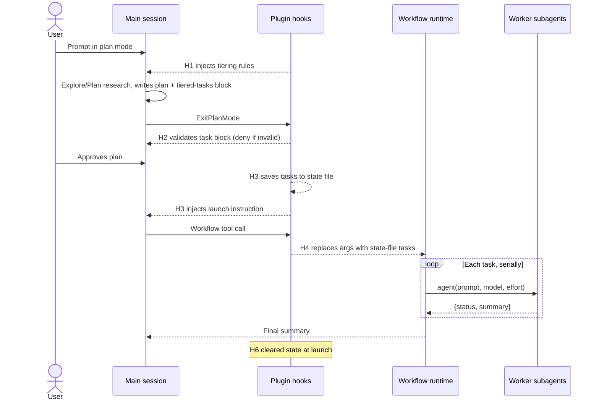

# Tiered Plan Execution — Design for Spike

Sep 25, 2026 · @Tim

## Summary and goals

A Claude Code plugin that turns an approved plan-mode plan into serial subagent execution, each task at the model and effort chosen during planning. Planning uses built-in plan mode unchanged. Execution runs as a saved plugin workflow, and hooks make the hand-off automatic.

**Goals**

- **Seamless:** plan, approve, watch. No commands to type after approval.
- **Cheaper than Orcastrat:** orchestration runs as code, not model turns, and each task runs on the cheapest adequate model and effort.
- **Deterministic:** task order, tiers and prompts come from the approved plan, never from a model recalling them.
- **Built-in first:** plan mode, the Explore and Plan subagents, `ExitPlanMode` approval, and the workflow runtime.

**Non-goals**

- Parallel task execution. Tasks run one at a time.
- Approval gates between tasks. The workflow runtime cannot pause for user input mid-run.
- Nested subagents. Workers cannot spawn workers.
- A dependency on `opusplan`. The session model only matters for planning.

## End-to-end flow

The user's experience is unchanged from plain plan mode: plan, approve, watch. Hooks H1–H6 are specified in the hook section below.



1. **Planning.** In plan mode, H1 injects the tiering rules. The model plans normally, including built-in Explore and Plan research, and ends the plan with a `json tiered-tasks` block.
2. **Gate.** H2 blocks `ExitPlanMode` until the task block parses and validates, so an invalid plan never reaches approval.
3. **Hand-off.** After approval, H3 saves the parsed tasks to a state file and tells the main thread to launch the workflow. H5 blocks main-thread edits and early stops until it does.
4. **Execution.** H4 rewrites the Workflow call so `args` holds the approved tasks. The script runs each task at its tagged model and effort, and halts on the first failure.
5. **Completion.** H6 clears the state file as soon as the workflow launches, and the session returns to normal. The workflow reports one summary when it finishes.

## Plugin layout

Everything ships in one plugin, so installing it is the entire setup. Plugin name `tiered` is a placeholder.

```
tiered/
  .claude-plugin/plugin.json
  agents/
    worker.md                  # worker definition (see Workflow and worker)
  workflows/
    execute-plan.js            # runs as /tiered:execute-plan
  hooks/
    hooks.json                 # H1–H6 registrations
  scripts/
    h1-plan-rules.js
    h2-gate-exit-plan.js
    h3-post-approval.js
    h4-rewrite-workflow-args.js
    h5-guard.js
    h6-cleanup.js
    lib/state.js               # state file read/write keyed by session_id
    lib/tasks.js               # extract + validate the tiered-tasks block
  rules/
    tiering.md                 # text H1 injects: tier criteria, allowed pairs, block format
```

| Component | Kind | Role |
| --- | --- | --- |
| `tiering.md` | Injected text | Tier criteria, allowed model/effort pairs, required task-block format |
| H1–H6 | Plugin hooks | Inject rules, gate the plan, hand off, rewrite args, guard, clean up |
| `execute-plan.js` | Saved workflow | Serial dispatcher; halts on first failure |
| `worker.md` | Subagent | Executes one task; cannot spawn agents |
| `lib/tasks.js` | Hook library | Single parser and validator used by H2 and H3 |

Hook scripts run under `node` in exec form (`command: "node"`, `args: ["${CLAUDE_PLUGIN_ROOT}/scripts/…"]`), which works the same on Windows, macOS and Linux. All paths are absolute, built from `${CLAUDE_PLUGIN_ROOT}`, `${CLAUDE_PLUGIN_DATA}` or the hook input's `cwd`.

## Data contracts

The plan carries the tasks as JSON text; everything downstream carries them as a parsed object. `lib/tasks.js` is the only code that parses the text.

### Task block (written by the planner, inside the plan markdown)

The plan must end with exactly one fenced block tagged `json tiered-tasks`:

````markdown
## Tasks

```json tiered-tasks
{
  "tasks": [
    {
      "id": "T01",
      "title": "Add IClock abstraction",
      "model": "haiku",
      "effort": "low",
      "prompt": "Re-read CLAUDE.md, AGENTS.md and docs/spec.md. Then: … Verify: dotnet build succeeds."
    }
  ]
}
```
````

| Field | Type | Rule |
| --- | --- | --- |
| `id` | string | Unique, `T` + two digits, in execution order |
| `title` | string | One line, shown as the workflow phase title |
| `model` | string | `haiku`, `sonnet`, `opus` or `fable` |
| `effort` | string | `low`, `medium`, `high`, `xhigh` or `max`; pair must be on the allowed list |
| `prompt` | string | Self-contained; starts by re-reading CLAUDE.md/AGENTS.md and the spec; ends with a verify step |

The allowed model/effort pairs live in `tiering.md` and `lib/tasks.js`. Haiku 4.5 is not in the model-config effort table, so Haiku tasks may be limited to one effort value pending probe P7.

### State file (written by hooks)

Path: `${CLAUDE_PLUGIN_DATA}/sessions/<session_id>.json`, outside the repo.

```json
{
  "phase": "approved",
  "tasks": [ … parsed task objects … ],
  "approvedAt": "2026-09-25T14:03:00Z"
}
```

| `phase` | Set by | Meaning |
| --- | --- | --- |
| `approved` | H3 | Plan approved; workflow not yet launched. Guards active |
| `launched` | H4 | Workflow call made; guards stand down |
| (file absent) | H6 | Idle; no guards |

The timestamp is written by the hook, never by the workflow script, because the runtime throws on `Date.now()`.

## Hook specifications

Six hooks carry the design: two shape planning, four enforce the hand-off. Hooks run outside plan mode's write restriction, which applies only to the model's own tool calls.

| ID | Event | Matcher | Active when | Behavior | Output |
| --- | --- | --- | --- | --- | --- |
| H1 | `UserPromptSubmit` | none | `permission_mode == "plan"` | Inject `tiering.md` | Plain stdout (added as context) |
| H2 | `PreToolUse` | `ExitPlanMode` | Always | Extract + validate the `tiered-tasks` block from the plan text | Deny with reason on failure; silent on success |
| H3 | `PostToolUse` | `ExitPlanMode` | Always | Write state file (`phase: approved`) with parsed tasks | `additionalContext`: launch `/tiered:execute-plan` |
| H4 | `PreToolUse` | `Workflow` | State `approved` | Replace input with original input + `args: {tasks}`; set `phase: launched` | `updatedInput` (full input) |
| H5a | `PreToolUse` | `Edit\|Write\|Bash\|PowerShell` | State `approved`, no `agent_id` | Block main-thread work | Deny: "Launch /tiered:execute-plan first" |
| H5b | `Stop` | none | State `approved` | Block stopping before launch | Block with the same reason |
| H6 | `PostToolUse` / `PostToolUseFailure` | `Workflow` | State `launched` | Success: delete state file. Failure: revert to `approved` | None |

**Rules that apply to every hook**

- `updatedInput` replaces the whole tool input rather than merging, so H4 spreads the original `tool_input` and overrides only `args`.
- H5b checks `stop_hook_active` and allows the stop on a second consecutive block, so a stuck session cannot loop forever.
- H2 reads `tool_input.plan`; if the field is absent, it reads the plan file named in the input instead (probe P2).
- Every hook exits 0 and does nothing when its state precondition is not met. Only H2, H5a and H5b ever block.
- Guards (H5a, H5b) stand down at launch, not at workflow completion, because the workflow runs in the background and the main thread is idle while it runs.

## Workflow and worker

The workflow is a fixed dispatcher: it loops over `args.tasks` in order and stops at the first failure. It never parses plan text.

### `workflows/execute-plan.js`

```javascript
export const meta = {
  name: 'execute-plan',
  description: 'Execute an approved tiered plan, one task at a time',
}

const input = typeof args === 'string' ? JSON.parse(args) : args   // fallback if P5 shows a string
const tasks = input?.tasks
if (!Array.isArray(tasks) || tasks.length === 0) {
  return { status: 'error', message: 'Expected args.tasks to be a non-empty array' }
}

const resultSchema = {
  type: 'object',
  required: ['status', 'summary'],
  properties: {
    status: { type: 'string', enum: ['done', 'failed'] },
    summary: { type: 'string' },
    filesChanged: { type: 'array', items: { type: 'string' } },
  },
}

const results = []
for (const task of tasks) {
  phase(`${task.id}: ${task.title}`)
  const result = await agent(task.prompt, {
    label: task.id,
    model: task.model,
    effort: task.effort,            // option name unverified: P6
    agentType: 'tiered:worker',     // option name unverified: P6
    schema: resultSchema,
  })
  results.push({ id: task.id, ...(result ?? { status: 'stopped' }) })
  if (!result || result.status !== 'done') {
    log(`Halting at ${task.id}`)
    return { status: 'halted', at: task.id, results }
  }
}
return { status: 'complete', results }
```

If P6 shows `effort` cannot be passed per call, the fallback is one worker definition per effort level (`worker-low` … `worker-max`) with `effort` in frontmatter, selected through the agent-type option.

### `agents/worker.md`

```markdown
---
name: worker
description: Executes one task from an approved tiered plan. Used only by the execute-plan workflow.
disallowedTools: Agent
---

You execute exactly one task. Before anything else, re-read CLAUDE.md,
AGENTS.md and the spec named in the task. Do only what the task says;
make no design decisions. Run the task's verify step. Report status
"done" only if verification passed; otherwise "failed" with the reason.
```

The worker sets no `model` or `effort`, so the values the script passes decide them. `disallowedTools: Agent` blocks nesting, and plugin agents honor that field.

## Verified vs unverified

Nine facts the design relies on are documented; seven are not and each maps to a spike probe. Official docs were read on 2026-09-25.

**Verified**

| Fact | Source |
| --- | --- |
| Subagent frontmatter supports `model` and `effort`; frontmatter effort overrides session effort | [Sub-agents](https://code.claude.com/docs/en/sub-agents) |
| Plugin agents ignore only `hooks`, `mcpServers`, `permissionMode` (and `initialPrompt`); `disallowedTools` is honored | [Sub-agents](https://code.claude.com/docs/en/sub-agents) |
| `CLAUDE_CODE_EFFORT_LEVEL` beats frontmatter effort; unsupported levels clamp down to the highest supported | [Model configuration](https://code.claude.com/docs/en/model-config) |
| A model the workflow script names for a stage counts as the per-invocation model | [Workflows](https://code.claude.com/docs/en/workflows) |
| Saved workflows ship in a plugin `workflows/` dir and run as `/plugin:name`; `args` arrives as structured data when Claude passes it | [Workflows](https://code.claude.com/docs/en/workflows) |
| Workflow scripts cannot read files, use `import()`, `Date.now()` or `Math.random()`, or pause for input | [Workflows](https://code.claude.com/docs/en/workflows) |
| Plugins can ship hooks in `hooks/hooks.json`; hook input includes `session_id`, `cwd`, and `agent_id` inside subagents | [Hooks reference](https://code.claude.com/docs/en/hooks) |
| `additionalContext` is injected as a system reminder; `UserPromptSubmit` plain stdout becomes context | [Hooks reference](https://code.claude.com/docs/en/hooks) |
| `updatedInput` replaces the whole tool input; hooks must spread the original | [Issue #30770](https://github.com/anthropics/claude-code/issues/30770) |

**Unverified (each is a probe)**

| Assumption | Why uncertain | Probe |
| --- | --- | --- |
| `UserPromptSubmit` input includes `permission_mode` | Docs say not every event receives it | P1 |
| `PreToolUse`/`PostToolUse` fire for `ExitPlanMode`; plan text is in `tool_input.plan` | [Issue #21282](https://github.com/anthropics/claude-code/issues/21282) said no; [Plannotator](https://plannotator.ai/docs/guides/claude-code) shows `PermissionRequest` works | P2 |
| First request after approval sees H3's `additionalContext` | Timing undocumented | P3 |
| Workflow tool fires `PreToolUse`; its input field names | Tool input schema not retrievable from the SDK reference | P4 |
| Hook-supplied `args` reach the script as an object | Docs cover Claude-passed args only | P5 |
| `agent()` accepts per-call `effort` and agent type, and effort is applied | Option names undocumented; [Issue #85416](https://github.com/anthropics/claude-code/issues/85416) questions background effort | P6 |
| Haiku accepts an effort value | Haiku absent from the effort-support table | P7 |

## Spike plan

One throwaway plugin, `tiered-probe`, answers all seven probes in two runs: one plan-and-approve cycle (P1–P5) and one workflow run (P6–P7). Every probe hook appends its raw stdin to `${CLAUDE_PLUGIN_DATA}/probe.log` before doing anything else.

| Probe | Setup | Pass | Fallback if it fails |
| --- | --- | --- | --- |
| P1 | `UserPromptSubmit` hook logs stdin; prompt once in plan mode, once out | `permission_mode` present and correct both times | Inject rules unconditionally, worded "when writing a plan…" |
| P2 | `PreToolUse` + `PostToolUse` on `ExitPlanMode` log stdin; `PreToolUse` denies once | Both fire; plan text present; deny makes the model revise | `PermissionRequest` hook on `ExitPlanMode` (Plannotator's route) |
| P3 | `PostToolUse` on `ExitPlanMode` returns `additionalContext` with a marker word | First response after approval echoes the marker | `PostModelSwitch` injection, or H5b `Stop` block as the only trigger |
| P4 | `PreToolUse` on `Workflow` logs stdin | Hook fires; log shows the input field names | Redesign H4 around what the log shows |
| P5 | Same hook returns `updatedInput` = original input + `args: {tasks:[{id:"T01"}]}`; script logs `typeof args` | `/workflows` shows `object` and the test data | Script's `JSON.parse` fallback line |
| P6 | Run `/workflow-authoring`; script calls `agent()` with per-call `effort: "low"` and the worker type | Reference lists the options; agent detail or `/tasks` reports `low` | Per-effort worker definitions selected by agent type |
| P7 | Same, with `model: "haiku"` and each effort value | Reported effort matches or clamps predictably | Restrict Haiku tasks to one effort value in the allowed pairs |

**Exit criteria.** The spike succeeds when one real plan (at least 3 tasks across 2 tiers) goes from plan mode to completed execution with no typed commands after approval, and `/workflows` shows each task at its tagged model and effort.

**Environment for the spike**

- [ ] Claude Code v2.1.271 or later (newest features referenced here)
- [ ] `CLAUDE_CODE_EFFORT_LEVEL` unset
- [ ] `CLAUDE_CODE_SUBAGENT_MODEL_FORCE` unset
- [ ] Dynamic workflows enabled (`/config`)
- [ ] Session started in a trusted folder

## Risks and open decisions

The largest risk is P5/P6: if hook-set `args` or per-call effort fail, execution falls back to per-effort worker files or to the hook-driven dispatch loop.

| Risk | Impact | Mitigation |
| --- | --- | --- |
| Workflows are a research-preview feature | Behavior or API changes between versions | Pin a tested Claude Code version; keep the probe plugin to re-verify after upgrades |
| First workflow run in a project shows an approval prompt | One extra click per project | Choose "don't ask again" (offered for plugin workflows) |
| Auto mode doesn't treat script prompts as user requests | Workers stall on permission prompts | Allow rules for the tools workers need |
| Failure mid-run reruns later tasks on relaunch | Wasted tokens | Halt on first failure; fix, then relaunch (completed tasks replay from cache) |
| Background `effort` may not apply ([#85416](https://github.com/anthropics/claude-code/issues/85416)) | Tasks run at session effort | P6 verifies; fallback per-effort workers |
| Long plans make approval slow to read | Review fatigue | Prose summary on top; full instructions only in task `prompt` fields |

**Fallback architecture.** If the workflow path fails P4–P6, the design switches to hook-driven dispatch: the main thread calls the Agent tool once per task, a `PreToolUse` hook rewrites each call to the next pending task, `SubagentStop` records results, and `Stop` keeps the loop moving. Planning hooks (H1–H3) are unchanged.

**Open decisions**

- [ ] Session model for planning: Opus (default) or Fable for harder plans
- [ ] Allowed model/effort pairs, including whether Haiku gets an effort value
- [ ] Final plugin name and whether it ships in the claude-plugins marketplace
