# tierminator reference

A complete description of what the `tierminator` plugin does and how each part works. The user-facing
quick start is the plugin's own [README](../../plugins/tierminator/README.md). The design history is in
[`tierminator-spike-spec.md`](tierminator-spike-spec.md), and the measurements behind the design are in
the findings docs listed under [Evidence](#evidence).

Tested on Claude Code 2.1.283 (Windows).

## Contents

- [What it is](#what-it-is)
- [Requirements and installation](#requirements-and-installation)
- [Commands](#commands)
- [The lifecycle of a plan](#the-lifecycle-of-a-plan)
- [The task block](#the-task-block)
- [Model and effort tiers](#model-and-effort-tiers)
- [Opting out of tiering](#opting-out-of-tiering)
- [The hooks](#the-hooks)
- [The run](#the-run)
- [Executing a saved plan](#executing-a-saved-plan)
- [Unattended runs](#unattended-runs)
- [Spend telemetry](#spend-telemetry)
- [The sizing review](#the-sizing-review)
- [Session state](#session-state)
- [The tier agents](#the-tier-agents)
- [Permission modes](#permission-modes)
- [Failure handling and safety rules](#failure-handling-and-safety-rules)
- [Configuration and environment](#configuration-and-environment)
- [Plugin layout](#plugin-layout)
- [Testing](#testing)
- [Limitations and non-goals](#limitations-and-non-goals)
- [Troubleshooting](#troubleshooting)
- [Evidence](#evidence)
- [Planned changes](#planned-changes)

## What it is

tierminator turns an approved plan-mode plan into serial subagent execution. Each task in the plan runs
as its own subagent, one at a time, on the model and effort chosen for it while planning, and commits its
own work.

The plugin does nothing until the user types `/tierminator:plan <request>` or `/tierminator:execute`
(see [Commands](#commands)). After `/tierminator:plan`, the user's experience is plain plan mode: plan,
approve, watch. The plugin adds four things:

1. **Tiering rules while planning.** In plan mode, Claude is told to end the plan with a machine-readable
   task list, with a model, an effort and a self-contained prompt for each task.
2. **A gate on approval.** A plan whose task list is missing or invalid, or that is planned in a dirty
   Git working tree, cannot be approved. Claude sees the problems and fixes them (or tells the user), so
   the user never sees a plan that cannot run.
3. **Automatic hand-off.** After approval, Claude is given the exact Agent call for each task in turn and
   dispatches it. Hooks refuse any other dispatch. Nothing is typed after approval.
4. **Commits and retries.** Each task is one commit. A failed attempt is reset to the commit before it and
   retried one tier up, twice at most, and then the run stops.

### Design goals

| Goal | How it is met |
|---|---|
| **Seamless** | Built-in plan mode is unchanged; hooks do the hand-off. No command to type after approval. |
| **Cheap** | Each task runs on the cheapest tier expected to succeed first time. Orchestration costs one short Agent call and one short report per task attempt in the main session. |
| **Deterministic** | Task order, tier and prompt come from the tasks file named in the approved plan, checked against its hash. Workers read their prompt from that file; no model recalls or retypes a task. Hooks check every dispatch and every result. |
| **Recoverable** | Every finished task is a commit with `Tierminator-Task:` and `Tierminator-Plan:` lines, and a failed attempt is reset to the commit before it. A run that stopped, or whose session ended, can be picked up again with `/tierminator:execute`, skipping the tasks already committed. |
| **Built-in first** | Plan mode, `ExitPlanMode` approval, the Agent tool and plugin agents are all Claude Code's own. |

### Why not a workflow

Earlier versions ran the tasks in a dynamic workflow. Claude Code shows every workflow agent the user's
latest typed prompt as a request that overrides its task, and plan-dialog feedback is never relayed, so a
task changed through that feedback was refused. Subagents started with the Agent tool get no such
frame, and hooks can check each dispatch and read each report
([`tierminator-agent-dispatch-findings.md`](tierminator-agent-dispatch-findings.md)). So the tasks now
run through plugin agents, one per tier, the way
[Orchestratinator](../../plugins/orchestratinator/README.md) runs its workers.

## Requirements and installation

- **Node 20 or later** on the `PATH`. Every hook is a Node script.
- **Git.** A tiered plan must be planned and run in a Git repository that has at least one commit, a
  commit identity (`user.name` and `user.email`, from any config level) and a clean working tree. An
  opted-out plan has no such requirement.
- For the tested behavior, `CLAUDE_CODE_EFFORT_LEVEL` and `CLAUDE_CODE_SUBAGENT_MODEL_FORCE` should be
  unset. Either would override the agents' effort or model.

Install from the marketplace:

```bash
claude plugin marketplace add timschreiber/claude-plugins
claude plugin install tierminator@timschreiber
```

Or load it from a checkout of this repo, without installing:

```powershell
claude --plugin-dir ./plugins/tierminator
# after editing plugin files:
/reload-plugins
```

The plugin's state is one JSON file per session under the plugin's data directory, plus an activation flag
beside it (see [Session state](#session-state)). It also writes a tasks file next to each approved plan's
file, and shortens that plan file (see [The tasks file](#the-tasks-file)). The only changes to the
project are the tasks' own commits.

## Commands

Installing the plugin changes nothing on its own. Every session starts **inactive**, and in an inactive
session every hook returns at once without output (H1 still handles the two commands below), so Claude
Code behaves as if the plugin were not installed. The plugin can therefore stay installed everywhere. A
plan made in plan mode without `/tierminator:plan` is not tiered.

| Command | Effect |
|---|---|
| `/tierminator:plan <request>` | Starts planning the request as tiered tasks. Interactively: checks the working directory with `git.problem()`, the same check H2 makes (see [H2](#h2-gate)); if it passes, makes the session **active** (writes `sessions/<session_id>.active` beside the state file) and saves the `planning` phase. Typed in plan mode, it adds the tiering rules at once. Typed outside plan mode, the note asks Claude to call `EnterPlanMode`, loading it with ToolSearch first if it is deferred; the rules then come from H1's `enter` mode. Approving the plan runs it (H3). In a headless session it starts [an unattended run](#unattended-runs) instead. |
| `/tierminator:execute [plan path \| list number] [--from Txx]` | Runs a saved plan (see [Executing a saved plan](#executing-a-saved-plan)). With no arguments, lists recent plans. |

Either command first ends whatever the session was doing: a run in progress stops (as for a typed prompt,
below), and the session is made inactive before the command starts anew.

**How tierminator's part ends.** The session is made inactive, and its state removed, when:

- the user leaves plan mode without approving: the next prompt typed outside plan mode while planning
  ends it, silently;
- the approved plan does not start a run (it opts out, its tasks cannot be loaded, it is invalid after the
  denial cap, or the repository cannot run it);
- the user types any prompt during a run: the run stops, nothing more is dispatched, and Claude is told
  which tasks are done, which are not, and that `/tierminator:execute "<plan file>"` resumes it;
- the user types any prompt after a run has ended (`complete`, `halted` or `abandoned`), silently;
- the session ends (H6).

A run resumes only through `/tierminator:execute`. A worker still running when a run is stopped finishes,
but H4 no longer judges it: whatever it commits or leaves in the working tree stays. `/clear` starts a new
session id, and so an inactive session; flags left behind are pruned after 7 days.

**Why Claude switches the mode, not the hook.** A hook can set the permission mode only while answering a
permission prompt (`updatedPermissions` `setMode` on `PermissionRequest`), and none is pending when the
command is typed. Skill frontmatter has no mode key. Whether `EnterPlanMode` asks the user to approve is
not documented; the run guide records it.

Both are skills in [`skills/`](../../plugins/tierminator/skills/) (`plan` and `execute`) with
`disable-model-invocation: true`, so only the user can run them. **H1 does the work**, not the skill:
`UserPromptSubmit` receives the raw typed text (measured; see [Evidence](#evidence)), and H1 matches
`/tierminator:plan` or `/tierminator:execute` at the start of the prompt. It does the work and prints a
note starting with `tierminator:`. The `plan` skill's body tells Claude to follow the note (call
`EnterPlanMode` if asked, or report a refusal in its words) and gives it the request through
`$ARGUMENTS`; the `execute` skill's body tells Claude to do what the note says and nothing more. With no
note, Claude says tierminator did not respond and neither plans nor runs anything.

The `/tierminator:plan` notes (interactive):

| Situation | Note |
|---|---|
| No request after the command | `tierminator: planning was not started: /tierminator:plan needs a request, …` Nothing is activated. |
| The repository cannot run a plan | `tierminator: planning was not started: <reason>. …` Git is missing, the directory is not a repository or has no commit, Git has no user name and email, or the tree has uncommitted changes. Claude tells the user what to fix and to type `/tierminator:plan` again. Nothing is activated. |
| The flag or the state could not be written | `tierminator: planning was not started: …` The session stays inactive. |
| Planning started, in plan mode | `tierminator: planning started. …`, then the rules |
| Planning started, outside plan mode | `tierminator: planning started. …` and a request to call `EnterPlanMode` now |
| A run was in progress | The run's stop note (done, not done, the resume command) comes first, then the note above |

## The lifecycle of a plan

```mermaid
sequenceDiagram
    actor U as User
    participant M as Main session
    participant H as Plugin hooks
    participant A as Tier agent
    U->>M: /tierminator:plan <request>
    H-->>M: H1 activates the session and asks for plan mode
    M->>M: EnterPlanMode
    H-->>M: H1 adds the tiering rules
    M->>M: Explores, writes the plan and its tiered-tasks block
    M->>H: ExitPlanMode
    H-->>M: H2 checks the block and the Git tree (deny with reasons)
    H-->>H: H2 moves the block to the tasks file, leaves a table
    U->>M: Approves the plan (with the table)
    H-->>M: H3 starts the run and gives the first dispatch
    loop Each task, in order
        M->>H: Agent(tierminator:<tier>, pointer prompt)
        H-->>H: H4 pre checks the dispatch, records HEAD
        H-->>M: H4 post: the task runs in the background; end the turn
        H->>A: The worker reads its task, does it, runs Verify, commits
        A-->>H: SubagentStop: H4 checks the commit and moves the run on (notice saved)
        A-->>M: The report arrives as a prompt
        H-->>M: H1 gives the notice: next task, retry after a reset, or stop
    end
    H-->>M: All tasks done (or the run stopped)
```

0. **The command.** The user types `/tierminator:plan` and the request. H1 checks the repository,
   activates the session in the `planning` phase, and asks Claude to enter plan mode (or, already there,
   adds the rules). Without the command, none of what follows happens.
1. **Planning.** In plan mode, H1 adds the rules in [`rules/tiering.md`](../../plugins/tierminator/rules/tiering.md)
   to the conversation. Claude plans as usual, including any Explore or Plan research, and ends the plan
   with a `## Tasks` section holding one `json tiered-tasks` block.
2. **Gate.** When Claude calls `ExitPlanMode`, H2 reads the plan file and validates the block. If it is
   invalid, the call is denied with every problem listed, and Claude fixes the plan file and calls
   `ExitPlanMode` again. If the directory is not a Git repository, has no commit identity or has
   uncommitted changes, the call is denied and Claude tells the user. Once both are fine, H2 moves the block to the tasks file and puts a
   table of the tasks in its place, because the approval dialog cannot show a plan with very long lines.
3. **Approval.** The user reads the plan, with the table, and approves it. The prompts are in the tasks
   file the table names. A rejected plan triggers nothing: Claude revises it and offers it again. Leaving
   plan mode without approving ends tierminator's part.
4. **Hand-off.** H3 starts the run as `/tierminator:execute` would (`executePlan()` in `lib/execute.js`):
   it loads the tasks from the tasks file, saves a `running` state, and gives Claude the exact Agent call
   for the first task.
5. **The run.** Claude makes that call. H4 checks it. In an interactive session the worker runs in the
   background, so Claude ends its turn. The worker does its task and commits. When it stops, H4 checks the
   result and moves the run on, and when the worker's report arrives, H1 gives Claude the next call: the
   next task, a retry one tier up after a reset, or the end of the run. See [The run](#the-run).
6. **The end.** The run completes or halts. The next prompt the user types makes the session inactive,
   and H6 deletes the session's state file and its activation flag when the session ends.

## The task block

The plan must end with a `## Tasks` section holding **exactly one** fenced block whose info string is
`json tiered-tasks`:

````markdown
## Tasks

```json tiered-tasks
{
  "tasks": [
    {
      "id": "T01",
      "title": "Add the IClock abstraction",
      "model": "sonnet",
      "effort": "medium",
      "prompt": "Read docs/spec.md section 3. Create src/IClock.cs with ... Verify: dotnet build succeeds and dotnet test --filter ClockTests passes."
    }
  ]
}
```
````

The block is what gets executed. The prose above it is for the user to read and judge, so the two must
agree.

### Fields

Every task has exactly these five keys, all strings. Any other key is an error.

| Field | Rule |
|---|---|
| `id` | `T01`, `T02`, ... matching the task's position: the first task must be `T01`, the second `T02`, with no gaps. |
| `title` | One non-empty line, at most 100 characters. Used as the task's commit message and in its dispatch description. |
| `model` | `sonnet` or `opus`. |
| `effort` | `low`, `medium` or `high` for `sonnet`; `medium` or `high` for `opus`. `sonnet` / `xhigh` and `opus` / `low` are accepted as aliases for `opus` / `medium`, and `opus` / `xhigh` for `opus` / `high`. |
| `prompt` | Non-empty and contains the text `Verify:`. |

### Whole-block rules

- The block must be a JSON object of the form `{"tasks": [...]}` with a non-empty `tasks` array.
- At most 99 tasks.
- Exactly one `json tiered-tasks` block in the plan. Two or more is an error.
- The block and the opt-out line (below) cannot both appear.
- Invalid JSON is an error that includes the parser's message.

### How the block is found

[`lib/tasks.js`](../../plugins/tierminator/scripts/lib/tasks.js) is the only code that reads or rewrites
plan text. H2 and H3 reach its `parsePlan()` through `resolvePlan()` in
[`lib/sidecar.js`](../../plugins/tierminator/scripts/lib/sidecar.js), which also loads the tasks file. It
scans the plan line by line and tracks fenced code blocks, so:

- Backtick and tilde fences both work, with up to three spaces of indentation, and a fence closes only on
  a matching character with at least the opening length.
- A `json tiered-tasks` fence quoted inside another fence (as an example, like the one in this document)
  is content, not a block.
- A fence with any other info string (for example plain `json`) is not a task block.
- CRLF and LF line endings are both handled.
- The tasks it returns carry only the five known keys.

Validation collects **every** problem before returning, so Claude can fix them all in one pass. Error
messages name the task and field and list the allowed values, for example
`T03.effort: "max" is not allowed for opus; use medium or high`.

### The tasks file

The approval dialog withholds a plan that has one very long line: a line of 4,500 characters was
withheld, while a 21 KB plan with short lines was shown (see
[`tierminator-dialog-findings.md`](tierminator-dialog-findings.md)). Each task's prompt is a single JSON
line, so a long prompt would make the plan impossible to approve. The dialog reads the plan file after
H2 runs, so H2 shortens the file first.

When the block is valid and H2 read it from the plan file, H2:

1. Writes the block's body, exactly as Claude wrote it, to `<plan>.tasks.json` next to the plan file
   (`brave-fox.md` gives `brave-fox.tasks.json`).
2. Replaces the block, fence lines included, with a generated section, and removes any earlier one. The
   plan keeps its line endings.

```text
<!-- tierminator:tasks -->
Tasks file: `C:\Users\me\.claude\plans\brave-fox.tasks.json` (sha256 `0123456789abcdef`)

| ID | Title | Model | Effort | Prompt |
|---|---|---|---|---|
| T01 | Add the IClock abstraction | sonnet | medium | 412 chars |

Open the tasks file to read each prompt before approving.
<!-- /tierminator:tasks -->
```

The hash is the first 16 hex characters of the tasks file's sha256. A plan with this section and no block
is loaded from the tasks file. That works only if the file still matches the hash, and the section is
exactly the one H2 would write for those tasks (trailing spaces and line endings aside). The hash proves
the file is unchanged, and the second check proves the table does: without it, a table edited by hand (a
new title, another model) would be approved while the old tasks ran.

| Situation | Result |
|---|---|
| The tasks file matches its hash, validates, and matches the table | The plan is valid, with the tasks from the file. A resubmitted plan passes H2 unchanged. |
| The tasks file is missing, changed, or invalid, or the table was edited | H2 denies and tells Claude to write the complete block again in place of the table. H3 runs nothing. |
| Two sections, a section with no `Tasks file:` line, or a section with the opt-out line | An error, handled the same way. |
| A new block and an old section | The block wins. H2 moves it and removes the old section. |

To change the tasks after the user rejects the plan, Claude writes a complete new block under `## Tasks`.
Neither Claude nor the user should edit the table or the tasks file by hand. The tasks files are not
deleted, so each one remains a record of what ran. The workers read their prompts from this file during
the run.

### Writing task prompts

A worker sees only its own prompt and the repository. It never sees the plan or the conversation, though
it does get the project's `CLAUDE.md` automatically. The rules therefore tell Claude to make each prompt:

- Name the files and spec sections to read first, including `AGENTS.md` or a spec if the project has one.
- State exact names, signatures, behavior and error handling, and name the tests with their cases, so no
  design decision is left to the worker.
- For a find-and-replace task, make the prompt a list of `(file, old_str, new_str)` triples, not prose
  describing the changes, followed by the `Verify:` step.
- Cover one coherent piece of work, roughly one commit, touching a few files.
- End with a `Verify:` step: a command or check that fails if the task is incomplete, such as a build, a
  named test run or a grep for the expected change. The task is committed only when it passes.
- Leave out commit steps: the worker commits the task itself.

A task can depend only on earlier tasks, so tasks are ordered accordingly.

## Model and effort tiers

Five tiers are allowed. Each is also the name of the agent that runs it, `tierminator:<model>-<effort>`.
The rules tell Claude to favor the smallest model and effort that will get the job done:

1. Pick the model by the kind of work: `sonnet` for fully specified work, `opus` for work that needs
   judgment or is too intricate and wide for `sonnet`.
2. Start at `medium` effort, the baseline for both models. For `sonnet`, lower it for a task that is
   easier or simpler than the baseline, and raise it for one that is harder or more complex. For `opus`,
   raise it to `high` for the hardest work; `opus` has no lower effort.
3. Past `sonnet` / `high`, go to `opus` / `medium`: `sonnet` stops at `high`, and `opus` starts at
   `medium`.

A failed task is reset and retried one tier up, so a tier that is slightly too small usually costs less
than one that is too big.

| Tier | Use for |
|---|---|
| `sonnet` / `low` | Easier than the baseline: fully given work, such as literal find-and-replace pairs, a new file whose exact content is in the prompt, or a rename whose complete set of references the planner has checked. Full rules below. |
| `sonnet` / `medium` | **The baseline.** Fully specified work: names, signatures, behavior and test cases are all in the prompt. |
| `sonnet` / `high` | Harder than the baseline: fully specified but intricate work, such as parsers, state machines, numeric code, many edge cases, including interacting edge cases across several files. |
| `opus` / `medium` | **The baseline for judgment work.** Judgment the plan cannot pin down: a well-defined change in unfamiliar code that the prompt cannot fully describe, unfamiliar library internals, poorly documented APIs, debugging a known failure. |
| `opus` / `high` | Rare: the hardest bounded work, such as a failure of unknown cause across components, subtle cross-cutting changes, concurrency correctness, algorithmic subtleties or security-critical logic. |

If more than about one task in ten is `opus` / `high`, the rules treat the plan as
under-specified: the design decisions belong in planning, with the answers written into the prompts.

**Why these five.** On Anthropic's Sonnet 5.5 launch charts (Terminal-Bench 4.0, FrontierCode 1.1 and
CursorBench 4.0), Sonnet 5.5 at `high` scores above Opus 5.5 at `low` on all three, so `opus-low` is no
step up from `sonnet-high`. Opus 5.5 at `high` scores as well as or better than Sonnet 5.5 at `xhigh` at
equal or lower cost, so Sonnet stops at `high`. Opus 5.5 at `xhigh` ties or trails `high` on two of the
three and gains 2 points on the third for about twice the cost. So `opus-low` and `opus-xhigh` were
dropped, as `sonnet-xhigh` had been against Sonnet 5. The data is Anthropic's own. See
[`tierminator-tier-findings.md`](tierminator-tier-findings.md).

**Dropped pairs are aliases.** The rules never offer them, but a plan that asks for one is not denied: the
parser replaces it with the next tier up. `sonnet` / `xhigh` and `opus` / `low` become `opus` / `medium`,
and `opus` / `xhigh` becomes `opus` / `high`, so the table in the approval dialog, the dispatch and the
retries all use the replacement. Saved tasks files are parsed the same way, so a plan saved before a pair
was dropped still runs. The aliases are in `ALIASES` in `lib/tasks.js`.

**Not allowed:** Haiku, the `max` effort, and Fable. Haiku was removed because, in the user's experience,
it does not follow instructions reliably and too often does its own thing on coding work. The published
coding results agree: 25.5 against Sonnet 5's 88.2 on Scale's SWE-Bench Pro V2, and 17 against Sonnet 5
at `low`'s 24 on the Artificial Analysis index (`planandtier-tier-research.json`).

**The retry ladder** is the table's order: `sonnet` from `low` to `high`, then `opus` at `medium` and
`high`.

The allowed tiers are defined in three places that must be kept in step: `ALLOWED` in `lib/tasks.js`,
which enforces them and derives `TIERS`, the agents in `agents/`, and `rules/tiering.md`, which tells
Claude about them. `agents.test.js` checks the first two against each other.

### `sonnet` / `low`: fully given work

Work whose result is fully written out in the prompt. There are three kinds.

**Find-and-replace.** Extremely mechanical work, expressed as one or more literal find-and-replace pairs.
For each edit, the task's prompt states the exact file, the exact existing text to match (`old_str`), and
the exact text to replace it with (`new_str`). A single task may contain multiple such pairs across one or
a few files — do not fragment mechanical work into one task per pair. Each `old_str` must include enough
surrounding context to match exactly one location in its file; the planner must verify this (e.g. by
grep) before finalizing the plan, not leave it for the worker to discover.

**A new file**, with its complete, exact content in the prompt.

**A rename.** A rename qualifies for this tier only when the planner has enumerated the complete, closed
set of reference sites — the file's own path plus every import, config entry, build script line, test
fixture, etc. that names it — and has confirmed (e.g. via a verified grep) that the set is exhaustive. The
edits may be given as replacement pairs or described. If the planner cannot be confident the set of
references is closed — dynamically constructed paths, reflection, generated code, string
interpolation, or a codebase where a plain search might miss variants — the rename is not mechanical:
it moves to `sonnet` / `medium` or higher. Either way, its `Verify:` step must do more than confirm a
build passes — it needs a check that would catch a missed reference (e.g. a repo-wide search for the old
name returning nothing outside comments/history).

Anything that needs the worker to work out code or content belongs to `sonnet` / `medium` or above.

## Opting out of tiering

For an ordinary plan, the user asks for one. Claude then puts this exact line in the plan, on its own
line and outside any code fence, with no task block:

```
Tiered execution: off
```

With that line, H2 lets the plan through without any Git check, H3 deletes the session's planning state
and makes the session inactive, and the plan is approved and carried out the ordinary way. The rules tell Claude to use the line
only when the user asks for it or the task is trivial.

A plan with neither a task block nor the opt-out line cannot be approved (until the denial cap below is
reached). The opt-out line inside a code fence does not count.

## The hooks

Six scripts under [`scripts/`](../../plugins/tierminator/scripts/), registered in
[`hooks/hooks.json`](../../plugins/tierminator/hooks/hooks.json). Each runs as
`node "${CLAUDE_PLUGIN_ROOT}/scripts/<script>.js" [mode]`.

| Hook | Event | Matcher | Script and mode | Timeout |
|---|---|---|---|---|
| H1 Rules | `UserPromptSubmit` | none | `h1-plan-rules.js` | 15 s |
| H1 Rules | `PostToolUse` | `EnterPlanMode` | `h1-plan-rules.js enter` | 15 s |
| H1 Rules | `PreCompact` | none | `h1-plan-rules.js compact` | 15 s |
| H1 Rules | `SessionStart` | `compact` | `h1-plan-rules.js session` | 15 s |
| H2 Gate | `PreToolUse` | `ExitPlanMode` | `h2-gate-exit-plan.js` | 30 s |
| H3 Hand-off | `PostToolUse` | `ExitPlanMode` | `h3-post-approval.js` | 30 s |
| H4 Dispatch | `PreToolUse` | `Agent` | `h4-dispatch.js pre` | 30 s |
| H4 Dispatch | `SubagentStop` | none | `h4-dispatch.js stop` | 15 s |
| H4 Dispatch | `PostToolUse` | `Agent` | `h4-dispatch.js post` | 60 s |
| H4 Dispatch | `PostToolUseFailure` | `Agent` | `h4-dispatch.js failure` | 60 s |
| H4 Dispatch | `PreToolUse` | `SendMessage` | `h4-dispatch.js resume-pre` | 30 s |
| H4 Dispatch | `PostToolUse` | `SendMessage` | `h4-dispatch.js resume-post` | 30 s |
| H4 Dispatch | `PostToolUseFailure` | `SendMessage` | `h4-dispatch.js resume-failure` | 60 s |
| H5 Guard | `PreToolUse` | `Edit\|Write\|NotebookEdit` | `h5-guard.js pre` | 15 s |
| H5 Guard | `Stop` | none | `h5-guard.js stop` | 15 s |
| H6 Cleanup | `SessionEnd` | none | `h6-cleanup.js end` | 15 s |

Every hook ignores calls made by subagents (any input with an `agent_id`), so workers and other agents are
never gated, guarded or given the rules. H4's `stop` mode is the exception: `SubagentStop` comes from the
subagent itself.

**Every hook is gated on activation.** Unless the session's flag exists, each hook returns without output:

| Hook | In an inactive session |
|---|---|
| H1 | Handles `/tierminator:plan` and `/tierminator:execute` only. No rules, no `enter` output, no run notes. |
| H2 | Silent: every plan goes to the dialog unchanged. It also acts only in the `planning` phase (or with no state), never during a run. |
| H3 | Silent: nothing is saved. It also acts only in the `planning` phase, so a plan-mode plan made without `/tierminator:plan` is not tiered. |
| H4 | Silent in every mode, even for `tierminator:*` agents. `SubagentStop`'s `session_id` is the main session's, so a worker still running when its run was stopped is not judged. |
| H5 | Silent. |
| H6 | Still deletes the session's state and flag at `SessionEnd`. |

### H1: rules

- On `UserPromptSubmit`, a prompt that starts with `/tierminator:plan` or `/tierminator:execute` (matched
  by `COMMAND`, `^\s*\/tierminator:(plan|execute)(?![\w-])`) first ends whatever the session was doing
  (`endRun()`: a run in progress stops, and the session is made inactive), then starts planning (see
  [Commands](#commands)) or runs a saved plan (see [Executing a saved plan](#executing-a-saved-plan)). The
  stop note, if any, comes before the command's note, and a stopped run's spend goes to the UI as
  `systemMessage`. These commands are the only thing H1 handles in an inactive session. Everything below
  needs the session active.
- The rules (the text of `rules/tiering.md`) are shown once per plan-mode stint, and the file
  `sessions/<session_id>.rules`, beside the `.active` flag, records that they were shown. They are shown on
  `/tierminator:plan` typed in plan mode, on `PostToolUse` for `EnterPlanMode` while planning (as
  `additionalContext`), and on the first prompt the user types in plan mode while planning if neither has
  happened yet. A `<task-notification>` or `<agent-message>` prompt never shows them.
- The marker is cleared by a harness prompt outside plan mode, by `PreCompact` (`h1-plan-rules.js compact`,
  since the rules are about to fall out of context), and by deactivation (which `SessionEnd` also does).
  The next plan-mode stint or prompt then shows the rules again. H2's denial of a plan with a missing or
  invalid task block appends them regardless.
- A prompt the user types (not a command, not a harness prompt) in an active session:
  - while `planning`, in plan mode: the rules once per stint, as above;
  - while `planning`, outside plan mode: the user left plan mode without approving, so the session is made
    inactive and its state removed, silently;
  - while `drafting` (headless): the unattended note again;
  - during a `running` run: the run stops. It is marked `abandoned`, its queued attempt lines and its spend
    summary go to the UI, and Claude is told which tasks are done, which are not, whether a worker is still
    running unchecked, and that the user types `/tierminator:execute "<plan file>"` to resume. The session is
    made inactive and the state removed;
  - after a run has ended, or with no state: the session is made inactive, silently.
- On `UserPromptSubmit` outside plan mode, if H4 left a **notice** (a worker finished and its attempt was
  judged), it prints the notice and clears it. The worker's report arrives as an `<agent-message>` or
  task-notification prompt, so this is how a background run moves on to its next step with nothing typed.
- The notice H4 leaves for a background worker (`noticeByNotification`) is normally given on that
  `<task-notification>` prompt, which always follows the worker's `SubagentStop`. Any other prompt gives it
  too.
- A hand-back's `<task-notification>` is transcript-only: it starts no turn and fires no `UserPromptSubmit`
  (see [the findings](tierminator-agent-dispatch-findings.md#a-hand-back-makes-the-finished-notification-transcript-only-claude-code-2285)).
  So H1 judges the hand-back itself. When an `<agent-message>` arrives while the task is still in flight,
  it first claims the attempt (see below), then takes the report from the prompt, or else from the worker's
  transcript at `subagents/agent-<id>.jsonl`, runs `settle()` from `lib/settle.js`, records the attempt's
  spend, and saves the state with the agent id in `handedBack`. It then gives Claude the notice (the next
  dispatch, a retry, a halt or the completion message) in that same turn. If H4 already judged the attempt,
  it gives that notice once and does not judge again. With no task in flight it prints nothing.
- The hand-back and the worker's `SubagentStop` (H4 `stop`) fire within about 50-100 ms of each other, in
  either order, so one hook claims each attempt and the other stands down. The claim is a file created
  exclusively beside the state, `<session_id>.<run>-<task index>-<attempt>.claim` (`state.claimAttempt()`);
  only the first hook to create it judges the attempt. When H4 claimed it first, H1 judges nothing: it
  waits up to 4 seconds, polling every 50 ms, for H4's saved state to show the attempt settled with a
  notice, then gives that notice and clears it. If none comes in time it prints nothing and leaves the state
  as it is; the notice stays flagged `noticeByNotification`, and H5 lets the turn end. A claim that cannot
  be written for any reason but an existing claim is granted, so an attempt is never left unjudged.
- A `<task-notification>` that says a worker "stopped at its N-turn limit" does start a turn, but no
  `SubagentStop` judged the worker (see
  [the findings](tierminator-agent-dispatch-findings.md#a-worker-that-reaches-its-turn-limit-claude-code-21286)).
  While a task is in flight and no resume is pending, H1 matches the notification's `<task-id>` to the
  task's recorded `agentId` (an unknown `agentId` is taken from the notification; a notification for another
  agent is ignored) and calls `onTurnLimit()` (`lib/turnlimit.js`). With resumes left it saves
  `resumePending` and tells Claude to resume the worker with `SendMessage`; otherwise the run halts (see
  [Judging an attempt](#judging-an-attempt)). Either way it speaks in that same turn, since no later event
  would.
- In a headless session, `/tierminator:plan` starts the drafting phase instead of plan mode, and the
  `SessionStart` hook re-injects the note and rules after a compaction. See
  [Unattended runs](#unattended-runs).

### H2: gate

Runs before every main-thread `ExitPlanMode` call in an active session that is planning (the `planning`
phase, or no state). During a run, or after `/tierminator:execute`, it does nothing.

1. Reads the plan from the file at `tool_input.planFilePath`. If the file is missing or empty, it falls
   back to `tool_input.plan`. The file comes first because `tool_input.plan` is whatever Claude sent and
   was measured to be stale after a retry.
2. Parses it with `resolvePlan()`. The opt-out line passes silently.
3. For a valid tiered plan, checks the Git working directory (`cwd`) with `git.problem()`, the same check
   `/tierminator:plan` makes: `git` must run (`git --version`; otherwise the reason says Git is missing, not that there
   is no repository), and the directory must be inside a repository that has a commit and a commit identity (`git var GIT_COMMITTER_IDENT` succeeds),
   with no uncommitted changes (`git status --porcelain` empty; ignored files do not count). Without an
   identity every worker's commit would fail and use up its retries, so the plan is refused up front.
   Otherwise it denies, names the problem, and tells Claude not to call `ExitPlanMode` again until the user
   has fixed it. These denials are never passed through and do not count toward the cap.
4. A valid plan read from the plan file then has its block moved to the tasks file (see
   [The tasks file](#the-tasks-file)). A plan that already has its table passes unchanged. It never rewrites
   text that came from `tool_input.plan`, so a missing plan file is never created.
5. Otherwise it denies the call with `permissionDecision: "deny"` and a reason that lists every problem,
   names the plan file to fix, and mentions the opt-out line. When the problem is the table or its tasks
   file, the reason tells Claude to write the complete block again in place of the table. If the plan has
   no block, no table and no opt-out line at all, the full rules are appended to the reason.

**Denial cap.** H2 counts its denials of invalid plans in the session state. After three, it lets the next
call through rather than spend more turns; H3 then runs the plan untiered and says so. The count is reset
when a tiered plan is approved. A denial keeps any existing state intact apart from the count.

Claude sees a denial as `PreToolUse:ExitPlanMode hook error: <reason>`. The user sees no dialog.

### H3: hand-off

Runs after a successful `ExitPlanMode`, which means the user approved the plan. A rejected plan does not
fire it. Calls from agents (`tool_response.isAgent`) are ignored. It acts only in an active session in the
`planning` phase, that is, after `/tierminator:plan`; a plan-mode plan made without it is not tiered.
Whatever happens, planning is over: unless a run started, H3 makes the session inactive and removes its
state.

It reads the approved text from the file at `tool_response.filePath`, then `tool_input.planFilePath`, then
`tool_response.plan`, then `tool_input.plan`, taking the first that is non-empty. The file comes first
because the dialog shows the file as H2 left it, and the user can edit it there. `tool_response.plan` was
measured to hold the same shortened text. It parses the text with `resolvePlan()`. Then:

| Parse result | What H3 does |
|---|---|
| Opt-out line | Ends planning (inactive, state removed) and says nothing. |
| A table that was edited, or whose tasks file is missing, changed or invalid | Ends planning and tells Claude that nothing will run: tell the user and suggest planning again, and do not implement the plan, since its prompts are not in it. |
| Invalid (only possible after H2's cap) | Ends planning and tells Claude the plan will not run as tiered tasks: tell the user, then implement the plan normally. |
| Valid | Runs the plan file with `executePlan(input, planFile, { approved: true })`, the code behind `/tierminator:execute` (see [Executing a saved plan](#executing-a-saved-plan)), and gives Claude its note as `additionalContext`. On success the note opens `tierminator: the user approved <n> tiered tasks and wants them run.` and gives the exact Agent call for the first task not already committed; a `running` state is saved and session files older than 7 days are pruned. |
| Valid, but the run did not start | The note is `executePlan()`'s refusal. For a tree that is no longer clean (or any other Git problem) it is `tierminator: the plan cannot run here: <reason>. Tell the user what to fix, then to type /tierminator:execute "<plan file>".` Planning ends. |

The plan file is `tool_response.filePath`, else `tool_input.planFilePath`. If neither is readable, H3
saves the plan text as `<session_id>.plan.md` beside the state file and runs that; if that write fails,
planning ends and Claude is told to implement the plan normally. If H2 could not write a tasks file,
`executePlan()` writes the tasks to `<plan>.tasks.json`, or else `<session_id>.tasks.json` beside the state
file, so the workers always have one to read.

### H4: dispatch

Drives [the run](#the-run). It acts only on Agent calls whose `subagent_type` starts with `tierminator:`;
other agent types are left alone.

- **`pre`** refuses, with the reason and the exact expected call, any dispatch that is not the one the run
  expects: the current task's tier agent, the expected prompt (line endings and trailing spaces aside), and
  no task already in flight. With no run in progress it refuses every tierminator dispatch. It then checks
  the tree: uncommitted changes that no task made, or a different branch from the one the run started on,
  **halt** the run at once. On a pass it records HEAD, marks the task in flight, and drops any notice not
  yet shown (it is stale once Claude has made the next dispatch).
- **`stop`** (`SubagentStop`) fires when the dispatched worker finishes, in the foreground or the
  background. It reads the report from `last_assistant_message` if that holds a STATUS block; otherwise it
  searches the worker's transcript (`agent_transcript_path`), newest first, in the `message` of a
  `SubagentHandback` call and then in assistant text. A worker often hands its report back with that tool
  and then ends with a line such as "Task complete.", so its last message is not reliably the report. It
  then judges the attempt (see [Judging an attempt](#judging-an-attempt)), moves the run on, and saves what
  Claude must be told next as the state's `notice`. It also records the attempt's tokens and cost, and queues
  the line H5 shows the user (see [Spend telemetry](#spend-telemetry)). Before judging, it claims the
  attempt: the hand-back (H1) and `SubagentStop` of one attempt arrive close together, so one hook claims
  each attempt and the other stands down (see [H1](#h1-rules)). When H1 claimed it first, `stop` returns
  without writing the state. It also ignores an agent listed in the state's `handedBack`: H1 already judged
  that worker's hand-back, and the run's next task may be in flight.
  The defensive rule: when no report can be found and the worker's transcript holds at least the tier's
  `maxTurns` messages, `stop` judges nothing and claims nothing. It records `turnLimited: {turns}` and the `agentId` and leaves
  the resume to H1 or `post`. The findings measured no `SubagentStop` at a turn limit, so this only keeps a
  stop that does fire from becoming a failed attempt and a reset.
- **`post`** (`PostToolUse`) fires when Claude's Agent call returns. If a notice is waiting, the worker
  already finished (a foreground run, as in a headless session): it gives Claude the notice as
  `additionalContext` and clears it. Otherwise the task is running in the background: it marks the attempt
  `background`, records the `agentId` from the launch response, and tells Claude to end its turn. The next
  step comes when the report arrives (H1). When a background attempt is judged, its notice is flagged
  `noticeByNotification`, for H1 to give with the "finished" notification instead of H5 blocking a stop.
  A foreground call (no `isAsync`) whose result says `stopped at its N-turn limit` is a turn-limit stop:
  `SubagentStop` does not fire for it (measured headless), so `post` calls `onTurnLimit()` and gives Claude
  the resume, or the halt, as `additionalContext`.
- **`failure`** (`PostToolUseFailure`) treats a failed Agent call as a failed attempt, with the error's
  first line as the reason, and gives Claude the result directly.
- **`resume-pre`**, **`resume-post`** and **`resume-failure`** handle the `SendMessage` that resumes a worker
  stopped at its turn limit. A `SendMessage` is touched only when it is addressed to the run's worker
  (`to` equal to the task's `agentId`) or a resume is pending; any other message is left alone. `resume-pre`
  refuses, with the reason and the expected call, a resume sent when none is due, to another agent, or with a
  message other than `RESUME_MESSAGE`; on a pass it clears `resumePending` and adds one to `resumes`.
  `resume-post` tells Claude to end its turn. `resume-failure` halts the run without a reset, with the
  error's first line as the reason. The resumed worker runs in the background; its report, or another
  turn-limit notification, arrives as for any worker.

Whether a dispatch runs in the foreground is not checked. In an interactive session the Agent tool has no
`run_in_background` setting and always runs subagents in the background; in a headless session Claude can
choose (see [`tierminator-agent-dispatch-findings.md`](tierminator-agent-dispatch-findings.md)).

It never sets `permissionDecision: "allow"`; its only decisions are denials.

### H5: guard

Keeps the main thread dispatching while a task is due. Active only while the run is `running` and no task
is in flight, except that `stop` also blocks while a task is in flight with `resumePending` set: the resume
`SendMessage` is still due, so the turn must stay open until it is sent, with the resume instruction as the
reason.

- **`pre`:** denies main-thread `Edit`, `Write` and `NotebookEdit` calls, with a reason that repeats the
  next dispatch. After three denials it steps aside and marks the run `abandoned`. Shell commands are not
  guarded, so Claude can inspect the repository; if one changes files, H4 halts the run at the next
  dispatch.
- **`stop`:** blocks the turn from ending, with the same reason, or with H4's notice if one is waiting
  (which it then clears). The exception is a background worker's notice (`noticeByNotification`): that
  stop is allowed and the notice left for H1. Claude Code labels a blocked stop "Stop hook error", and in
  the live runs every task's hand-off went through that block. If Claude Code reports the stop hook is already active (a second consecutive
  stop), it allows the stop and marks the run `abandoned`. While a task is in flight it is silent, so
  Claude can end its turn while a background worker runs.
- **After the run ends** (`complete`, `halted` or `abandoned`), the first Stop records the run's
  orchestration and shows the spend summary, once (see [Spend telemetry](#spend-telemetry)).

In an unattended session, H5 also guards the drafting phase and turns the final message into a run. See
[Unattended runs](#unattended-runs).

### H6: cleanup

On `SessionEnd` it deletes the session's state file, its activation flag, its telemetry cursor and rules
marker, its saved plan listing and its `<session_id>.plan.md` (a pruned file too, after 7 days). A run does not outlive its session; the tasks that
finished are already committed.

## The run

### The dispatch

For each attempt, Claude calls the Agent tool with:

- `subagent_type`: `tierminator:<tier>`, for example `tierminator:sonnet-medium`;
- `description`: `<id>: <title>`;
- `prompt`: a pointer to the task, never the task itself:

```
Tasks file: C:\Users\me\.claude\plans\brave-fox.tasks.json
Plan: 0123456789abcdef
Task: T02
```

`Plan:` is the plan's id (see [Plan identity](#plan-identity)). A retry adds two lines:

```
Retry: attempt 2 of 3; the attempt at sonnet-medium failed and was rolled back.
Reason: Verify failed: 2 tests fail in ClockTests
```

H3, H4 and H1 always give Claude this call spelled out, and H4 refuses any other.

In an interactive session the worker runs in the background: Claude's Agent call returns at once, H4 tells
Claude to end its turn, and the run continues when the worker's report arrives as a prompt. So Claude's
turn ends between tasks, and each report starts the next with nothing typed. When the worker hands its
report back through `SubagentHandback`, the notification that follows starts no turn, so the next step is
given by H1, which judges the hand-back in the turn it arrives (see H1). In a headless session the
call can run in the foreground, and the run continues within the turn.

### The worker

The worker reads the tasks file, finds its task by id, and does only what that task's prompt says. It runs
the `Verify:` step, and only if it passed commits everything as one commit:

```
git add -A
git commit -m "<title>" -m "Tierminator-Task: T02" -m "Tierminator-Plan: 0123456789abcdef"
```

It never pushes, amends, resets, stashes, rebases or switches branches. It ends with a report block:

```
STATUS: DONE | FAILED
COMMIT: <sha> | NONE
VERIFY: PASS | FAIL | NOT RUN
NOTE: <one line>
```

### Judging an attempt

H4's `stop` mode does not take `DONE` on trust. An attempt succeeds only if all of these hold:

- the report says `DONE` and its `VERIFY` line says `PASS`;
- exactly one new commit exists since the recorded HEAD, and its message has the task's
  `Tierminator-Task:` line and, when the run has a plan id, its `Tierminator-Plan:` line;
- the working tree is clean;
- the branch is the one the run started on.

A different branch is fatal. Anything else that fails is a failed attempt, with the worker's NOTE or the
failed check as the reason.

**A turn limit is not a failure.** A worker that reaches its `maxTurns` before reporting is not judged as a
failed attempt: nothing is reset and no tier up is asked for, because a higher tier uses more turns on the
same task, not fewer (see
[the findings](tierminator-agent-dispatch-findings.md#turn-usage-per-tier)). Claude is told to resume the
worker with `SendMessage` and a fixed message (`RESUME_MESSAGE`), at most `MAX_RESUMES = 2` times per
attempt; a resume gets a fresh turn budget. The resumed worker's report is then judged as above. A worker
that stops at its limit again after the second resume **halts** the run, without a reset, with the reason
that the task is probably too large for one task: split it and run `/tierminator:execute` again.

### After an attempt

| Outcome | What happens |
|---|---|
| Success, more tasks left | The next task starts at its own tier. Claude gets its dispatch. |
| Success, last task | The run is `complete`. Claude lists each task's commit and tier and tells the user. |
| Failure, fewer than 2 retries used, a higher tier exists | H4 checks that no commit made by the attempt is on a remote branch, runs `git reset --hard <recorded HEAD>` and `git clean -fd`, and asks for the same task one tier up, with the reason. |
| Failure after 2 retries, or at `opus-high` | The run is `halted`. Nothing is reset: the last attempt's changes and any commit it made stay for the user to inspect. Claude reports the task, each tier tried and the reason, and must not fix it itself. |
| Turn limit reached, fewer than `MAX_RESUMES` resumes used | The worker is resumed (see above); the task stays in flight on the same attempt and tier. |
| Turn limit reached after `MAX_RESUMES` resumes | The run is `halted`, without a reset and without a tier up. |
| A failed attempt's commit is on a remote branch, the reset fails, or the branch changed | The run is `halted` at once, without a reset. |

The reset removes the failed attempt's commits, changes and untracked files. Ignored files are left alone.
Earlier tasks' commits are kept, because the recorded HEAD is after them. A git command that fails with a
lock-type error (a Git `.lock` file another git command holds, or a Windows file another process has open)
is repeated after waits of 100, 200, 400, 800 and 1500 ms. Two runs failed this way when the hand-back
prompt (H1) and SubagentStop (H4) both settled the same attempt and their two resets met each other's
`index.lock` (`probes/evidence/planandtier-reset-failure.json`); one hook now claims each attempt and the
other stands down (see [H1](#h1-rules)), so only one of them resets. `git clean` runs only after `git reset --hard`
succeeds, and a failed `git reset --hard` changes nothing. When the reset still fails, the halt reason
names the git command and the first line of its error output, for example `the reset to 397dcba before
the retry failed (git reset --hard <sha> failed: fatal: Unable to create '.../index.lock': File exists.)`.

### Continuing and stopping

Any prompt the user types during a run stops it: the run is marked `abandoned`, nothing more is
dispatched, and Claude is told which tasks are done, which are not, and that
`/tierminator:execute "<plan file>"` resumes it (see [H1](#h1-rules)). The session is made inactive. A
worker already running finishes unjudged; the tasks that finished are already committed, so
`/tierminator:execute` picks the plan up at the first task that is not. Prompts from the harness (a
worker's `<agent-message>` or a `<task-notification>`) do not stop the run. If Claude stops dispatching
on its own, H5 blocks a few times and then steps aside.

### Plan identity

A plan's id is the first 16 hex characters of the sha256 of its task block's text. H2 writes exactly that
text to the tasks file and puts the same hash in the table, so the id is the same whether or not the block
was moved (`planIdOf()` in `lib/sidecar.js`). The run keeps it as `planId`, the dispatch prompt names it
in a `Plan:` line, and every worker commit carries `Tierminator-Plan: <id>` beside
`Tierminator-Task: <task id>`. Task ids repeat from plan to plan (every plan has a T01); the plan line is
what tells one plan's T01 from another's.

## Executing a saved plan

A run ends when it completes or halts, when the user types a prompt during it, or with its session, and a
run starts by itself only when a plan made after `/tierminator:plan` is approved. So a plan left
unapproved, or a run that stopped partway, does not continue on its own. The plan file and its tasks file
stay in the plans directory, and `/tierminator:execute [plan path | list number] [--from Txx]` runs them,
in the same session or a new one.

As with `/tierminator:plan`, **H1 does the work.** It first ends whatever the session was doing (a run in
progress stops). The skill ([`skills/execute/`](../../plugins/tierminator/skills/execute/SKILL.md),
user-only) only tells Claude to do what the note says. H1 matches the command at the start of the prompt
and parses the rest (`lib/execute.js`):

- **The path** may be quoted, unquoted with spaces (the words are joined), start with `~`, or be relative
  to the session's working directory.
- **A lone number** (`1` or `1.`) picks that entry from the list the session was last shown, saved in
  `sessions/<session_id>.listing.json`, which SessionEnd removes. With no list yet, or a number the list did
  not have, the list is shown (and saved) again. A number never names a file.
- **`--from Txx`** (or `--from=Txx`, any case) is optional.

It then checks, in order:

| Case | Note (the session is active only in the last row) |
|---|---|
| In plan mode | Refused: leave plan mode first. Workers work in the session's permission mode, so they could not edit anything. (H3's call, after approval, skips this check.) |
| `--from` without a task id | Refused. |
| No path | Lists up to 5 plans in `${CLAUDE_CONFIG_DIR ?? ~/.claude}/plans` that hold a tierminator table or block, newest first, numbered, each with its `# ` heading, task count and time. Saves the list for the session. Claude shows them and asks the user to type the command with a number. A custom `plansDirectory` is not visible to hooks, so the note says the path must then be typed. |
| The file cannot be read | Refused, naming the resolved path. |
| No table or block, or `Tiered execution: off` | **Runs without tierminator:** Claude reads the file and implements the plan as it normally would. The session is not activated and Git is not checked. |
| A table whose tasks file is missing, changed or invalid, or a table that was edited | Refused with `resolvePlan()`'s errors. The prompts are not in the plan, so Claude must not implement it itself. |
| An invalid raw block | Refused with the errors. |
| `git.problem()` finds a problem | Refused with the reason, as for `/tierminator:plan`, and told to type `/tierminator:execute "<plan file>"` once it is fixed. |
| A gap: a task is committed while an earlier one is not | Refused; `--from` chooses the start. |
| `--from` names no task in the plan | Refused, naming the plan's first and last task. |
| Every task is committed | Nothing runs; the note lists the commits. |
| Otherwise | Activates the session, saves a `running` state starting at the first task not done, and gives the first dispatch. |

**Which tasks are done.** `git.committedTasks()` runs `git log HEAD` for commits with this plan's
`Tierminator-Plan:` line and reads their `Tierminator-Task:` lines. Only commits reachable from HEAD count,
so another branch's commits do not. The run starts after the leading tasks found there. `--from` overrides
this: the tasks before it count as done, whether or not they were found.

**Skipped tasks** go into the state's `done` list as `{id, commit, tier: null, attempts: 0, skipped}`, with
`skipped` either `committed` (the commit found) or `from` (no commit, skipped by `--from`). Claude's notes
show them as `T01 abc1234 (earlier run)` or `T01 (skipped by --from)`.

**Tasks file.** A table's tasks file is used as it is. A plan that still has its raw block (H2 never moved
it) gets its block written to `<plan>.tasks.json` beside it, or beside the session state if that fails. The
plan file itself is never rewritten.

From there the run is the same as one started by approval: H4 checks each dispatch and judges each attempt,
and H5 guards the main thread.

## Unattended runs

For headless `claude -p` runs, where no one approves a plan.

- **Headless detection.** A session is headless when the hook process's `CLAUDE_CODE_ENTRYPOINT` starts
  with `sdk` (`lib/unattended.js`, `headless()`). Claude Code sets it to `sdk-cli` for `claude -p`, and
  interactive sessions record `cli`; a missing value counts as interactive (measured; see
  [`tierminator-headless-command-findings.md`](tierminator-headless-command-findings.md)). Only
  `/tierminator:plan` consults it: a headless session without the command is left alone, like any
  inactive session.
- **Launch.** Recommended:
  `claude -p --model opus --effort medium --permission-mode bypassPermissions "/tierminator:plan <request>"`.
  The main thread plans and then orchestrates, so `--model` and `--effort` choose the planning model.
  Hooks cannot set the main thread's model or effort, so tierminator does not try. Workers run at their
  task's tier regardless.
- **Not plan mode.** A headless session has no `ExitPlanMode`
  (see [the interactive spike](tierminator-spike-interactive-run.md)), so the session must not be in plan
  mode. H1 refuses `/tierminator:plan` there, tells Claude to report that the session must be relaunched
  without `--permission-mode plan`, and activates nothing.
- **Activation and drafting.** On `/tierminator:plan`, if the Git checks pass, H1 activates the session
  and puts it in the `drafting` phase with a plan file name:
  `tierminator-unattended-<UTC YYYYMMDD-HHmmss>-<first 8 characters of the session id>.md` in the plans
  directory. It prints the unattended note (`tierminator: unattended run (a headless session started
  with /tierminator:plan). …`) and the tiering rules. The skill gives Claude the request through
  `$ARGUMENTS`. Claude plans read-only and ends its turn with the plan as its final message.
- **The drafting guard (H5 `pre`).** While the phase is `drafting`, main-thread `Edit`, `Write` and
  `NotebookEdit` are denied with a reason that files cannot be edited until the plan runs. After three
  denials the guard steps aside, as it does during a run.
- **Stop handling (H5 `stop`).** In the `drafting` phase the final message is the plan:
  - **Valid:** it is written to the plan file, its planning spend is recorded, and `executePlan` starts the
    run as `/tierminator:execute` would. The stop is blocked with the first dispatch. If the file
    cannot be written, the phase becomes `abandoned` and the user is told nothing ran.
  - **`executePlan` refuses** (a dirty tree, for example): the state is removed, the refusal is given to
    Claude to report, and the next stop passes.
  - **Invalid:** the stop is blocked with each problem and the rules attached every time. After three
    invalid plans the phase becomes `abandoned` and nothing runs. It never falls back to untiered work.
  - **Opt-out** (`Tiered execution: off`): the state is removed and Claude is told tierminator will not
    run the plan and to implement it itself.
- **After a compaction.** The `SessionStart` hook with matcher `compact` runs `h1-plan-rules.js session`,
  which re-injects the note and rules for a session still `drafting`.
- **Stopping.** A headless run has no one typing, so it ends when it completes, halts or is abandoned by the guard. A later
  `/tierminator:execute` resumes a stopped run like any other.
- **Permissions.** No hook sets `permissionDecision: "allow"`. Workers need permissions to edit, run their
  `Verify:` commands and `git commit` on their own: `--permission-mode bypassPermissions` in a sandbox or
  CI, or `acceptEdits` with `--allowedTools` rules.

## Spend telemetry

tierminator estimates the tokens and cost of every run: each worker attempt by tier, the main session's
planning, and its orchestration during the run. It shows them in the UI and records them beside the plan.
The sources and prices are measured in
[`tierminator-telemetry-findings.md`](tierminator-telemetry-findings.md).

### Where the numbers come from

- **Worker attempts: the worker's transcript,** from `SubagentStop`'s `agent_transcript_path`. The Agent
  tool's result has no usage for a background worker, so it is not used.
- **Planning and orchestration: the main session's transcript** (`transcript_path` in the hook input), and
  the subagent transcripts beside it (`<session>/subagents/agent-*.jsonl`, typed by their `.meta.json`).
- **Counting (`lib/usage.js`):** one entry per `message.id`, each field at its largest value across the
  message's lines. The first line of a message is written while it streams, with a small output count.
- **Mode:** each message is in plan mode or not by the latest `permission-mode` entry, or user entry's
  `permissionMode`, before it.
- **Pricing (`lib/prices.js`):** each message is priced at its own `message.model`, category by category:
  input, 5-minute and 1-hour cache writes, cache reads, and output. `inference_geo: "us"` is 1.1×. A model
  missing from the table keeps its tokens and is reported as unpriced.

### What is recorded

Records go to `<plan>.telemetry.jsonl`, beside `<plan>.md` in the plans directory, one JSON line each. With
no plan file known, they go to `sessions/<session_id>.telemetry.jsonl`. Every record has `kind`, `at`,
`priceAsOf`, `sessionId` and `planId`, plus `tokens` (`input`, `output`, `cacheWrite5m`, `cacheWrite1h`,
`cacheRead`), `total`, `messages`, `costUsd`, `unpriced` and `models`, plus `cacheReadPct`, `contextStart` and
`contextEnd`. The last two are context sizes: input plus cache writes plus cache reads, of the first and last message.

| `kind` | Written by | Counts | Also has |
|---|---|---|---|
| `planning` | H2, each time a valid tiered plan passes | Plan-mode main messages and non-tierminator subagents that started since the session's cursor | `window`, `subagents`, `mainModel` |
| `attempt` | H4 `stop`, and `failure` for a failed Agent call (zero usage) | The worker's whole transcript | `runId`, `task`, `tier`, `effort`, `attempt`, `maxTurns`, `resumes`, `stopReason`, `agentId`, `outcome` (`done`, `retry`, `halt`), `reason`, `durationMs` |
| `orchestration` | H5 at the first Stop after the run ends, or H1 when a typed prompt or command stops it | Non-plan main messages, and non-tierminator subagents, since the run was approved or started | `runId`, `end` (the phase), `window`, `subagents` |
| `run` | `executePlan()` when a run starts: H3 on approval, `/tierminator:execute`, or H5 for an unattended plan | Nothing (no usage fields) | `runId`, `startTask`, `contextTokens` |
| `estimate` | H5 or H1, right after orchestration | Nothing | `runId`, `model`, `costUsd`, `total`, `extraCacheRead`, `reason` |

**Turn fields.** On an `attempt` record, `maxTurns` is the tier agent's limit (`MAX_TURNS`), `resumes` the
resumes sent before the record, and `stopReason` why it was written: `report` (the worker reported),
`no-report` (it stopped without a report), `turn-limit` (the run halted at the limit) or `call-failed` (the
Agent call itself failed). `messages` is the worker's turn count. An attempt is written once:
`recordAttempt` skips a record whose `runId`, `task`, `attempt` and `agentId` are already in the file, and
the summary and the estimate de-duplicate the same way when they read, so older files with duplicates count
each attempt once. The summary adds a line, for example `Near the turn limit: T04 75/100 turns
(opus-medium)`, for each attempt whose `messages` exceed 70% of its `maxTurns`.

**The cursor.** `sessions/<session_id>.cursor` holds the time up to which planning has been counted. Activation
starts it, each planning record moves it, and deactivation and SessionEnd delete it. So a rejected plan and its
resubmission each record only their own share.

**Runs.** `startRun` gives each run a random `runId`, so a plan run twice (for example with
`/tierminator:execute` after a partial run) is summed per run. The run state keeps
`spend: {costUsd}` for the running total, `spendLines` for attempt lines not yet shown, and `spendReported`
once the summary has been shown.

**Which planning belongs to a run.** A plan rejected and revised in the dialog gets a new id each round, so
planning is not matched by id alone. Each session that planned the run contributes its `planning` records
back to its previous `run` record:
- the run's own session, up to this run's `run` record;
- any other session (a plan run with `/tierminator:execute`), up to its latest planning record with
  this plan's id.

### What is shown

Both go to the UI as a `Stop` hook's `systemMessage`. A `SubagentStop` hook's `systemMessage` is not shown
for a background worker (measured; see [the telemetry findings](tierminator-telemetry-findings.md#the-first-live-run)),
so H4 only queues the attempt line and H5 shows it. Claude's notices are unchanged, so the numbers cost it no
context.

- **After each attempt,** at the next Stop:
  `tierminator: T02 on sonnet-medium done: 412k tokens (96% cache reads), ~$0.31. Run so far: ~$0.52.`
  - In a background run, that Stop is the one right after the next dispatch.
  - A failed attempt says `failed, retrying a tier up` or `failed, run stopped`.
  - An unreadable transcript says `usage unavailable`.
  - Lines still queued when a typed prompt stops the run go out with the stop note.
- **When the run ends** (H5, or H1 when a typed prompt stops it), once, after any queued lines:
  - a row for planning (see above);
  - a row per tier used by this run, in ladder order, with its attempts, failures and tokens;
  - a row for orchestration;
  - a total, with its tokens;
  - every row above ends with its cache-read share;
  - a main agent row: the estimated cost and tokens had the planning model run the finished tasks itself;
  - a row for the difference.

  **The main agent row.** For each done task, in order, the extra cache reads are
  `max(0, messages × (C + G − contextStart))`. Here `messages` and `contextStart` are the attempt's, `C` is the run's
  `contextTokens` (the session's context at approval), and `G` is what earlier tasks added: it grows after each task by
  `max(0, contextEnd − contextStart)`. The extra reads are priced as cache reads at the planning model, added to the
  task's own tokens. The row's cost and tokens are that sum over the done tasks plus the planning cost and tokens.
  Failed attempts and orchestration are left out. If the planning model, the run's context size, or any done
  task's sizes are missing, or the model is unpriced, the row says `not estimated` and gives the reason.

  **The difference row.** It compares the total with the main agent row. It is `savings` when the total is lower and
  `extra cost` when it is higher, with the difference in cost, its share of the main agent's cost, and the
  difference in tokens.

### Updating prices

The table in `lib/prices.js` is copied from Anthropic's pricing page, with its date in `AS_OF`. To update
it:
1. Change the table and `AS_OF` together.
2. Record the page in `probes/evidence/planandtier-pricing.json`.

`prices.test.js` holds the table equal to that evidence file.

## The sizing review

A task that may be too large for one worker is sent back to the planner before the plan is approved
(`lib/sizing.js`). These are guidelines: a task is flagged when it

- is a `sonnet` task with no `Files to change:` line, or one that lists more than 4 files (`MAX_FILES`).
  An `opus` task's line lists only the files the planner expects, and its worker may change others, so
  neither is checked for it;
- has a prompt over 4,000 characters for `sonnet` or 5,000 for `opus` (`MAX_PROMPT`);
- has "and", "then" or ";" in its title.

The planner splits a flagged task, or keeps it by adding a line `Keep T03: <why it stays one task>` to the
plan, outside the task block; a kept task is not flagged again. H2 denies `ExitPlanMode` with the list of
flags, and in a headless draft H5 blocks the final message the same way. A plan gets at most
`MAX_REVIEWS = 2` reviews, counted in `sizingReviews` (not toward H2's denial cap), and then passes with
whatever flags remain. Only H2 and headless drafting review: `/tierminator:execute` runs a saved plan as it
is.

## Session state

One JSON file per session: `${CLAUDE_PLUGIN_DATA}/sessions/<session_id>.json`, outside the project.
The activation flag is a separate file beside it, `<session_id>.active` (its content is the time it was
activated), so the run state's own removals never deactivate the session. `/tierminator:plan` and
`/tierminator:execute` write it. Another file beside it, `<session_id>.rules`, marks that the rules were shown in the current plan-mode stint. If `CLAUDE_PLUGIN_DATA` is unset, `<temp dir>/tierminator/sessions/` is used. With `--plugin-dir`, Claude
Code sets `CLAUDE_PLUGIN_DATA` itself, to `~/.claude/plugins/data/tierminator-inline`.

During a run the file looks like this:

```json
{
  "phase": "running",
  "tasks": [ { "id": "T01", "title": "...", "model": "sonnet", "effort": "low", "prompt": "..." } ],
  "tasksFile": "<path to the tasks file>",
  "tasksHash": "<the 16-character hash from the plan's table, or null>",
  "planFile": "<path to the approved plan file>",
  "planId": "<the plan's 16-character id>",
  "branch": "main",
  "cwd": "<the repository's working directory>",
  "current": {
    "index": 1, "attempt": 2, "tier": "sonnet-high", "tried": ["sonnet-medium"],
    "head": "<sha recorded at dispatch>", "inFlight": false, "report": null,
    "lastFailure": { "tier": "sonnet-medium", "reason": "..." },
    "agentId": null, "resumes": 0, "resumePending": false, "turnLimited": null
  },
  "done": [ { "id": "T01", "tier": "sonnet-low", "commit": "<sha>", "attempts": 1 } ],
  "notice": "<what Claude must be told next, or null>",
  "approvedAt": "2026-09-28T14:03:00.000Z",
  "denials": 0,
  "guardDenials": 0
}
```

In `current`, `agentId` is the worker's agent id (recorded from the background launch's response, or from the
turn-limit notification), `resumes` counts the resumes sent for this attempt, `resumePending` is true from
a turn-limit stop until the resume is sent, and `turnLimited` is `{turns}` after a turn-limit stop, else
`null`. A retry starts these again at `null`, 0, false and `null`. `sizingReviews`, at the top level, counts
the sizing reviews of the plan (see [The sizing review](#the-sizing-review)).

`notice` is written by H4 when it judges an attempt, and cleared by whichever hook shows it first: H4's
`post` for a foreground run, H1 when the worker's report arrives, or H5 if Claude stops first. A halted run
also has `halt: {task, tried, reason}`. A run started part-way (by `/tierminator:execute`, or by approving
a plan some of whose tasks are already committed) has the skipped tasks in `done` (see
[Executing a saved plan](#executing-a-saved-plan)). Before approval the file holds the `planning` phase
that `/tierminator:plan` wrote, with H2's denial count. Timestamps are written by hooks.

### Phases

```mermaid
stateDiagram-v2
    [*] --> planning: H1, /tierminator:plan
    [*] --> drafting: H1, /tierminator:plan (headless)
    planning --> running: H3, plan approved
    planning --> [*]: H3, no run started; H1, plan mode left
    drafting --> running: H5, valid final plan
    drafting --> abandoned: H5, invalid plan or guard gives up
    [*] --> running: H1, /tierminator:execute
    running --> running: H4, next task or retry
    running --> complete: H4, last task done
    running --> halted: H4, retries used up or a fatal problem
    running --> abandoned: H5, guard gives up
    running --> [*]: H1, a typed prompt stops it
    complete --> [*]: H1, the next typed prompt
    halted --> [*]: H1, the next typed prompt
    abandoned --> [*]: H1, the next typed prompt
    running --> [*]: H6 session end
```



| Phase | Set by | Meaning | Guards | Dispatches accepted |
|---|---|---|---|---|
| (no file) | H1 on a command or a typed prompt that ends tierminator's part, H3 when no run started, H6 end | Idle; the session is inactive. | Off | No |
| `planning` | H1, on `/tierminator:plan`; H2 keeps its denial count there | Planning in plan mode. | Off | No |
| `drafting` | H1, on a headless `/tierminator:plan` | Unattended planning; see [Unattended runs](#unattended-runs). | File edits denied | No |
| `running` | `executePlan()`: H3 on approval, H1 on `/tierminator:execute`, H5 for an unattended plan | Tasks in progress. | **On** while no task is in flight | Only the expected one |
| `complete` | H4 | Every task committed. | Off | No |
| `halted` | H4 | Stopped at a task; see `halt`. | Off | No |
| `abandoned` | H5, after giving up; H1, when a typed prompt stops the run (the state is then removed) | Claude stopped dispatching, or the user typed a prompt. | Off | No |

State writes are atomic (a temp file, then a rename). Session ids are reduced to letters, digits, `_` and
`-` before being used as file names. A corrupt or unreadable file reads as no state. Each approval and each
`/tierminator:plan` prunes session files, flags and temp files not modified in 7 days.

## The tier agents

[`agents/`](../../plugins/tierminator/agents/) holds five plugin agents, one per tier, named
`<model>-<effort>` and run as `tierminator:<model>-<effort>`. They share the commit and
report parts of the body (above) and have two versions of the rest, by model, because the two kinds of task
differ. The prompt of a `sonnet` task is a contract (exact names, behavior and test cases), so a `sonnet`
worker makes only small local choices and reports `FAILED` with a question when a choice would change the
result materially. The prompt of an `opus` task gives the goal, the constraints and the acceptance criteria,
so an `opus` worker makes routine judgment calls itself and asks only when readings differ materially or the
task conflicts with the code or a spec. The files an `opus` task names are a starting point, not a limit:
its worker changes any other file the goal needs, such as a caller, a test or a config entry, and no more,
and names each one, with why, in its `NOTE:`. Both are told to keep working until the task is done, to make
independent tool calls together, and to run only narrow checks until the `Verify:` step. The agents differ
in frontmatter:

| Frontmatter | Value |
|---|---|
| `model` | `sonnet` or `opus` |
| `effort` | The tier's effort |
| `maxTurns` | 40, 60 and 100 for `sonnet` at `low`, `medium` and `high`; 100 and 150 for `opus` at `medium` and `high` (`MAX_TURNS` in `lib/tasks.js`) |
| `disallowedTools` | `Agent, Workflow`, so a worker cannot start subagents or workflows |

Workers inherit the session's permission mode and get the project's `CLAUDE.md` automatically. The
worker's rules replace any git instructions in the project's instruction files for the length of the task.

## Permission modes

The plugin does not depend on auto mode.

| | Auto mode | Manual permissions |
|---|---|---|
| Dispatch after approval | Claude dispatches with nothing typed. | The same. The Agent tool needs no permission. |
| Worker actions | Proceed under auto mode. | Workers can ask for permission as they edit files, run commands or commit. Allow rules for the tools your tasks use reduce this. |

The plugin never sets `permissionDecision: "allow"` anywhere, so it never bypasses a permission prompt.
The only decisions it makes are denials, from H2, H4 and H5. The agent-dispatch design has not yet been
run end to end in either mode; see [Evidence](#evidence).

## Failure handling and safety rules

Rules every hook follows, enforced by [`lib/hook.js`](../../plugins/tierminator/scripts/lib/hook.js) and
[`lib/git.js`](../../plugins/tierminator/scripts/lib/git.js), and checked by the tests:

- **Never fail loudly.** Every error, including an uncaught exception or unhandled rejection, is swallowed
  and the exit code stays 0. Empty, malformed or non-object stdin produces no output.
- **Degrade to ordinary Claude Code.** In an inactive session every hook does nothing (H1 still handles
  the `/tierminator:plan` and `/tierminator:execute` commands). If the state cannot be read, a hook does
  nothing. If the run cannot be saved at approval, nothing starts and Claude tells the user.
- **Never grant permission.** No hook sets `permissionDecision: "allow"`.
- **Never block forever.** H2 gives up after three denials of an invalid plan, H5's `pre` after three, and
  H5's `stop` on the second consecutive stop. H2's Git denials are the user's to fix and are not capped,
  but each one tells Claude to stop and tell the user.
- **Never lose work silently.** A reset happens only before a retry, only to the HEAD recorded when that
  task was dispatched from a clean tree, and never over a commit that a remote branch contains. The last
  failed attempt is never reset.
- **Debug output goes to a file, never to stdout,** and only when `TIERMINATOR_DEBUG` is set.
- **Output is flushed, not cut off.** Hooks set the exit code instead of calling `process.exit`, so large
  outputs such as the rules text are written in full.

How the plugin behaves when something goes wrong:

| Situation | Outcome |
|---|---|
| Claude cannot produce a valid block in three tries | The fourth `ExitPlanMode` passes; H3 tells Claude to implement the plan normally and tell the user. |
| The working tree is dirty or not a Git repository when the plan is submitted | H2 denies, and Claude tells the user to commit or stash. |
| Git has no user name and email for the repository | H2 denies, and Claude tells the user to set `user.name` and `user.email`. |
| The user types a prompt during a run | The run is marked `abandoned` and the session made inactive; Claude is told what is done, what is not, and the `/tierminator:execute` command that resumes it. A worker in flight finishes unjudged. |
| The user leaves plan mode without approving | The next typed prompt makes the session inactive. The plan, if saved, can still be run with `/tierminator:execute`. |
| The tree becomes dirty between submission and approval | Nothing starts and the session is made inactive; Claude tells the user to fix it and type `/tierminator:execute "<plan file>"`. |
| The tree is dirty, or the branch changed, at a dispatch | The run halts before the task starts. |
| A task fails | It is reset and retried one tier up, twice at most, then the run halts with the last attempt left in place. |
| A worker reports `DONE` without exactly one trailer commit, or leaves changes uncommitted | Treated as a failed attempt. |
| A worker returns no report | Treated as a failed attempt. |
| The Agent call itself fails | Treated as a failed attempt. |
| A failed attempt's commit is on a remote branch | The run halts without a reset. |
| Claude dispatches the wrong tier or prompt, or a second task while one is running | H4 refuses and repeats the right call. |
| The worker's report never arrives as a prompt | The notice waits in the state, and the run waits with it. A prompt the user types then stops the run, and `/tierminator:execute` resumes it from the first task not committed. |
| Claude edits files or stops instead of dispatching | H5 blocks a few times, then steps aside and marks the run `abandoned`. |
| The tasks file or the table changes after the table is written | H2 denies a resubmission and asks for the full block again. After approval, H3 runs nothing and tells Claude to say so. |
| H2 cannot write the tasks file or the plan | The plan reaches the dialog with its block, and H3 writes a tasks file beside the state. A plan with a very long line is then withheld by the dialog. |

## Configuration and environment

| Setting | Effect |
|---|---|
| `TIERMINATOR_DEBUG` | When set, hook errors, unparseable input, a block H2 could not move, and every state write and removal are appended, with timestamps, to `tierminator-debug.log` in the system temp directory. |
| `CLAUDE_PLUGIN_DATA` | Set by Claude Code. Parent of the `sessions/` state directory. A value set in the shell is ignored under `--plugin-dir`. |
| `CLAUDE_PLUGIN_ROOT` | Set by Claude Code. Used to locate the hook scripts and the rules file. |
| `CLAUDE_CODE_ENTRYPOINT` | Set by Claude Code. A value starting with `sdk` (`sdk-cli` for `claude -p`) makes `/tierminator:plan` start an [unattended run](#unattended-runs); anything else, or unset, plans interactively. |
| `CLAUDE_CODE_EFFORT_LEVEL` | If set, overrides the agents' effort. Leave unset. |
| `CLAUDE_CODE_SUBAGENT_MODEL_FORCE` | If set, overrides the agents' models. Leave unset. |

There is no plugin-specific settings file. The tiers, limits and wording are constants in the scripts:

| Constant | Value | Where |
|---|---|---|
| Allowed models and efforts | `sonnet` × `low`, `medium`, `high`; `opus` × `medium`, `high` | `lib/tasks.js` `ALLOWED` |
| Aliases | `sonnet` / `xhigh` and `opus` / `low` run as `opus` / `medium`; `opus` / `xhigh` runs as `opus` / `high` | `lib/tasks.js` `ALIASES` |
| Tier ladder | `ALLOWED` in order | `lib/tasks.js` `TIERS` |
| Retries per task | 2 | `lib/run.js` `MAX_RETRIES` |
| Commit lines | `Tierminator-Task: <id>` and `Tierminator-Plan: <plan id>` | the agents; checked in `lib/run.js` |
| Plan id | First 16 hex characters of the sha256 of the task block | `lib/sidecar.js` `planIdOf` |
| Plans listed by `/tierminator:execute` | 5, from `${CLAUDE_CONFIG_DIR ?? ~/.claude}/plans` | `lib/execute.js` |
| Maximum tasks | 99 | `lib/tasks.js` |
| Maximum title length | 100 characters | `lib/tasks.js` |
| Block info string | `json tiered-tasks` | `lib/tasks.js` |
| Opt-out line | `Tiered execution: off` | `lib/tasks.js` |
| Table markers | `<!-- tierminator:tasks -->`, `<!-- /tierminator:tasks -->` | `lib/tasks.js` |
| Tasks file name | `<plan name>.tasks.json`, next to the plan | `lib/sidecar.js` |
| Tasks file hash | First 16 hex characters of sha256 | `lib/sidecar.js` |
| H2 denial cap | 3 | `h2-gate-exit-plan.js` |
| H5 tool-denial cap | 3 | `h5-guard.js` |
| State pruning age | 7 days | `h3-post-approval.js`, `h1-plan-rules.js` |
| Commands | `/tierminator:plan`, `/tierminator:execute`, at the start of the prompt | `h1-plan-rules.js` `COMMAND` |

## Plugin layout

```
plugins/tierminator/
  .claude-plugin/plugin.json     # name, displayName, description; no version field
  README.md                      # user-facing quick start
  agents/<model>-<effort>.md     # the five tier agents, one shared body
  hooks/hooks.json               # H1-H6 registrations
  rules/tiering.md               # text H1 adds, and H2 appends when the block is missing
  skills/plan/SKILL.md           # /tierminator:plan (user-only; H1 starts planning, the body passes $ARGUMENTS)
  skills/execute/SKILL.md        # /tierminator:execute (user-only; H1 starts the plan)
  scripts/
    h1-plan-rules.js
    h2-gate-exit-plan.js
    h3-post-approval.js
    h4-dispatch.js
    h5-guard.js
    h6-cleanup.js
    lib/git.js                   # the Git commands a run needs; never throws
    lib/hook.js                  # stdin, output, debug logging, never-throw wrapper
    lib/execute.js               # /tierminator:execute and H3's approval: arguments, the plan listing, where to start
    lib/prices.js                # per-model prices by token category, from Anthropic's pricing page
    lib/settle.js                # judging a worker's report: the report from a transcript, and settle()
    lib/spend.js                 # what each hook records for telemetry, and the UI text
    lib/telemetry.js             # <plan>.telemetry.jsonl: records, the attempt line, the summary
    lib/usage.js                 # token usage from transcripts: de-duplicated, windowed, by mode
    lib/run.js                   # the run as pure functions: dispatch, report, judging, retries
    lib/sidecar.js               # the tasks file: move the block, load and check it; the plan id
    lib/state.js                 # per-session state file, activation flag and telemetry cursor: read, atomic write, remove, activate, prune
    lib/tasks.js                 # the only parser, validator and rewriter of plan text; the tiers
    lib/unattended.js            # headless runs: the CLAUDE_CODE_ENTRYPOINT check, the plan file name, the final message, the note
```

The plugin is pure Node and Markdown, with no dependencies and nothing vendored from `shared/`. It is
cataloged in [`.claude-plugin/marketplace.json`](../../.claude-plugin/marketplace.json) as
`tierminator` (display name "Tierminator").

## Testing

Unit and integration tests use Node's built-in test runner, with no dependencies. They need `git` on the
`PATH`: the run's tests commit, reset and push in temporary repositories.

```powershell
node --test tests/tierminator/*.test.js
```

On Node 24, pass the files as above; `node --test tests/tierminator/` treats the directory as a single
file and fails.

| File | Covers |
|---|---|
| `tests/tierminator/tasks.test.js` | Every validation rule, the allowed and rejected tiers, the tier ladder, fence handling (nested, tilde, CRLF, other info strings), the opt-out line, multiple blocks, invalid JSON, collecting all errors, key stripping; the generated table, finding and rejecting sections, and replacing a block while keeping CRLF or LF. |
| `tests/tierminator/sidecar.test.js` | The tasks file's name and hash, moving a block, and loading a tasks file that is intact, missing, changed or invalid, or whose table was edited; a plan's id before and after its block is moved. |
| `tests/tierminator/git.test.js` | The Git-installed, repository, commit identity and clean-tree check, HEAD and branch, commits since a base, a plan's committed tasks on the current branch, pushed commits (with a bare remote), and the reset. |
| `tests/tierminator/run.test.js` | The expected dispatch and prompt, checking a dispatch, parsing reports, judging an attempt (with and without a plan id), and moving on: next, complete, retry up the ladder, halt; a run started part-way. |
| `tests/tierminator/agents.test.js` | One agent per tier with the right frontmatter, and one shared body. |
| `tests/tierminator/state.test.js` | Round-trips, missing and corrupt files, id sanitizing, atomic writes, pruning, an unwritable data directory, the temp-directory fallback, the activation flag and the telemetry cursor. |
| `tests/tierminator/prices.test.js` | The price table against the pricing evidence, longest-prefix model lookup, per-category costs, US-only inference. |
| `tests/tierminator/usage.test.js` | De-duplicating repeated message lines, cache writes with and without a 5 m / 1 h split, an `opusplan` session split by mode and priced per model, time windows, unpriced models, unreadable transcripts, and subagents by window and type. |
| `tests/tierminator/telemetry.test.js` | The telemetry file's place, appending and reading records, formatting, the per-attempt line, and the summary's rows, order and per-run separation. |
| `tests/tierminator/unattended.test.js` | The headless check (`sdk-cli`, `sdk-ts`, `cli`, empty and unset entrypoints), the plan file name, the final message from the Stop input or the transcript, and the planning note. |
| `tests/tierminator/hooks.test.js` | Each hook run as a child process against real stdin, with no `CLAUDE_CODE_ENTRYPOINT` unless a test sets one: `/tierminator:plan` (activating and asking for plan mode outside it, the rules inside it, refusing an empty request or a repository where a plan could not run, drafting when headless and refusing headless plan mode, stopping a run first), a plan-mode plan made without the command not being tiered, approval running the plan or, with a dirty tree, naming `/tierminator:execute`, leaving plan mode deactivating silently, a typed prompt stopping a run while harness prompts do not, a background task's next step given with its notification and not by a Stop block, every hook silent when inactive, `/tierminator:execute` in every case it handles (stopping a run first, by list number, a raw block, a moved block, resuming after committed tasks, a gap, `--from`, all done, path forms, a plain plan, refusals, the plan listing), spend telemetry (attempt records and lines, an unreadable transcript, a failed Agent call, planning records at H2 and the cursor, the end summary once, a halted run, nothing when inactive), the gate and its Git checks (including a repository with no identity), the tasks file, starting a run, the dispatch check, whole runs through real commits, retries with a real reset, halts, the guard, silent exit on bad input and an unwritable data directory, debug logging, `hooks.json`, and that no script ever grants permission. |

The agents' behavior cannot be unit tested; it is checked by the end-to-end run under [Evidence](#evidence).
To try the plugin by hand, load it with `claude --plugin-dir ./plugins/tierminator` in a clean repository
and type `/tierminator:plan` with a small multi-step change.

## Limitations and non-goals

- **Serial only.** Tasks run one at a time. Parallel execution is a non-goal.
- **No pauses between tasks.** There are no per-task approval gates.
- **No pushing.** Each task is a local commit on the current branch.
- **Spend is an estimate.**
  - Transcript output counts can run slightly low.
  - Fast mode is priced at the standard rate (transcripts do not record it).
  - Web searches' per-search fee is not counted.
  - The price table is fixed in the plugin, with its date.
  - A worker still running when a typed prompt stops the run is not counted.
  - Orchestration includes anything else the user asks Claude during the run.
  - On a subscription plan, the figures are what the usage would cost at API rates.
- **Git required.** A tiered plan needs a Git repository with a commit identity and a clean working tree.
- **Only what `Verify:` checks is checked.** A worker commits when its verify step passes; work the step does
  not cover is not caught.
- **Workers see only their prompt**, not the plan or the conversation. A vague prompt gives a vague result.
- **Orchestration uses model turns.** One Agent call and one short report per attempt reach the main
  session.
- **A hand-back's usage is as of the hand-back.** H1 records the worker's spend when it judges the
  hand-back, so tokens the worker uses after handing back are not counted.
- **A background task's next step waits for its "finished" notification.** That notification arrived after
  the worker's `SubagentStop` in every live run. If one never came, the run would wait; a prompt the user
  types then stops it, and `/tierminator:execute` resumes it.
- **Switching to plan mode on `/tierminator:plan` is Claude's call to make.** The hook can only ask for
  `EnterPlanMode`.
- **The model dispatches.** The plugin gives the exact call and refuses any other, but cannot make the call
  itself. If Claude never dispatches, the guard steps aside after a few blocks.
- **A run ends with its session, or with any prompt the user types during it.** Neither a resumed session
  nor "continue" carries a run on. The tasks that finished are committed with their plan's id, and
  `/tierminator:execute` picks the plan up from the first task that is not. Commits made before the plan line existed are not recognized; use `--from`.
- **The plan listing sees only the default plans directory.** Hooks cannot read the `plansDirectory`
  setting, so a moved plans directory needs the path typed.
- **The user approves a table, not the prompts.** The dialog cannot show very long lines, so the prompts
  are in the tasks file, which the user has to open to read.
- **Tasks files are kept.** One is written next to each plan file that passes H2, and none is deleted.
- **One plan per command.** Only a plan started with `/tierminator:plan` is tiered, and leaving plan mode
  without approving it ends tierminator's part; the next tiered plan needs the command again. Activation
  does not carry over to a new session, a `/clear` or a resumed session. While planning after the command,
  ask for the opt-out line for an ordinary plan.
- **Rules are shown once per stint.** After compaction, or after leaving plan mode and entering it again, the
  rules are shown again. A planner that lost them without either relies on H2's denial messages, which
  include them.

## Troubleshooting

| Symptom | Likely cause and fix |
|---|---|
| Claude says planning was not started, with a reason | `/tierminator:plan` checks the repository first, and needs a request after the command. Fix what the reason names (install Git, commit or stash, set `user.name` and `user.email`), then type `/tierminator:plan` again. |
| Plan mode behaves as if the plugin were absent | The plan was not started with `/tierminator:plan`, or plan mode was left without approving. Type `/tierminator:plan` and the request. If Claude says tierminator did not respond, Node is not on the `PATH` or the plugin is not enabled. Check `node --version` and `/plugin`. Set `TIERMINATOR_DEBUG=1` and look at `tierminator-debug.log` in the temp directory. |
| `/tierminator:plan` is not recognized | The plugin is not installed or not enabled in this session. Check `/plugin`. |
| The run stopped after I typed something | Expected: any typed prompt stops a run. Type the `/tierminator:execute` command Claude gave to resume it from the first task not committed. |
| `ExitPlanMode` keeps being denied for the task block | The block is invalid; the denial lists each problem. After three denials the plan goes through untiered. |
| `ExitPlanMode` is denied because of the working tree | Commit or stash your changes, or make sure you are in a Git repository with at least one commit. |
| `ExitPlanMode` is denied because Git has no user name and email | Set them, globally (`git config --global user.name …`) or for the repository. |
| The dialog says the plan is too large to be shown in full | A line in the plan is too long for the dialog. If the plan still has its task block, H2 could not rewrite the plan file; `TIERMINATOR_DEBUG=1` logs that. If the long line is in the prose, ask Claude to wrap it. |
| After approval Claude says the tasks could not be loaded | The tasks file or the table was changed after the table was written. Plan again. |
| After approval Claude says the plan cannot run here | The tree became dirty after the plan was submitted. Commit or stash, then type the `/tierminator:execute "<plan file>"` command Claude gave. |
| A session ended before its plan ran or finished | Type `/tierminator:execute` (no path lists recent plans), or `/tierminator:execute <plan path>`. |
| `/tierminator:execute` reports a gap in the committed tasks | A later task is committed on this branch but an earlier one is not. Check `git log`, then type the command again with `--from` and the task to start at. |
| `/tierminator:execute` says the plan's tasks cannot be loaded | The tasks file beside the plan is missing or was changed, or the table was edited. The prompts are gone from the plan, so plan it again. |
| `/tierminator:execute` reruns tasks that an old run finished | Those commits predate the `Tierminator-Plan:` line. Use `--from` to start after them. |
| The run goes idle after a task reports | A hand-back is judged when it arrives, so idling means something else. Check the run state, or type `/tierminator:execute` with the plan, which stops the run and resumes it, skipping committed tasks. |
| A dispatch is refused | Claude's call did not match the expected one. The refusal repeats the right call; Claude should make it. |
| The run stopped at a task | Read Claude's report: the task, the tiers tried and the reason. The last attempt's changes are in the working tree. Fix or discard them, then plan the rest again. |
| The run stopped because of uncommitted changes or a branch change | Something other than a task changed the tree or the branch during the run. Nothing was reset. |
| Tasks run at the wrong effort or model | Check that `CLAUDE_CODE_EFFORT_LEVEL` and `CLAUDE_CODE_SUBAGENT_MODEL_FORCE` are unset. |
| Unattended run says plan mode | The session was launched in plan mode, where a headless session has no `ExitPlanMode`. Relaunch without `--permission-mode plan`. |
| Workers fail on permissions in an unattended run | Nobody can answer a prompt. Use `--permission-mode bypassPermissions` in a sandbox, or allow rules for the tools your tasks use. |
| Workers stop at permission prompts | Expected under manual permissions. Add allow rules for the tools your tasks use, or use auto mode. |

## Evidence

Every measured claim above traces to one of these. Evidence files are under `probes/evidence/`. The rows
marked *workflow era* were measured with the earlier design, which ran the tasks in a dynamic workflow;
their findings about plan mode, hooks and the dialog still apply.

| Claim | Document | Evidence |
|---|---|---|
| A background Agent result carries no usage, so worker usage comes from its transcript; repeated lines of a message need the largest value per field; the main transcript's mode entries separate planning from execution; `meta.json` types each subagent; Opus 5.5 cache reads cost 0.05× input and Sonnet 5 is $2/$10 | [`tierminator-telemetry-findings.md`](tierminator-telemetry-findings.md) | `planandtier-usage-shapes.json`, `planandtier-pricing.json` |
| In a live interactive run: a `SubagentStop` `systemMessage` is not shown for a background worker, a `Stop` one is; the planning of a rejected round is recorded under another plan id; the `sonnet` agents resolved to `claude-sonnet-5-5` | [`tierminator-telemetry-findings.md`](tierminator-telemetry-findings.md#the-first-live-run) | `planandtier-agents-20260928-155438-session-output.txt`, `-telemetry.jsonl`, `-git-log.txt` |
| With the fixes, in a live run: each attempt's spend line shows at the next Stop, and the summary's planning includes a rejected round | [`tierminator-telemetry-findings.md`](tierminator-telemetry-findings.md#the-fixes-in-a-live-run) | `planandtier-agents-20260928-161554-session-output.txt`, `-telemetry.jsonl`, `-git-log.txt` |
| Running a saved plan live (measured under the command's earlier name): a plan left unapproved runs in a later session; committed tasks are skipped; planning is counted across sessions; a plain plan runs without tierminator | [`tierminator-agent-dispatch-findings.md`](tierminator-agent-dispatch-findings.md#executing-a-saved-plan-live) | `planandtier-execute*-20260928-162334-partB-*`, `-partC-*`, `-partD-*`, `-telemetry.jsonl` |
| A typed plugin skill command reaches `UserPromptSubmit` as the raw text (for example `/planandtier-agent-probe:arm`), the namespaced name resolves, and a `disable-model-invocation` skill's body still reaches the model | [`tierminator-agent-dispatch-findings.md`](tierminator-agent-dispatch-findings.md#arming-what-a-typed-skill-command-looks-like-to-a-hook) | `planandtier-arm-probe.log`, `planandtier-arm-probe-results.json` |
| Headless, a typed plugin command reaches the hook as raw text, the hook sees `CLAUDE_CODE_ENTRYPOINT=sdk-cli` (interactive transcripts record `cli`), `$ARGUMENTS` expands to the text after the command, and `additionalContext` reaches the model | [`tierminator-headless-command-findings.md`](tierminator-headless-command-findings.md) | `tierminator-headless-probe-results.json`, `tierminator-headless-probe-hooks.jsonl`, `tierminator-headless-probe-output.json` |
| Opus 5.5 at `low` scored above Sonnet 5 at `xhigh` at a lower cost per task on every published comparison found; Sonnet 5.5 at `high` scores above Opus 5.5 at `low`, Opus 5.5 at `high` matches or beats Sonnet 5.5 at `xhigh` for equal or less, and Opus 5.5 at `xhigh` adds little over `high` | [`tierminator-tier-findings.md`](tierminator-tier-findings.md) | `planandtier-tier-research.json` (published sources, fetched 2026-09-28), `planandtier-sonnet-5-5-charts.json` (Anthropic's Sonnet 5.5 launch charts) |
| A worker's `SubagentHandback` report arrives as an `<agent-message>` prompt, and the later `<task-notification>` is transcript-only (`queueTranscriptOnly`): no turn, no `UserPromptSubmit`, so H1 judges the hand-back when it arrives | [`tierminator-agent-dispatch-findings.md`](tierminator-agent-dispatch-findings.md#a-hand-back-makes-the-finished-notification-transcript-only-claude-code-2285) | `planandtier-handback-stall.json` |
| Agent-tool subagents get no user-request frame; `PreToolUse` on Agent sees `subagent_type` and `prompt`, and a corrective denial is followed; the report is in `SubagentStop`'s `last_assistant_message`; in an interactive session the Agent call has no `run_in_background` field and the subagent runs in the background | [`tierminator-agent-dispatch-findings.md`](tierminator-agent-dispatch-findings.md) | `planandtier-agent-probe.log`, `planandtier-agent-probe-results.json`, `planandtier-reject-worker-frames.json`, `planandtier-agents-interactive-attempt1-probe.log`, `planandtier-agents-probe.log`, `planandtier-agents-debug.log`, `planandtier-agents-rerun-probe.log`, `planandtier-agents-rerun-debug.log` |
| The dialog withholds a plan with one line of about 4,500 characters but shows a 21 KB plan with short lines, and it reads the plan file after `PreToolUse` hooks run | [`tierminator-dialog-findings.md`](tierminator-dialog-findings.md), steps in [`dialog-shapes-run.md`](../../probes/planandtier/dialog-shapes-run.md) | `planandtier-dialog-shapes-observations.json`, `planandtier-dialog-shapes-probe.log` |
| The tasks file end to end: a plan with a 5,781-character line shown as a table and loaded from its tasks file; `tool_response.plan` holds the shortened text (*workflow era*) | [`tierminator-dialog-findings.md`](tierminator-dialog-findings.md), steps in [`tierminator-sidecar-run.md`](tierminator-sidecar-run.md) | `planandtier-sidecar-observations.json`, `planandtier-sidecar-probe.log`, `planandtier-sidecar-debug.log`, `planandtier-sidecar-plan.md`, `planandtier-sidecar-plan.tasks.json` |
| Rejecting a plan after the move: Claude writes a new block and H2 replaces the table; workflow agents are shown the latest typed prompt as overriding their task, and dialog feedback is never relayed (*workflow era*) | [`tierminator-dialog-findings.md`](tierminator-dialog-findings.md), steps in [`tierminator-reject-run.md`](tierminator-reject-run.md) | `planandtier-reject-observations.json`, `planandtier-reject-probe.log`, `planandtier-reject-debug.log`, `planandtier-reject-plan.md`, `planandtier-reject-plan.tasks.json`, `planandtier-reject-worker-frames.json` |
| `permission_mode` on `UserPromptSubmit`; `ExitPlanMode` hooks fire; deny makes Claude revise; `tool_input.plan` can be stale; `additionalContext` reaches the model; Haiku ignores effort (*workflow era*) | [`tierminator-spike-findings.md`](tierminator-spike-findings.md) | `planandtier-spike-headless-results.json`, `planandtier-spike-interactive-results.json` |
| All eight Sonnet and Opus pairs run at exactly the requested effort (*workflow era*, per-call effort) | [`tierminator-spike-findings.md`](tierminator-spike-findings.md) | `planandtier-effort-pairs-results.json` |
| A CRLF workflow script fails the launch (*workflow era*; no longer applies) | [`tierminator-dialog-findings.md`](tierminator-dialog-findings.md) | `planandtier-launch-shapes-results.json` |
| End to end in auto mode and with manual permissions (*workflow era*) | [`tierminator-e2e-findings.md`](tierminator-e2e-findings.md), [`tierminator-manual-mode-findings.md`](tierminator-manual-mode-findings.md) | `planandtier-e2e-results.json`, `planandtier-default-mode-headless-results.json`, `planandtier-manual-mode-results.json` |

The agent-dispatch design has been run end to end once, interactively
([`tierminator-agent-dispatch-findings.md`](tierminator-agent-dispatch-findings.md), steps in
[`tierminator-agents-run.md`](tierminator-agents-run.md)). All three tasks committed with nothing typed.
Two correct attempts were failed because their report was handed back by tool, which has since been fixed
and confirmed in a live rerun. The probe plugins and their scripts are in
`probes/planandtier/`.

## Planned changes

[`tierminator-opt-in-draft-plan.md`](tierminator-opt-in-draft-plan.md) was a draft for making the plugin
opt-in per session and for running a saved plan named in a prompt. Its opt-in part was implemented as a
per-session arm and disarm pair, since replaced by `/tierminator:plan` and `/tierminator:execute` (see
[Commands](#commands)). Its saved-plan and workflow parts
were written for the earlier workflow design and are not planned. This document describes the plugin as it
is now.
